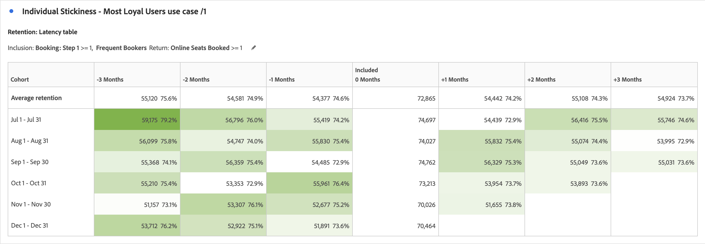

# コホート分析のユースケース

この記事では、コホートテーブルが次のアクションを実行するための有用なインサイトを提供するのに役立つ、いくつかの一般的なユースケースについて説明します。

## アプリエンゲージメント

アプリをインストールするユーザーがアプリを使用する時間の経過に伴うエンゲージメントを分析するとします。 ユーザーはアプリをインストールし、その後アプリを使用することはありませんか？ あるいは、アプリをしばらく使用した後、使用を停止したか？ あるいは、利用者は時間の経過とともにエンゲージメントし続けますか？

6か月間のコホート分析を作成できます。 これらのユーザーがセッションを持っているか、少なくともアプリを起動しない限り、訪問者は、その後の数か月間は&#x200B;*`engaged`*&#x200B;としてカウントされません。 [!UICONTROL コホート分析]は、*`App Install`* が常に 0 ヶ月目に発生する使用状況のパターンを示します。 ユーザーがアプリをインストールした時期に関係なく、2か月で使用率が低下する場合があります。 この分析を使用すると、すべてのユーザーに対して、アプリのインストール後2か月間に電子メールまたはプッシュメッセージを送信して、アプリの使用を促すことができます。

+++ コホートテーブルの視覚化の例

+++

## サブスクリプション

Adobe.comで働き、無料のCreative Cloud サブスクリプションを提供しています。 目標は、ユーザーが無料版から30日間の体験版版、または最終的には有料版にアップグレードすることです。

例えば、[!UICONTROL &#x200B; コホート分析]を使用すると、インストール後1か月で、無料のCreative Cloud ユーザーの8 ～ 10%が、インストールのタイミングに関係なくアップグレードすることを理解できます。 その後、使用の2か月目に12～15%のアップグレードが行われます。 それ以降は、アップグレードは大幅に低下します。3 ヶ月目には 4～5 ％、4 ヶ月目には 3～4 ％、そして 5 ヶ月目には 1～2 ％になります。

3か月で潜在顧客を失いたくないことを認識し、3か月半ばにオーディエンスのサンプルにアクセスするように設計されたメールキャンペーンを設定します。 この施策では、アップグレードしていない利用者に50 ドルのクーポンを提供します。

数か月後にコホート分析を確認しましょう。 キャンペーン開始後に形成されたコホートについては、3か月後の有料Creative Cloudサブスクリプションへのコンバージョン率は、4～5%から13～14%に上昇しました。 コンバージョンの結果、1 コホートあたり数十万ドルの費用が発生し、それ以降3 ヶ月のコホートごとに発生します。

+++ コホートテーブルの視覚化の例

+++

## 複雑なコホートセグメント

大規模なホテルチェーンを構築する場合、複数の顧客グループをターゲットにプロモーションを実施し、顧客グループのパフォーマンスを追跡します。 ターゲットにするユーザーコホートの最適なグループを特定するには、非常に具体的なコホートグループを作成します。 [!UICONTROL &#x200B; コホート &#x200B;] テーブル内の拡張[!UICONTROL &#x200B; インクルージョン &#x200B;]および[!UICONTROL &#x200B; リターン &#x200B;]条件を使用して、複数の指標とセグメントを含む適切なコホートグループを定義します。 この分析は、パフォーマンスの低い顧客グループを特定し、プロモーションやセールでターゲティングすることで、予約を増やすのに役立ちます。

+++ コホートテーブルの視覚化の例

+++

## アプリ版の導入

あなたは、モバイルアプリを活用して顧客エンゲージメントを促進する大手保険会社のアナリストです。 アプリに新機能が追加された場合、顧客は最新のアプリバージョンにアップグレードする必要があります。 [!UICONTROL &#x200B; カスタム Dimension] コホートを使用して、アプリのバージョンを分析し、並べて比較することで、どのアプリのバージョンをターゲットにするかを確認できます。 さらに、顧客維持率や顧客離れを追跡し、特定のアプリのバージョンによって顧客がアプリを利用しなくなる原因を突き止めることができます。 モバイルメッセージを通じてオーディエンスとリエンゲージメントし、オーディエンスを最新バージョンにアップグレードして、最新機能を活用できるようにします。

+++ コホートテーブルの視覚化の例

+++

## キャンペーンの粘着性

あなたは、ターゲットを絞ったキャンペーンを使用して、オーディエンスをさまざまなプラットフォームに誘導し、エンゲージメントを促進する多国籍メディア企業のアナリストです。 顧客エンゲージメントとリテンションにもとづいて、プラットフォームあたりの広告費を算出します。 キャンペーンの成功は、ビジネスの成功に不可欠です。 [!UICONTROL &#x200B; コホート &#x200B;] テーブルの新しい[!UICONTROL &#x200B; カスタム Dimension] コホート機能を使用して、様々なキャンペーンを並べて比較し、エンゲージメントを高めるためにユーザーの獲得と維持に最も効果的なキャンペーンを特定します。 次に、施策を成功に導く側面を特定し、その知識をほかの施策に適用することで、さまざまなプラットフォームをまたいでエンゲージメントを高めることができます。

+++ コホートテーブルの視覚化の例

+++

## 製品リリース

レベニューオペレーション部門は、売上の大部分を占める特定の顧客セグメントを多く持つ、大規模なアパレル業界のretailerのアナリストです。 各セグメントには、セグメントを念頭に置いて設計および制作された特定の製品があります。 新製品の発売ごとに、その新製品が時間の経過とともにどのように様々なグループへの販売を促進したのかを把握する必要があります。 [!UICONTROL &#x200B; コホート分析]の新しい[!UICONTROL &#x200B; レイテンシーテーブル &#x200B;]設定を使用すると、特定の顧客セグメントのローンチ前およびローンチ後の動作と収益を分析できます。 これらの情報を活用すれば、新たな売上につなげている製品と、顧客の関心を惹いていない製品を特定できます。

+++ コホートテーブルの視覚化の例

+++

## 個々の粘り強さ – 最も忠実なユーザー

あなたは、リピート顧客やロイヤルカスタマーから成功と収益の大部分を得ている大手航空会社のアナリストです。 多くの場合、ロイヤルティの高い旅行者が売上の大部分を占めており、こうした顧客を維持することは、長期的な成功に不可欠です。 一貫性のある顧客を特定するのは、容易なことではありません。 ただし、[!UICONTROL &#x200B; コホート分析]の新しい[!UICONTROL &#x200B; ローリング計算]設定を使用すると、ロイヤルカスタマーのセグメントを分析し、どの旅行者がリピート購入者であったかを月ごとに把握できます。 その場合、これらの旅行者に対して、ロイヤルティに対する特典や特典を提供することができます。 さらに、コホートの種類を「維持」から「解約」に切り替えることで、どの顧客がリピート購入に至らなかったかを前月比で特定することもできます。 そして、これらのセグメントをプロモーションでターゲットとし、これらの顧客と再エンゲージすることで、将来的にロイヤルティを維持することができます。

+++ コホートテーブルの視覚化の例

+++
