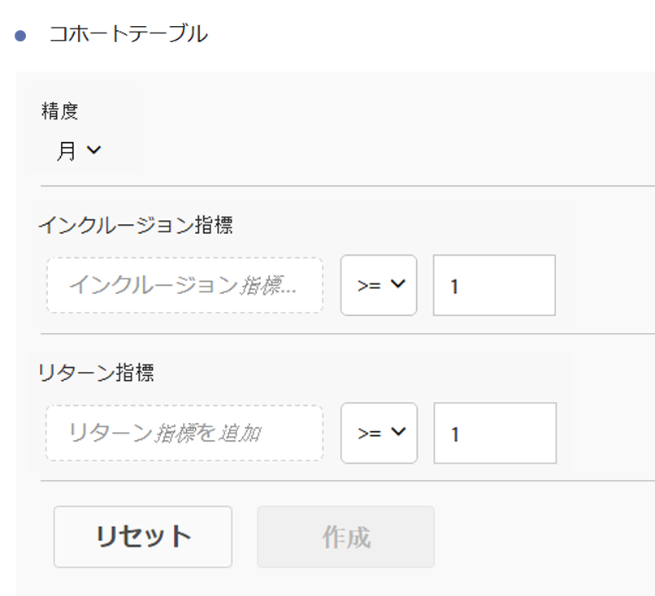
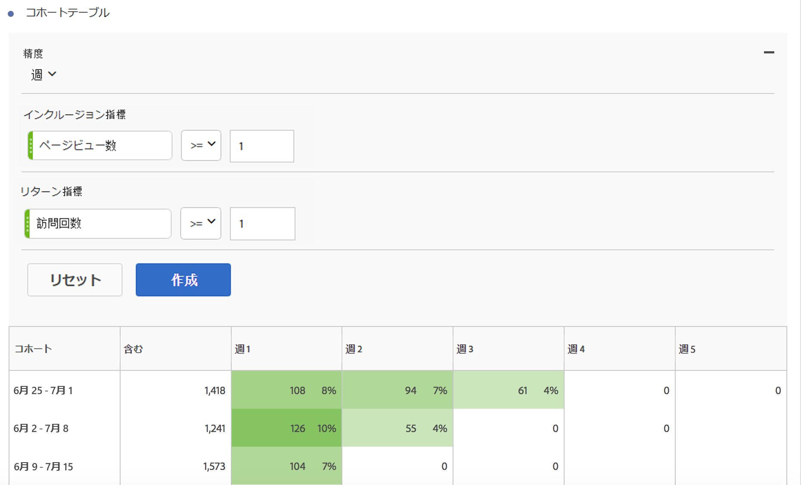

# コホート分析レポートの設定

Analysis Workspaceでコホートを作成し、コホート分析レポートを実行します。

1. In Analysis Workspace, click the **[!UICONTROL Visualizations]** icon in the left rail and drag a **[!UICONTROL Cohort Table]** to the canvas.

   

1. Define the **[!UICONTROL Inclusion Criteria]**, **[!UICONTROL Return Criteria]**, **[!UICONTROL Cohort Type]**, and **[!UICONTROL Settings]** as defined in the table below.

| 要素 | 説明 |
|--- |--- |
| **[!UICONTROL 包含条件]** | 最大で、10 個のインクルージョンセグメントおよび 3 個のインクルージョン指標を適用できます。この指標は、ユーザーをコホートに配置する場所を指定します。 例えば、インクルージョン指標が「注文」の場合、コホート分析の期間中に注文したユーザーのみが最初のコホートに含まれます。 指標間のデフォルトの演算子は「および」ですが、「または」に変更することもできます。また、これらの指標に対して数値的なフィルタリングを追加することもできます。例えば、「訪問数 &gt;= 1」のように設定することもできます。  |
| **[!UICONTROL リターン条件]** | 最大で、10 個のリターンセグメントおよび 3 個のリターン指標を適用できます。この指標は、ユーザーが保持されたか（リテンション）、保持されなかったか（チャーン）を示します。例えば、リターン指標が「ビデオ視聴回数」の場合、その後の期間（コホートに追加された後の期間）にビデオを視聴したユーザーのみが保持されているとして表されます。保持を定量化するその他の指標は「訪問回数」です。 |
| **[!UICONTROL 精度]** | 日、週、月、四半期および年の時間の精度。 |
| **[!UICONTROL タイプ]** | ****&#x200B;リテンション（デフォルト）：リテンションコホートでは、訪問者のコホートが時間の経過に伴ってどの程度サイトやアプリに戻ってきたかを測定します。これは常に使用されてきた標準的なコホートで、サイトやアプリに戻り、リピートする行動を示します。リテンションコホートは、テーブルでは緑色で表示されます。 **[!UICONTROL Churn: A churn (also known as "attrition" or "fallout") cohort measures how your visitor cohorts fall out of your property over time.]**「チャーン = 1 - リテンション」となります。チャーンは、顧客がどの程度戻ってこなかったかを示すことで、定着度および改善のチャンスを示す良い指標となります。チャーンを使用して、焦点の領域を分析し、特定できます。どのコホートセグメントが何らかの注意を払う可能性があるか。 A Churn Cohort is indicated by the color red in the table (similar to fallout in our **[!UICONTROL Flow]** visualization).  |
| **[!UICONTROL 設定]** | **[!UICONTROL ローリング計算]**：「含む」列（デフォルト）ではなく、直前の列に基づいてリテンションまたはチャーンを計算できます。ローリング計算では、「リターン」の期間の計算方法が変わります。通常の計算では、直前の期間で該当するコホートに含まれていたかどうかにかかわらず、インクルージョン期間に含まれる「リターン」条件を満たすユーザーが独立して検出されます。ローリング計算では、直前の期間で該当するコホートに含まれていたユーザーのうち、「リターン」条件を満たすユーザーが検出されます。したがって、ローリング計算では、各期間で継続的に「リターン」条件を満たすユーザーをフィルタリングし、絞り込むことができます。リターン条件は、選択した期間に至るまでの各期間に適用されます。  **[!UICONTROL 待ち時間テーブル]**：待ち時間テーブルは、インクルージョンイベント発生前後の経過時間を測定します。待ち時間は、イベント前後の分析に役立ちます。例えば、製品の発売やキャンペーンの開始を控えており、発売／開始前の行動を追跡し、発売／開始後のパフォーマンスを測定したい場合、待ち時間テーブルを使用すると、発売／開始前後の行動を並べて表示できるので、直接の影響を確認できます。待ち時間テーブルのインクルージョン前のセルは、インクルージョン期間に「インクルージョン」条件を満たし、インクルージョン期間前の期間に「リターン」条件を満たすユーザーによって計算されます。待ち時間テーブルおよびカスタムディメンションコホートは一緒に使用することはできません。  **[!UICONTROL カスタムディメンションコホート]**：時間に基づくコホート（デフォルト）ではなく、選択したディメンションに基づくコホートを作成します。多くのユーザーは、時間以外の基準でコホートを分析することを必要としています。新しいカスタムディメンションコホート機能を使用することで、任意のディメンションに基づいて柔軟にコホートを作成できます。マーケティングチャネル、キャンペーン、製品、ページ、地域などのディメンションや、Adobe Analytics のその他のディメンションを使用して、これらのディメンションの様々な値に基づいてリテンションがどのように変化しているかを表示します。カスタムコホートディメンションセグメント定義では、ディメンション項目をリターン定義の一部ではなくインクルージョン期間の一部としてのみ適用します。  カスタムディメンションコホートオプションを選択した後、任意のディメンションをドロップゾーンにドラッグ＆ドロップします。これにより、同じ期間で類似のディメンション項目を比較できます。例えば、都市、製品、キャンペーンなどを並べて比較できます。上位 14 のディメンション項目が返されます。ただし、フィルター（ドラッグされたディメンションの右側にマウスポインターを置くとこの機能を使用できます）を使用して、必要なディメンション項目のみを表示できます。カスタムディメンションコホートは待ち時間テーブル機能とともに使用することはできません。  |

1. 歯車アイコン **[!UICONTROL をクリックして]** 、コホートテーブル設定を調整します。

|設定|説明||割合のみ表示|数値を削除し、割合のみを表示します。 ||パーセントを最も近い整数に丸めます|パーセント値を小数値ではなく、最も近い整数に丸めます。 ||平均パーセント行を表示|テーブルの先頭に新しい行を挿入し、各列の値の平均を加算します。 |

## コホート分析レポートの作成

1. Click **[!UICONTROL Build]**.

   

   このレポートは、注文した訪問者（列）と、そ *`Included`* の後の訪問でサイトに戻った訪問者を表示します。 時間の経過に伴う訪問者数の減少は、問題の目印となり、行動を起こすことを可能にします。
1. （オプション）選択範囲からセグメントを作成します。

   Select cells (contiguous or noncontiguous), then right-click &gt; **[!UICONTROL Create Segment From Selection]**.

1. In the [Segment Builder](https://marketing.adobe.com/resources/help/en_US/analytics/segment/seg_build.html), further edit the segment, then click **[!UICONTROL Save]**.

   保存したセグメントは、Analysis Workspace の[!UICONTROL セグメント]パネルで使用できます。
1. コホートプロジェクトに名前を付けて保存します。
1. (Optional) [Curate and share](../../../../analyze/analysis-workspace/curate-share/curate.md#concept_4A9726927E7C44AFA260E2BB2721AFC6) the project components.

   >[!NOTE]
   >
   >キュレーションを使用する前に、プロジェクトを保存する必要があります。

