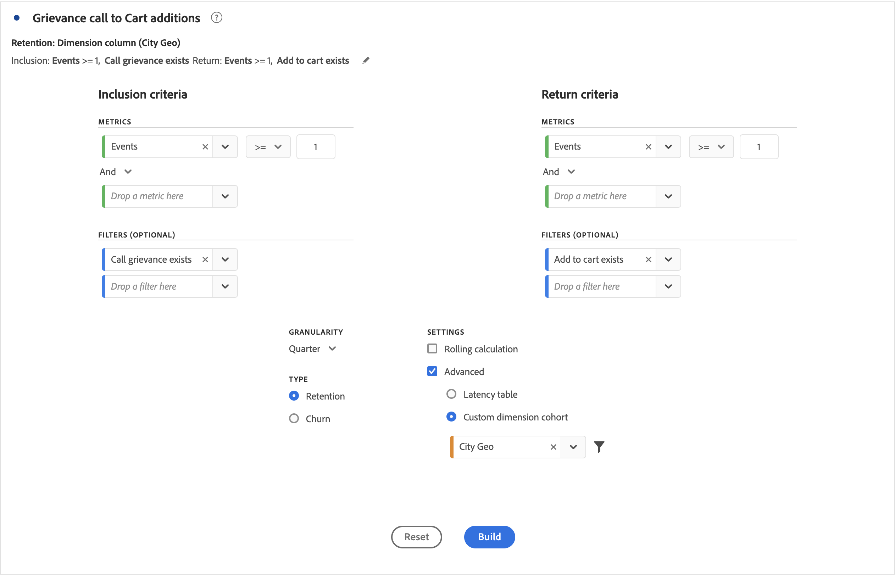

# コホートテーブルの設定

[!UICONTROL  コホートテーブル ] を作成および設定するには：

1. **[!UICONTROL コホートテーブル]** ビジュアライゼーションを追加します。 [ パネルへのビジュアライゼーションの追加 ](../freeform-analysis-visualizations.md#add-visualizations-to-a-panel) を参照してください。

1. 以下のテーブルに従って、**[!UICONTROL インクルージョン条件]**、**[!UICONTROL リターン条件]**、**[!UICONTROL コホートタイプ]**、**[!UICONTROL 設定]**&#x200B;を定義します。

   

   | 要素 | 説明 |
   |--- |--- |
   | **[!UICONTROL インクルージョン基準]** | 最大で、10 個のインクルージョンフィルターおよび 3 個のインクルージョン指標を適用できます。指標は、ユーザーが属するコホートを指定します。 例えば、インクルージョン指標が「注文」の場合、コホート分析の時間範囲内に注文したユーザーのみが最初のコホートに含まれます。 指標間のデフォルトの演算子は「AND」ですが、「OR」に変更することもできます。また、これらの指標に対して数値的なフィルタリングを追加することもできます。例：`Sessions >= 1`.  |
   | **[!UICONTROL 再来訪条件]** | 最大で、10 個のリターンフィルターおよび 3 個のリターン指標を適用できます。この指標は、ユーザーが保持されたか（リテンション）、保持されなかったか（チャーン）を示します。例えば、再来訪指標がビデオビューの場合、それ以降の期間（コホートに追加された期間の後）にビデオを視聴したユーザーのみが保持されます。 リテンションを定量化するもう 1 つの指標はセッションです。 |
   | **[!UICONTROL 精度]** | 日、週、月、四半期および年の時間の精度。 |
   | **[!UICONTROL タイプ]** | **[!UICONTROL リテンション]** （デフォルト）:**[!UICONTROL リテンション]** コホートは、ユーザーのコホートが時間の経過と共にプロパティに戻る度合いを測定します。 保持コホートは標準コホートで、復帰およびリピートのユーザー行動を示します。 緑色は、テーブル内の [!UICONTROL  リテンション ] コホートを示します。 **[!UICONTROL  チャーン ]**:**[!UICONTROL  チャーン ]**（アトリビューションまたはフォールアウトとも呼ばれます）コホートは、人物コホートが時間の経過と共にプロパティからどのように脱落するかを測定します。 チャーンはリテンションの逆、つまり `Churn = 1 - Retention` です。 [!UICONTROL チャーンは]、顧客がどの程度戻ってこなかったかを示すことで、定着度および改善のチャンスを示す良い指標となります。チャーンを使用して、注目すべき領域（どのコホートフィルターに注目すべきか）を分析し、特定できます。 赤い色は、テーブル内の [!UICONTROL  チャーン ] コホートを示します（**[!UICONTROL  フロー ]**ビジュアライゼーションのフォールアウトと同様）  。 |
   | **[!UICONTROL 設定]** | **[!UICONTROL ローリング計算]**：含まれる列（デフォルト）ではなく、前の列に基づいてリテンションまたはチャーンを計算します。 [!UICONTROL ローリング計算では]、「リターン」の期間の計算方法が変わります。通常の計算では、返品条件を満たし、インクルージョン期間に含まれていたユーザーが検索されます。 前の期間のコホートに含まれているかどうかに関係なく。 [!UICONTROL ローリング計算]では、直前の期間で該当するコホートに含まれていたユーザーのうち、「リターン」条件を満たすユーザーが検出されます。したがって、[!UICONTROL ローリング計算]では、各期間で継続的に「リターン」条件を満たすユーザーをフィルタリングし、絞り込むことができます。[!UICONTROL Return] 条件は、選択した期間に至る各期間に適用されます。   **[!UICONTROL  待ち時間テーブル ]**: [!UICONTROL  待ち時間テーブル ] は、インクルージョンイベントが発生する前後の経過時間を測定します。 [!UICONTROL  待ち時間テーブル ] は、事前/事後分析に使用するのに最適です。 例えば、今後の製品やキャンペーンのローンチがあり、ローンチの前後の行動を追跡するとします。 [!UICONTROL  待ち時間テーブル ] には、直接的な影響を確認するために、前後の動作が並んで表示されます。 [!UICONTROL  待ち時間テーブル ] 内の事前インクルージョンセルは、インクルージョン期間の [!UICONTROL  インクルージョン ] 条件を満たし、インクルージョン期間より前の期間で [!UICONTROL  リターン ] 条件を満たすユーザーを計算します。 [!UICONTROL  待ち時間テーブル ] と [!UICONTROL  カスタムディメンションコホート ] は一緒に使用できません。  **[!UICONTROL  カスタムディメンションコホート]**：時間ベースのコホート（デフォルト）ではなく、選択したディメンションに基づいてコホートを作成します。 多くのユーザーは、時間以外の基準でコホートを分析したいと考えています。新しいカスタムディメンションコホート機能では、顧客が選択したディメンションに基づいてコホートを柔軟に構築することができます。マーケティングチャネル、キャンペーン、製品、ページ、地域などのディメンションや、その他のディメンションを使用して、これらのディメンションの様々な値に基づいてリテンションがどのように変化しているかを表示します。 [!UICONTROL カスタムディメンション]コホートフィルター定義では、ディメンション項目をリターン定義の一部ではなくインクルージョン期間の一部としてのみ適用します。   「[!UICONTROL  カスタムディメンションコホート ]」オプションを選択したら、必要なディメンションをドロップゾーンにドラッグ&amp;ドロップできます。 ディメンションを追加すると、同じ期間で類似するディメンション項目を比較できます。 例えば、都市のパフォーマンスを、製品、キャンペーンなどで並べて比較できます。 コホートテーブルは、上位 14 個のディメンション項目を返します。 ただし、 フィルターを使用して、目的のディメンション項目のみを表示できます。 [!UICONTROL  カスタムディメンションコホート ] は、[!UICONTROL  待ち時間テーブル ] 機能   と共に使用することはできません。 |

1. 「**[!UICONTROL 作成]**」をクリックします。
1. [!UICONTROL  コホートテーブル ] を再設定するには、「」を選択します。

1. （任意）選択範囲からセグメントを作成します。

   1 つ以上のセル（連続または不連続）を選択し、右クリックして **[!UICONTROL 選択範囲からセグメントを作成]** します。

1. [ セグメントビルダー ](/help/components/segmentation/segmentation-workflow/seg-build.md) で、セグメントをさらに編集して、「**[!UICONTROL 保存]** をクリックします。

   保存したセグメントは、[!UICONTROL Analysis Workspace] の[!UICONTROL セグメント]パネルで使用できます。

## 設定

[!UICONTROL  コホートテーブル ] の特定の設定を定義できます。

1.  を選択して、[!UICONTROL  コホートテーブル ] 設定を調整します。

   | 設定 | 説明 |
   |---|---|
   | **割合のみを表示** | 数値を削除し、パーセンテージのみを表示します。 |
   | **割合を整数に四捨五入** | パーセント値を、小数値ではなく、最も近い整数に丸めます。 |
   | **割合の平均行を表示** | テーブルの先頭に新しい行を挿入し、各列の値の平均を加算します。 |

>[!MORELIKETHIS]
>
>[ パネルへのビジュアライゼーションの追加 ](/help/analyze/analysis-workspace/visualizations/freeform-analysis-visualizations.md#add-visualizations-to-a-panel)
>[ビジュアライゼーション設定 ](/help/analyze/analysis-workspace/visualizations/freeform-analysis-visualizations.md#settings)
>[ビジュアライゼーションコンテキストメニュー ](/help/analyze/analysis-workspace/visualizations/freeform-analysis-visualizations.md#context-menu)
>

