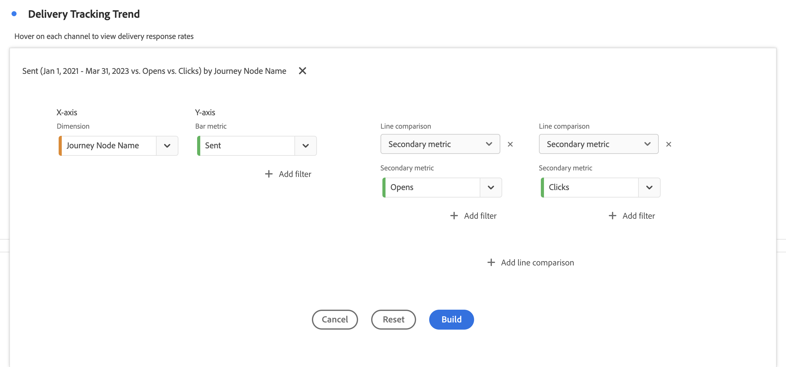

# コンボ {#combo}

<!-- markdownlint-disable MD034 -->

>[!CONTEXTUALHELP]
>id="workspace_combo_button"
>title="コンボ"
>abstract="最初にフリーフォームテーブルを作成せずに、コンボグラフのビジュアライゼーションをすばやく作成します。"

<!-- markdownlint-enable MD034 -->

>[!BEGINSHADEBOX]

_この記事では、_ _&#x200B;**Adobe Analytics** のコンボビジュアライゼーションについて説明します。_

_この記事の_  _&#x200B;**Customer Journey Analytics** バージョンについて詳しくは、[コンボ](https://experienceleague.adobe.com/ja/docs/analytics-platform/using/cja-workspace/visualizations/combo-charts)を参照してください。_

>[!ENDSHADEBOX]

 **[!UICONTROL コンボ]**&#x200B;ビジュアライゼーションを使用すると、最初にテーブルを作成しなくても、比較ビジュアライゼーションをすばやく簡単に作成できます。折れ線グラフと棒グラフの組み合わせでデータの傾向を簡単に表示できます。

[!UICONTROL コンボ]を使用すると、次の操作を実行できます。

* 今週の注文と、先月（および昨年）の同時刻の注文を比較できます。
* 複数の指標（[!UICONTROL ユーザー]や[!UICONTROL 売上高]など）を同じグラフで相互にすばやく分析して比較できます。
* 一定期間にわたって、関数（[!UICONTROL 累積平均]など）に対する指標を分析できます。

次の点に注意してください。

* 複数の比較を 1 つの[!UICONTROL 複合グラフ]に追加できます。
* 1 つ以上の比較を追加する場合は、[!UICONTROL 時間比較]など、同じタイプの比較にする必要があります。
* 最大 5 つの比較を追加できます。
* 1 つの指標に最大 3 つのフィルターを適用できます。
* 計算指標は複合グラフではサポートされません。

## 使用

1.  [!UICONTROL コンボ]ビジュアライゼーションを追加します。[パネルへのビジュアライゼーションの追加](freeform-analysis-visualizations.md#add-visualizations-to-a-panel)を参照してください。

1. ドロップダウンリストから、X 軸のディメンションと Y 軸の指標を選択します。

1. 使用する[!UICONTROL 折れ線比較]のタイプを選択します。

   | 折れ線比較タイプ | 定義 |
   | --- | --- |
   | **[!UICONTROL 時間比較]** | 最も一般的なタイプの比較です。例えば、この期間と 4 週間前の期間を比較します。 [!UICONTROL 時間比較]を選択した場合は、比較する期間についての補助的な選択を行います。
 |
   | **[!UICONTROL 関数]** | [!UICONTROL 平均]などの関数を比較に導入できます。[サポートされている関数](#supported-functions)のリストを参照してください。
 |
   | **[!UICONTROL セカンダリ指標]** | 例えば、[!UICONTROL 売上高]を別の指標と比較できます。
 |

   {style="table-layout:auto"}

1. 「**[!UICONTROL 作成]**」を選択します。

   出力は、例えば次のようになります。

   

   現在の期間は、棒グラフで表示されます。比較期間は、折れ線グラフで表示されます。折れ線グラフのドットは、*バーベル*&#x200B;と呼ばれます。

## サポートされている関数

[!UICONTROL 折れ線比較タイプ]として&#x200B;**[!UICONTROL 関数]**&#x200B;を選択すると、選択した指標の関数が返されます。

| 関数 | 定義 |
| --- | --- |
| **[!UICONTROL 列の合計値]** | （1 つのディメンションの複数の要素の）1 つの列内の指標のすべての数値を加算します。 |
| **[!UICONTROL 累加平均]** | 最終 N 行の平均を返します。 |
| **[!UICONTROL 中央値]** | 1 つの列の指標の中央値を返します。中央値は、一連の数の中央にある数値です。数値の半分は中央値以上の値であり、残りの半分は中央値以下の値です。 |
| **[!UICONTROL 累積]** | N 行の累積合計です。 |
| **[!UICONTROL 列の最大値]** | 指標列の一連のディメンション要素の中の最大値を返します。 |
| **[!UICONTROL 平均値]** | 指標の算術平均（平均）を返します。 |
| **[!UICONTROL 列の最小値]** | 指標列の一連のディメンション要素の中の最小値を返します。 |

{style="table-layout:auto"}

売上高指標の累積平均の例を以下に示します。

累積平均関数と平均関数の両方を含むコンボグラフの例を次に示します。

>[!MORELIKETHIS]
>
>[パネルへのビジュアライゼーションの追加](/help/analyze/analysis-workspace/visualizations/freeform-analysis-visualizations.md#add-visualizations-to-a-panel)
>&#x200B;>[ビジュアライゼーション設定](/help/analyze/analysis-workspace/visualizations/freeform-analysis-visualizations.md#settings)
>&#x200B;>[ビジュアライゼーションコンテキストメニュー](/help/analyze/analysis-workspace/visualizations/freeform-analysis-visualizations.md#context-menu)
>
