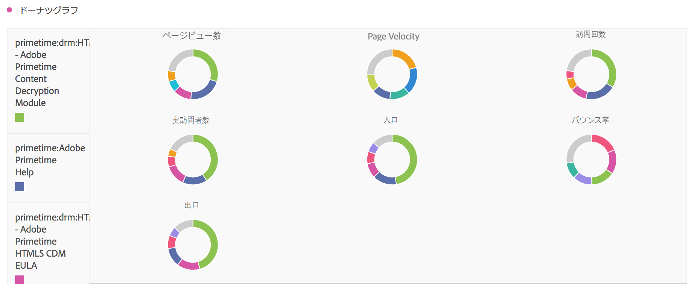

# [!UICONTROL ドーナツ] {#donut}

<!-- markdownlint-disable MD034 -->

>[!CONTEXTUALHELP]
>id="workspace_donut_button"
>title="ドーナツ"
>abstract="合計の割合を比較する場合は一般的に、項目数が少ないドーナツのビジュアライゼーションを使用します。"

<!-- markdownlint-enable MD034 -->

>[!BEGINSHADEBOX]

_この記事では、この記事の_  _**Adobe Analytics**_ _のドーナツビジュアライゼーションについて説明します。_  _**Customer Journey Analytics**&#x200B;版の[ ドーナツ ](https://experienceleague.adobe.com/ja/docs/analytics-platform/using/cja-workspace/visualizations/donut)を参照してください。_

>[!ENDSHADEBOX]

 **[!UICONTROL ドーナツ]**&#x200B;ビジュアライゼーションは、円グラフと同様に、データを全体の一部またはフィルターとして表示します。 合計の割合を比較するとき、一般的に、項目数が少ない場合はドーナツビジュアライゼーションを使用します。

>[!BEGINSHADEBOX]

デモビデオについて詳しくは、 [ドーナツビジュアライゼーションの追加](https://experienceleague.adobe.com/en/docs/analytics-learn/tutorials/analysis-workspace/visualizations/using-the-donut-visualization){target="_blank"}を参照してください。

>[!ENDSHADEBOX]

>[!MORELIKETHIS]
>
>[ パネルへのビジュアライゼーションの追加](/help/analyze/analysis-workspace/visualizations/freeform-analysis-visualizations.md#add-visualizations-to-a-panel)
>[ビジュアライゼーション設定](/help/analyze/analysis-workspace/visualizations/freeform-analysis-visualizations.md#settings)
>[ビジュアライゼーションコンテキストメニュー](/help/analyze/analysis-workspace/visualizations/freeform-analysis-visualizations.md#context-menu)
>

