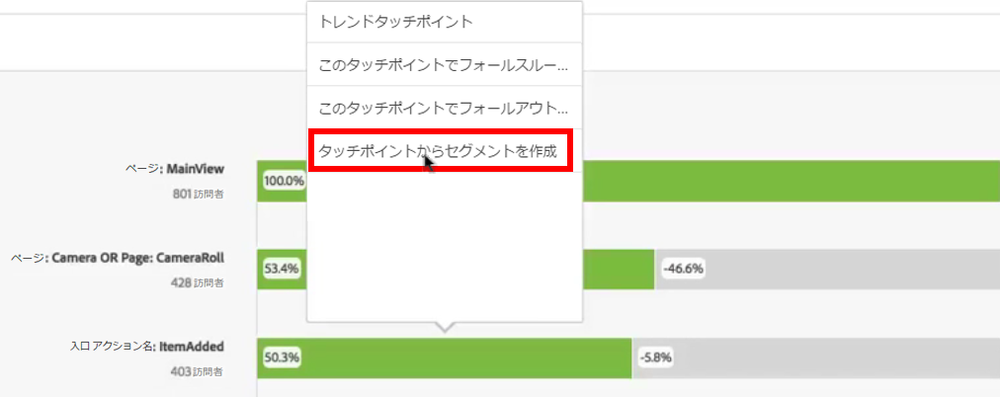
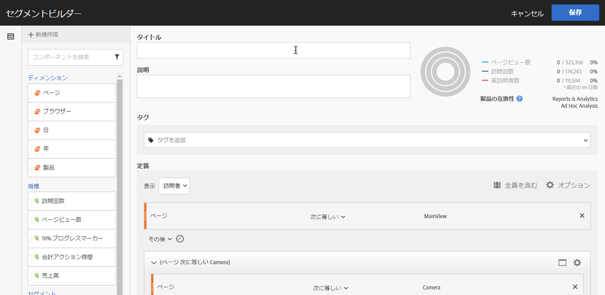
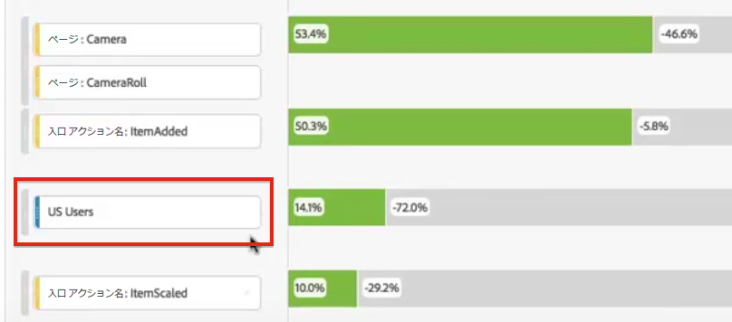
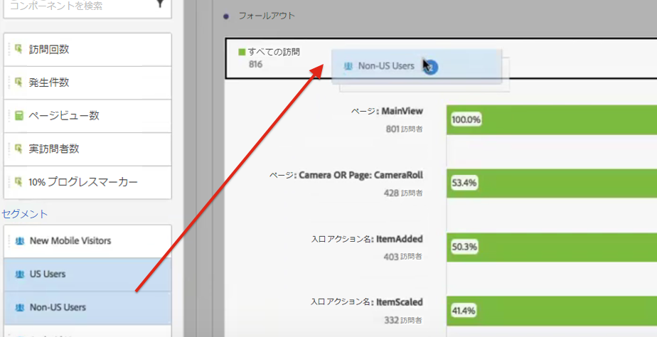
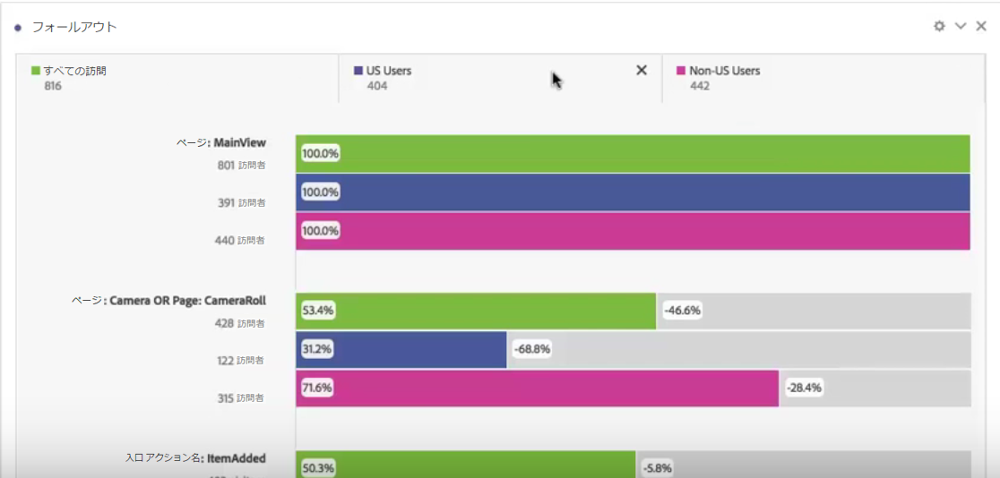

# フォールアウト分析でのセグメントの適用

タッチポイントからセグメントを作成したり、セグメントをタッチポイントとして追加したり、Analysis Workspace の様々なセグメントにわたって主なワークフローを比較したりできます。

>[!IMPORTANT]フォールアウトでチェックポイントとして使用されるセグメントでは、フォールアウトビジュアライゼーションの全体的なコンテキストよりも低いレベルのコンテナを使用する必要があります。訪問者コンテキストのフォールアウトを使用する場合、チェックポイントとして使用するセグメントは、訪問またはヒットベースのセグメントである必要があります。訪問コンテキストフォールアウトを使用する場合、チェックポイントとして使用するセグメントは、ヒットベースのセグメントである必要があります。無効な組み合わせを使用すると、フォールアウトは 100％になります。互換性のないセグメントをタッチポイントとして追加すると表示される警告を、フォールアウトビジュアライゼーションに追加しました。特定の無効なセグメントコンテナの組み合わせでは、次のような無効なフォールアウト図が生じます。

* 訪問者ベースのセグメントを訪問者コンテキストのフォールアウトビジュアライゼーション内のタッチポイントとして使用
* 訪問者ベースのセグメントを訪問コンテキストのフォールアウトビジュアライゼーション内のタッチポイントとして使用
* 訪問ベースのセグメントを訪問コンテキストのフォールアウトビジュアライゼーション内のタッチポイントとして使用

## タッチポイントからのセグメントの作成 {#section_915E8FBF35CD4F34828F860C1CCC2272}

1. 特に関心があり、他のレポートに適用するのに便利そうな特定のタッチポイントからセグメントを作成します。これを行うには、タッチポイントを右クリックし、を選択しま **[!UICONTROL Create segment from touchpoint]**&#x200B;す。

   

   セグメントビルダーが開き、選択したタッチポイントに一致する、事前にビルドされた順次セグメントが事前設定されます。

   

1. セグメントにタイトルと説明を付け、保存します。

   これで、このセグメントを任意のレポートで使用できます。

## セグメントのタッチポイントとしての追加 {#section_17611C1A07444BE891DC21EE8FC03EFC}

例えば、米国のユーザーがどのように傾向を示し、フォールアウトに影響を与えているかを確認するには、米国のユーザーセグメントをフォールアウトにドラッグします。

または、米国のユーザーセグメントを別のチェックポイントにドラッグして、ANDタッチポイントを作成できます。

## フォールアウトでのセグメントの比較 {#section_E0B761A69B1545908B52E05379277B56}

フォールアウトビジュアライゼーションで比較できるセグメントの数に制限はありません。

1. Select the segments you want to compare from the [!UICONTROL Segments] rail on the left. この例では、2つのセグメントを選択しています。米国ユーザーおよび米国以外のユーザーを参照してください。
1. 上部のセグメントドロップゾーンにドラッグします。

   

1. オプション：「すべての訪問」をデフォルトの訪問者として保持するか、コンテナを削除できます。

   

1. 一方のセグメントが他方のセグメントを上回るパフォーマンスを示している場所や他のインサイトなど、2つのセグメント間のフォールアウトを比較できるようになりました。
