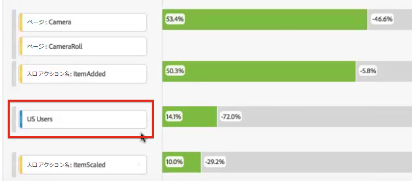

# フォールアウト分析でのセグメントの適用

タッチポイントからセグメントを作成したり、セグメントをタッチポイントとして追加したり、Analysis Workspace の様々なセグメントにわたって主なワークフローを比較したりできます。

>[!IMPORTANT]
>
>フォールアウトでチェックポイントとして使用されるセグメントでは、フォールアウトビジュアライゼーションの全体的なコンテキストよりも低いレベルのコンテナを使用する必要があります。 訪問者コンテキストのフォールアウトを使用する場合、チェックポイントとして使用するセグメントは、訪問またはヒットベースのセグメントである必要があります。 訪問コンテキストフォールアウトを使用する場合、チェックポイントとして使用するセグメントは、ヒットベースのセグメントである必要があります。 無効な組み合わせを使用すると、フォールアウトは 100％になります。 互換性のないセグメントをタッチポイントとして追加すると、フォールアウトビジュアライゼーションに警告が表示されます。 特定の無効なセグメントコンテナの組み合わせでは、次のような無効なフォールアウト図が生じます。
>
>* 訪問者コンテキストのフォールアウトビジュアライゼーション内で、訪問者ベースのセグメントをタッチポイントとして使用する。
>* 訪問者ベースのセグメントを、訪問コンテキストのフォールアウトビジュアライゼーション内のタッチポイントとして使用する。
>* 訪問ベースのセグメントを、訪問コンテキストのフォールアウトビジュアライゼーション内のタッチポイントとして使用する。
>

## タッチポイントからのセグメントの作成

1. 特に関心があり、他のレポートに適用するのに便利そうな特定のタッチポイントからセグメントを作成します。 それには、タッチポイントを右クリックし、「**[!UICONTROL タッチポイントからセグメントを作成]**」をクリックします。

   

   セグメントビルダーが開き、選択したタッチポイントに一致する事前定義済みのシーケンシャルセグメントが事前入力されます。

   

1. セグメントにタイトルと説明を付けて保存します。

   このセグメントは、任意のプロジェクトで使用できるようになりました。

## セグメントのタッチポイントとしての追加

例えば、モバイルアプリヒットのトレンドとフォールアウトに与える影響を確認したい場合は、モバイルアプリヒットのセグメントをフォールアウトにドラッグします。

または、モバイルアプリのヒット セグメントを別のチェックポイントにドラッグして、AND タッチポイントを作成することもできます。

## フォールアウトでのセグメントの比較

フォールアウトビジュアライゼーションでは、無数のセグメントを比較できます。 （以下のビデオでは、最大3つのセグメントを比較できることを示していますが、これは間違っています）。

1. 左側の[!UICONTROL  セグメント ] パネルから、比較するセグメントを選択します。 例では、**[!UICONTROL iOS]**&#x200B;と&#x200B;**[!UICONTROL Android]**&#x200B;の2つのセグメントが選択されています。
1. 3つのセグメントをビジュアライゼーションの上部にあるセグメントドロップゾーンにドラッグします。

   

1. オプション：*すべてのユーザー*&#x200B;をデフォルトコンテナとして保持するか、コンテナを削除できます。

1. 3つのセグメントのフォールアウトを比較できるようになりました。例えば、あるセグメントが他のセグメントよりも優れたパフォーマンスを発揮している場所や、他のインサイトが得られています。
