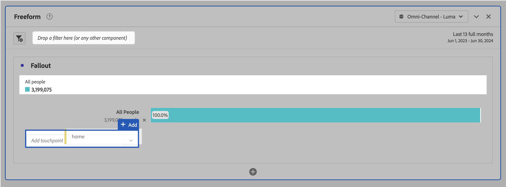

# フォールアウトビジュアライゼーションの設定

タッチポイントを指定して、複数のディメンションのフォールアウトシーケンスを作成できます。通常、タッチポイントはサイト上のページです。ただし、タッチポイントはページに限定されません。例えば、ユニットや一意のユーザー、再来訪などのイベントを追加できます。 また、カテゴリ、ブラウザーのタイプ、内部検索語句などのディメンションも追加できます。

タッチポイント内にセグメントを追加することもできます。例えば、iOS ユーザーやAndroid™ ユーザーなどのセグメントを比較したい場合があります。 目的のセグメントをフォールアウトの上部にドラッグすると、これらのセグメントに関する情報がフォールアウトレポートに追加されます。これらのセグメントのみを表示したい場合、「すべての訪問」ベースラインを削除できます。

追加できるステップ数や使用されるディメンション数に制限はありません。

ディメンション、指標およびセグメントに対してパスを設定できます。 例えば、誰かが靴やシャツを 1 ページで見ていて、次のページではシャツや靴下を見ているとします。 靴の次の製品フローレポートは、シャツではなく、シャツおよびソックスです。

## 使用

1. **[!UICONTROL フォールアウト]** ビジュアライゼーションを追加します。 [ パネルへのビジュアライゼーションの追加 ](../freeform-analysis-visualizations.md#add-visualizations-to-a-panel) を参照してください。
1. ページ（ホームなど）をページディメンションから「*タッチポイントを追加*」ドロップダウンメニューにドラッグします。

   

   タッチポイントにポインタを合わせると、そのレベルに関するフォールアウトやその他の情報（タッチポイントの名前、その時点でのユーザー数など）が表示されます。 そのタッチポイントの成功率を確認します（また、成功率を他のタッチポイントと比較します）。

   バーのグレー部分にある円で囲まれた数字は、（そのポイントへの合計フォールアウトではなく）タッチポイント間のフォールアウトを表しています。**[!UICONTROL タッチポイント %]** は、フォールアウトレポートで前のステップから現在のステップへの正常なフォールスルーを示します。

   また、フォールアウトレポートにはディメンション全体ではなく単一のページを追加できます。ページディメンションの右矢印  をクリックして、フォールアウトレポートに追加する特定のページを選択します。

1. シーケンスが完成するまでタッチポイントの追加を続けます。

   1 つ以上の追加のコンポーネントをタッチポイントにドラッグして、**複数のタッチポイントを組み合わせる** ことができます。

   >[!NOTE]
   >
   >複数のセグメントは AND で結合されますが、ディメンション項目や指標などの複数の項目は OR で結合されます。

   

1. また、パス内の **最終的に *ではなく**個々のタッチポイントを次のイベントに制限*）することもできます。 各タッチポイントの下には、次に示すように、オプション **[!UICONTROL 最終的なパス]** と **[!UICONTROL 次のイベント]** を持つセレクターがあります。

   

   | オプション | 説明 |
   |---|---|
   | **[!UICONTROL 最終的なパス]** （デフォルト） | カウントされるのは、パス内の次のページに到達する *最終的には* 人です。ただし、必ずしも次のイベントに到達する必要はありません。 |
   | **[!UICONTROL 次のイベント]** | は、次のイベントのパスの次のページに到達するとカウントされます。 |

## 設定

ビジュアライゼーションの一部として、特定の設定を使用できます。

| フォールアウトコンテナ | 説明 |
|--- |--- |
| **[!UICONTROL Session]** または **[!UICONTROL Person]** | [!UICONTROL  セッション ] と [!UICONTROL  人物 ] を切り替えて、人物パスを分析します。 デフォルトは「[!UICONTROL ユーザー]」です。これらの設定により、個人のエンゲージメントを（セッション全体にわたって）個人レベルで理解したり、分析を 1 回のセッションに制限したりできます。 |

## コンテキストメニュー

ビジュアライゼーションの一部として、特定のコンテキストメニューオプションを使用できます。

| オプション | 説明 |
|--- |--- |
| **[!UICONTROL トレンドタッチポイント]** | 折れ線グラフのタッチポイントのトレンドデータを、一部の事前に作成された異常値検出データと共に表示します。 |
| **[!UICONTROL トレンドタッチポイント （%）]** | 合計フォールアウト数の割合のトレンドを追跡します。 |
| **[!UICONTROL すべてのタッチポイントのトレンド （%）]** | フォールアウト内のすべてのタッチポイントの割合のトレンド（含まれる場合は **[!UICONTROL すべての人物]** を除く）を、同じグラフに表示します。 |
| **[!UICONTROL このタッチポイントでのフォールスルーの分類]** | 次のタッチポイントに進んだ場合に、2 つのタッチポイント（このタッチポイントと次のタッチポイント）間に実行した操作を表示します。 これにより、ディメンションを表示するフリーフォームテーブルを作成します。ディメンションおよびテーブルの他の要素を置き換えることができます。 |
| **[!UICONTROL このタッチポイントでのフォールアウトの分類]** | ファネルを通過しなかった人物が選択したステップの直後に取った行動を確認します。 |
| **[!UICONTROL タッチポイントからセグメントを作成]** | 選択したタッチポイントから新しいセグメントを作成します。 |

>[!MORELIKETHIS]
>
>[ パネルへのビジュアライゼーションの追加 ](/help/analyze/analysis-workspace/visualizations/freeform-analysis-visualizations.md#add-visualizations-to-a-panel)
>[ビジュアライゼーション設定 ](/help/analyze/analysis-workspace/visualizations/freeform-analysis-visualizations.md#settings)
>[ビジュアライゼーションコンテキストメニュー ](/help/analyze/analysis-workspace/visualizations/freeform-analysis-visualizations.md#context-menu)
>

