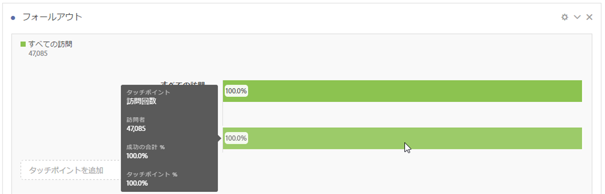
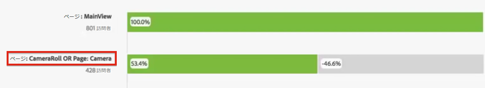
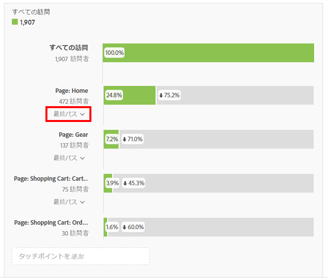

# フォールアウトビジュアライゼーションの設定

タッチポイントを指定して、複数のディメンションのフォールアウトシーケンスを作成できます。通常、タッチポイントはサイト上のページです。ただし、タッチポイントはページに限定されません。例えば、単位などのイベント、実訪問者数、再来訪を追加できます。また、カテゴリ、ブラウザーのタイプ、内部検索語句などのディメンションも追加できます。

タッチポイント内にセグメントを追加することもできます。例えば、iOS および Android ユーザーなどのセグメントを比較したい場合があります。目的のセグメントをフォールアウトの上部にドラッグすると、これらのセグメントに関する情報がフォールアウトレポートに追加されます。これらのセグメントのみを表示したい場合、「すべての訪問」ベースラインを削除できます。

追加できる手順の数または使用するディメンションの数に制限はありません。

マーチャンダイジング eVar および [listVars](https://marketing.adobe.com/resources/help/en_US/sc/implement/listN.html)（製品、listVar、マーチャンダイジング eVar およびリスト prop など、ヒットあたり複数の値を持つことができる変数）を含む、eVar へのパスを設定できます。例えば、誰かが靴とシャツを 1 つのページで探していて、次のページでシャツとソックスを探しているとします。靴の次の製品フローレポートは、シャツではなく、シャツおよびソックスです。

1. 「[!UICONTROL フォールアウト]」ビジュアライゼーションを「ビジュアライゼーション」ドロップダウンから「[!UICONTROL フリーフォームテーブル]」にドラッグします。

1. ページディメンションをフリーフォームテーブルにドラッグし、そしてそこから、最初のタッチポイントとしてページ（この場合、ホーム - JJEsquire）を「**[!UICONTROL タッチポイントを追加]」フィールドにドラッグします。**

   

   タッチポイントの上にマウスポインターを置いて、フォールアウトおよびそのレベルに関するその他の情報（タッチポイントの名前、そのポイントでの訪問者数）を確認し、そのタッチポイントの成功率（さらに他のタッチポイントとの成功率の比較）を確認します。

   バーのグレー部分にある円で囲まれた数字は、（そのポイントへの合計フォールアウトではなく）タッチポイント間のフォールアウトを表しています。タッチポイント % は、フォールアウトレポート内の現在のステップに対する、前のステップで成功したフォールスルーの比率です。

   また、フォールアウトレポートにはディメンション全体ではなく単一のページを追加できます。フォールアウトレポートに追加する特定のページを選択するには、ページディメンションの右向き矢印「&gt;」をクリックします。

1. シーケンスが完成するまでタッチポイントの追加を続けます。

   1 つまたは複数の追加のタッチポイントをタッチポイントにドラッグすることで、**複数のタッチポイントを組み合わせる**&#x200B;ことができます。

   >[!NOTE]
   >
   >複数のセグメントはANDで結合されますが、ディメンション項目や指標などの複数の項目はORで結合されます。

   

1. パス内の&#x200B;**次のヒットまで（「最後まで」ではなく）個別のタッチポイントを抑制する**&#x200B;こともできます。次に示すように、各タッチポイントの下には「最終パス」と「次のヒット」オプションを切り替えることができるセレクターがあります。

   

<table id="table_A91D99D9364B41929CC5A5BC907E8985"> 
 <tbody> 
  <tr> 
   <td colname="col1"> 
最終パス 
 
（デフォルト） 
 </td> 
   <td colname="col2"> 
カウントされるのは、「最終的に」パスの次のページを訪問した訪問者です。ただし、訪問者は必ずしも次のヒットで次のページに至っていません。 
 </td> 
  </tr> 
  <tr> 
   <td colname="col1"> 
次のヒット 
 </td> 
   <td colname="col2"> 
カウントされるのは、次のヒットでパスの次のページを訪問した訪問者です。 
 </td> 
  </tr> 
 </tbody> 
</table>

## Fallout settings {#section_0C7C89D72F0B4D6EB467F278AC979093}

| 設定 | 説明 |
|--- |--- |
| フォールアウトコンテナ <ul><li>訪問</li><li>訪問者</li></ul> | 「訪問」と「訪問者」を切り替えて、訪問者のパスを分析できます。デフォルトは訪問者です。これらの設定により、訪問者のエンゲージメントを（訪問全体にわたって）訪問者レベルで分析したり、1 回の訪問に分析を制限したりできます。 |
| 最初のタッチポイントとして「すべての訪問者」を表示 | 「すべての訪問」を最初のタッチポイントにしたくない場合、これを選択解除できます。 |

When you **right-click a touchpoint**, the following options appear:

| オプション | 説明 |
|--- |--- |
| トレンドタッチポイント | 折れ線グラフのタッチポイントのトレンドデータを、一部の事前に作成された異常値検出データと共に表示します。 |
| タッチポイント (%) のトレンドを追跡 | 合計フォールアウト数の割合のトレンドを追跡します。 |
| すべてのタッチポイント (%) のトレンドを追跡 | 同じチャート上のフォールアウトですべてのタッチポイントの割合のトレンドを追跡します（「すべての訪問」が含まれている場合はこれを除く）。 |
| このタッチポイントでフォールスルーに分類 | 訪問者が次のタッチポイントへと進んだ場合、訪問者が 2 つのタッチポイントの間で何をしたかを表示します。これにより、ディメンションを表示するフリーフォームテーブルを作成します。ディメンションおよびテーブルの他の要素を置き換えることができます。 |
| このタッチポイントでフォールアウトに分類 | ファネルを通過しなかった人が選択したステップの後にすぐに何をしたかを表示します。 |
| タッチポイントからセグメントを作成 | 選択したタッチポイントから新しいセグメントを作成します。 |