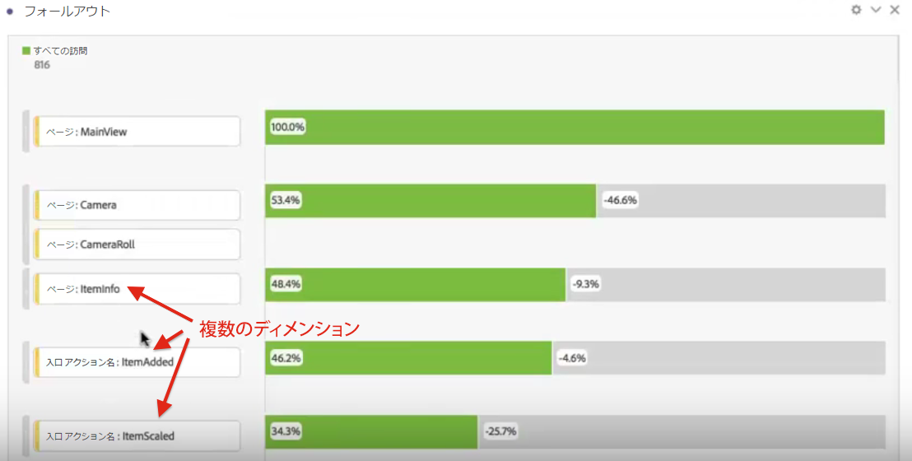
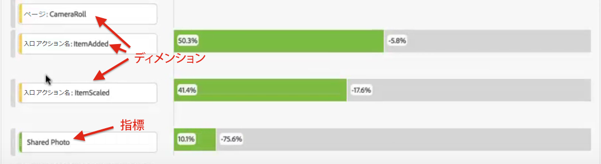
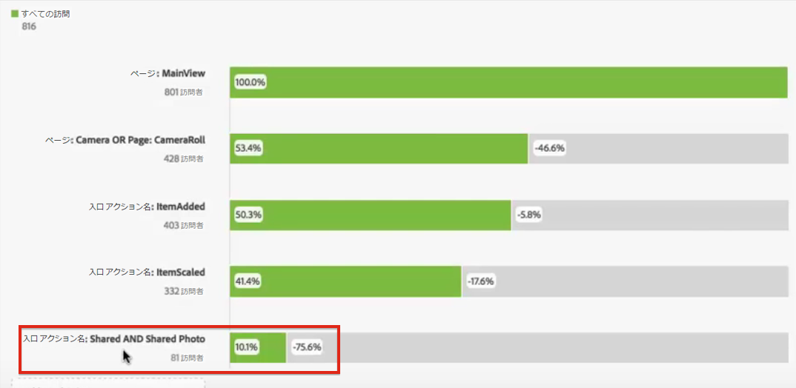

# ディメンション間のフォールアウト

Analysis Workspace のフォールアウトでは、ディメンションと指標をファネルとワークフローのタッチポイントとして組み合わせることができます。これにより、調査するユーザーステップをより柔軟に定義できます。

**例**：ページディメンションに加えて、アクションベースのディメンション項目をフォールアウトビジュアライゼーションに追加できます。これにより、顧客のパスで、ページおよび特定のアクションがどのように相互作用するかを可視化できます。

フォールアウトは動的に更新され、複数のディメンションにわたるフォールアウトを表示できます。

この組み合わせに指標を追加することもできます。この例では、「Shared Photo」指標を追加して、顧客がたどったパスを明確にします。

さらに、異なるディメンションおよび指標を AND チェックポイントに組み合わせることもできます。別のディメンションまたは指標を既存のものの上部にドラッグするだけです。

