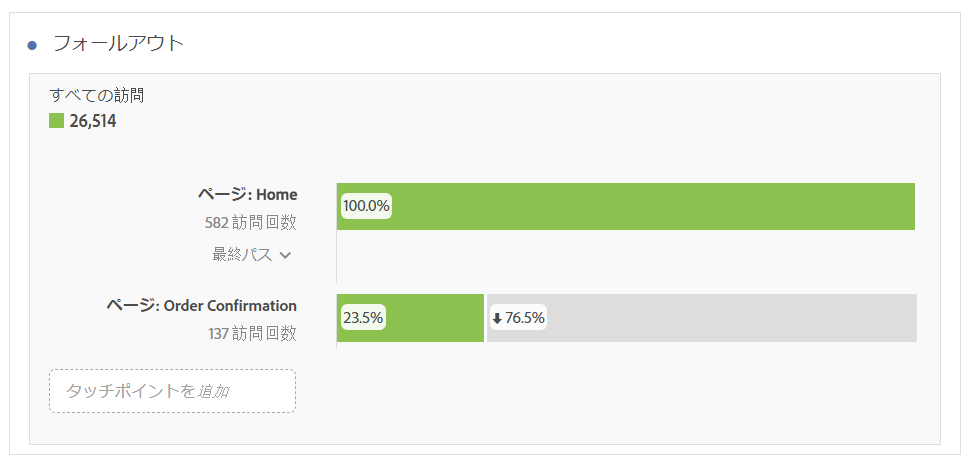
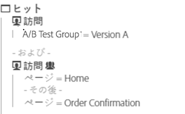
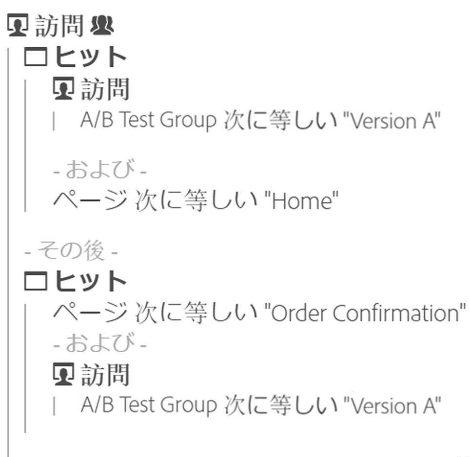

# フォールアウトの概要

フォールアウトビジュアライゼーションには、フォールアウトレポートを作成するためのより多くのオプションがあります。フォールアウトレポートは、事前に指定した一連のページ間で、訪問者が離脱した（フォールアウト）箇所や、次に進んだ（フォールスルー）箇所を表示します。

フォールアウトビジュアライゼーションでは、次の操作をおこなうことができます。

* 同じレポートの異なる 2 つのセグメントを並べて比較する
* ファネルステップ（タッチポイント）のドラッグ、ドロップ、整列
* 異なるディメンションおよび指標からの値を組み合わせる
* 複数ディメンションのフォールアウトレポートの作成
* フォールアウト直後に顧客がどこに移動したかの識別

フォールアウトは、各ステップまたはシーケンスのタッチポイント間のコンバージョン率とフォールアウト率を表示します。

例えば、購入プロセス中の訪問者のフォールアウトポイントを追跡できます。開始タッチポイントと終了タッチポイントを選択し、中間タッチポイントを追加して、Web サイトのナビゲーションパスを作成します。ただし、複数ディメンションのフォールアウトも可能です。

フォールアウトビジュアライゼーションは、次の分析に役立ちます。

* サイト上の特定のプロセス（購入や登録プロセスなど）を通してのコンバージョン率。
* 一般的でより広範囲なトラフィックフロー。ホームページを閲覧した訪問者のうち、検索を実行した訪問者の人数、その後特定の品目を閲覧した訪問者の人数などを表示できます。
* サイト上のイベント間の関連性。例えばプライバシーポリシーを閲覧した訪問者のうち製品の購入に到達した人の割合を示します。

[YouTubeのフォールアウトビジュアライゼーション](https://www.youtube.com/watch?v=VcrfHSyIoj8&index=52&list=PL2tCx83mn7GuNnQdYGOtlyCu0V5mEZ8sS) （4:15）

## Segmentation as a foundation for flow and fallout {#section_654F37A398C24DDDB1552A543EE29AA9}

Workspace パネルに適用されたセグメントの動作は、Reports &amp; Analytics または Ad Hoc Analysis のフォールアウトレポートやフローレポートに適用されたセグメントとわずかに異なります。ほとんどの場合、これらは同じ結果になります。主な違いは、Reports &amp; Analytics と Ad Hoc Analysis ではセグメントがシーケンスの各ステップで適用されることです。これにより、結果がわずかに異なることになります。

2 ステップのフォールアウトを例にします。

Workspace のパネルレベルでセグメントを適用すると、そのセグメントは次のようにフォールアウトと組み合わされます。

一方、Reports &amp; Analytics と Ad Hoc Analysis ではセグメントが計算されます。セグメントは次のように組み合わされます。

Reports &amp; Analytics と Ad Hoc Analysis は、セグメントを各ステップで組み合わせます。コンテナがフォールアウトと同じレベル（訪問レベルまたは訪問者レベルなど）の場合は、訪問数と訪問者数が同じになります。

ただし、パネルに適用されたセグメントがフォールアウトのレベル（ヒットレベルなど）より小さい場合、レポートに組み合わされる方法によって、セグメントは異なる結果を示します。繰り返した場合、ほとんどの状況で Analysis Workspace の数は Reports &amp; Analytics や Ad Hoc Analysis の数と一致します。次の条件がすべて当てはまる場合にのみ一致&#x200B;**しません**。

* セグメントがフォールアウトと同じレベルにない。
* 訪問中または訪問者としてのアクセス時に訪問者／訪問が複数の値を取ることができる変数がセグメントにある。

Analysis Workspace が Reports &amp; Analytics のようにセグメントをフォールアウト／フローに適用するようにする必要がある場合は、Workspace の各フォールアウトステップにセグメントをドロップすると、同じ数になります。
