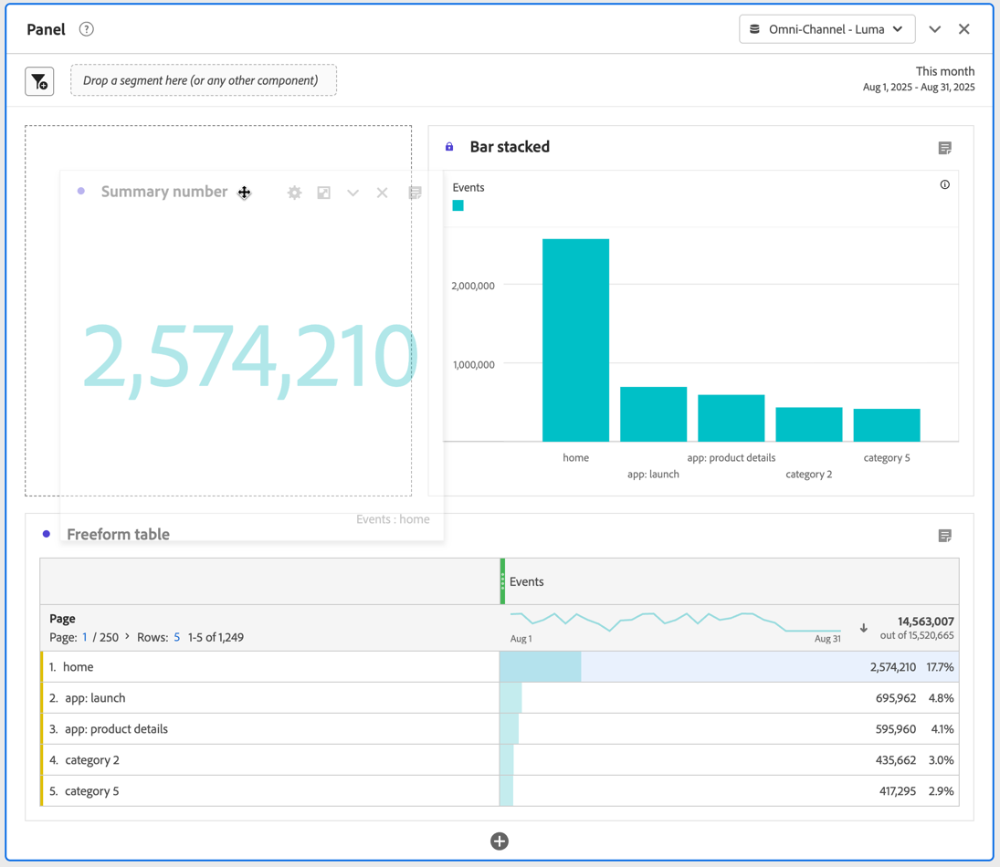

# ビジュアライゼーションの概要

Workspace には、データを視覚的に表現できる様々なビジュアライゼーションが用意されています。棒グラフ、ドーナツグラフ、ヒストグラム、折れ線グラフ、マップ、散布図などがあります。

## タイプ

Analysis Workspace では、次のビジュアライゼーションタイプを利用できます。

| アイコン | 名前 | 説明 |
| :---: | --- | ---| 
|  | [面グラフ](/help/analyze/analysis-workspace/visualizations/area.md) | 面グラフのビジュアライゼーション。折れ線グラフに似ていますが、線の下に色付きの領域があります。指標が複数あり、2 個以上の指標の積集合により表現される領域を視覚化する場合は、面グラフを使用します。 |
|  | [棒グラフ](/help/analyze/analysis-workspace/visualizations/bar.md) | 1 つ以上の指標の様々な値を表す縦棒グラフを含む棒グラフビジュアライゼーション。 |
|  | [積み重ね棒グラフ](/help/analyze/analysis-workspace/visualizations/bar.md) | 1 つ以上の指標の様々な値を表す縦棒グラフを含む積み重ね棒グラフビジュアライゼーション。 |
| 
 | [ブレット](/help/analyze/analysis-workspace/visualizations/bullet-graph.md) | 関心のある値が他のパフォーマンス範囲（目標）とどのように比較または測定されるかを示すブレットグラフビジュアライゼーション。 |
|  | [コホートテーブル](/help/analyze/analysis-workspace/visualizations/cohort-table/cohort-analysis.md) | コホートビジュアライゼーションは、特定の期間にわたって共通の特性を持つ人物のグループです。コホートテーブルは、リテンション、チャーンまたは待ち時間の分析に役立ちます。 |
|  | [コンボ](combo-charts.md) | コンボグラフを使用すると、最初にテーブルを作成しなくても、比較ビジュアライゼーションをすばやく作成できます。 |
|  | [ドーナツ](/help/analyze/analysis-workspace/visualizations/donut.md) | ドーナツビジュアライゼーションは、円グラフと同様に、データを全体の一部またはセグメントとして表示します。 |
|  | [フォールアウト](/help/analyze/analysis-workspace/visualizations/fallout/fallout-flow.md) | フォールアウトビジュアライゼーションは、事前に指定した一連のページ間で、ユーザーが離脱した（フォールアウト）箇所や、次に進んだ（フォールスルー）箇所を表示します。 |
|  | [フロー](/help/analyze/analysis-workspace/visualizations/c-flow/flow.md) | フロービジュアライゼーションは、web サイトおよびアプリの正確な顧客パスを表示します。 |
| 
 | [フリーフォームテーブル](/help/analyze/analysis-workspace/visualizations/freeform-table/freeform-table.md) | フリーフォームテーブルビジュアライゼーションは、インタラクティブなビジュアライゼーションです。フリーフォームテーブルビジュアライゼーションは、Workspace でのデータ分析の基盤となります。 |
|  | [ヒストグラム](/help/analyze/analysis-workspace/visualizations/histogram.md) | ヒストグラムビジュアライゼーションは、指標の量に基づいて、ユーザー、訪問またはイベントをバケットにまとめます。 |
|  | [横棒グラフ](/help/analyze/analysis-workspace/visualizations/horizontal-bar.md) | 横棒グラフビジュアライゼーションでは、1 つ以上の指標の様々な値を表す横棒グラフが表示されます。 |
|  | [積み重ね横棒グラフ](/help/analyze/analysis-workspace/visualizations/horizontal-bar.md) | 積み重ね横棒グラフビジュアライゼーションでは、1 つ以上の指標の様々な値を表す横棒グラフが表示されます。 |
|  | [主要指標の概要](/help/analyze/analysis-workspace/visualizations/key-metric.md) | 主要指標の概要ビジュアライゼーションは、折れ線グラフ、変更の概要および数値の概要のビジュアライゼーションを組み合わせます。 |
|  | [折れ線グラフ](/help/analyze/analysis-workspace/visualizations/line.md) | 折れ線グラフビジュアライゼーションでは、時間の経過に伴う値の変化を確認できるように、折れ線で指標が表されます。折れ線グラフは、X 軸で時間を表します。 |
|  | [マップ](/help/analyze/analysis-workspace/visualizations/map-visualization.md) | 任意の指標（計算指標を含む）の視覚的なマップを作成できます |
|  | [散布図](/help/analyze/analysis-workspace/visualizations/scatterplot.md) | 散布図ビジュアライゼーションは、ディメンション項目と最大 3 つの指標の関係を表示します。 |
|  | [セクションヘッダー](section-header.md) | パネル内のセクションを識別して明確にします。 |
|  | [変更の概要](/help/analyze/analysis-workspace/visualizations/summary-number-change.md) | 変更の概要ビジュアライゼーションには、選択したセル間の変更が 1 つの大きな数値または割合として表示されます。 |
| 
 | [数値の概要](/help/analyze/analysis-workspace/visualizations/summary-number-change.md) | 数値の概要ビジュアライゼーションには、選択したセルが 1 つの大きな数値として表示されます。 |
|  | [テキスト](/help/analyze/analysis-workspace/visualizations/text.md) | テキストビジュアライゼーションでは、ユーザー定義のテキストを Workspace に追加できます。パネルおよびビジュアライゼーションの説明の活用に加えて、分析とインサイトにコンテキストを追加するのに役立ちます。 |
|  | [ツリーマップ](/help/analyze/analysis-workspace/visualizations/treemap.md)
 | ツリーマップビジュアライゼーションには、階層（ツリー構造）データがネストされた長方形のセットとして表示されます。 |
|  | [ベン図](/help/analyze/analysis-workspace/visualizations/venn.md) | ベン図ビジュアライゼーションは、円を使用して、最大 3 つのセグメントの指標の重複を表します。 |

<!--

| Name| Icon | Description |
| --- |:---: | ---|
| [Area](/help/analyze/analysis-workspace/visualizations/area.md)|
 | Like a line graph, but with a colored area below the line. Use an area graph when you have multiple metrics and want to visualize the area expressed by the intersection of two or more metrics. |
| [Bar](/help/analyze/analysis-workspace/visualizations/bar.md)|
 | Shows vertical bars representing various values across one or more metrics. |
| [Bullet graph](/help/analyze/analysis-workspace/visualizations/bullet-graph.md)|
 | Shows how a value you are interested in compares to or measures against other performance ranges (goals). |
| [Cohort table](/help/analyze/analysis-workspace/visualizations/cohort-table/cohort-analysis.md)|
 | A *`cohort`* is a group of people sharing common characteristics over a specified period. Cohort Analysis is useful for retention, churn or latency analysis. |
| [Donut](/help/analyze/analysis-workspace/visualizations/donut.md) | 
 | Similar to a pie chart, this visualization shows data as parts or segments of a whole. |
| [Fallout](/help/analyze/analysis-workspace/visualizations/fallout/fallout-flow.md) | 
 | Fallout reports show where visitors left (fell out) and continued through (fell through) a predefined sequence of pages. Can be set to eventual or exact sequences |
| [Flow](/help/analyze/analysis-workspace/visualizations/c-flow/flow.md) | 
 | Shows exact customer paths through your websites and apps. |
| [Freeform table](/help/analyze/analysis-workspace/visualizations/freeform-table/freeform-table.md) | 
 | A Freeform table is not merely a data table, but also an interactive visualization. It is the foundation for data analysis in Workspace.|
| [Histogram](/help/analyze/analysis-workspace/visualizations/histogram.md) | 
 | A histogram buckets visitors, visits or hits into buckets based on a metric volume. |
| [Horizontal bar](/help/analyze/analysis-workspace/visualizations/horizontal-bar.md) | 
 | Shows horizontal bars representing various values across one or more metrics. |
| [Key metric summary](/help/analyze/analysis-workspace/visualizations/key-metric.md) | 
 | Shows how a metric is trending within a single timeframe, or lets you compare metric performance across two timeframes. |
| [Line](/help/analyze/analysis-workspace/visualizations/line.md) | 
 | Represents metrics using a line in order to show how values change over a period of time. A line chart uses time along the x-axis. |
| [Map](/help/analyze/analysis-workspace/visualizations/map-visualization.md) | 
 | Lets you build a visual map of any metric (including calculated metrics). |
| [Scatterplot](/help/analyze/analysis-workspace/visualizations/scatterplot.md) | 
 | Shows the relationship between dimension items and up to three metrics. |
| [Summary number](/help/analyze/analysis-workspace/visualizations/summary-number-change.md) | 
 | Shows the selected cell as 1 large number. |
| [Summary change](/help/analyze/analysis-workspace/visualizations/summary-number-change.md) | 
 | Shows the change between the selected cells as 1 large number/percent. |
| [Text](/help/analyze/analysis-workspace/visualizations/text.md) | 
 | Lets you add user-defined text to your Workspace. Helpful for adding additional context to your analysis and insights, in addition to leveraging panel/visualization descriptions |
| [Treemap](/help/analyze/analysis-workspace/visualizations/treemap.md) | 
 | Displays hierarchical (tree-structured) data as a set of nested rectangles. |
| [Venn](/help/analyze/analysis-workspace/visualizations/venn.md) | 
 | Uses circles to depict the metric overlap of up to 3 segments. |

-->

## パネルへのビジュアライゼーションの追加

1. ビジュアライゼーションを追加する Analysis Workspace プロジェクトを開きます。

1. 次のいずれかの方法を使用して、ビジュアライゼーションを追加します。

   

   * 左側のパネルで  **ビジュアライゼーション**&#x200B;を選択して、ビジュアライゼーションを追加するパネルにビジュアライゼーションをドラッグします。

   * ビジュアライゼーションを追加するパネルで、 を選択し、追加するビジュアライゼーションを表すアイコンを選択します。各ビジュアライゼーションのアイコンにポインタを合わせると、名前が表示されます。

   * [空のパネル](/help/analyze/analysis-workspace/c-panels/blank-panel.md)を追加して、追加するビジュアライゼーションを選択します。

   * Analysis Workspace プロジェクト内の既存のビジュアライゼーションのコンテキストメニューから、「**[!UICONTROL ビジュアライゼーションを複製]**」または「**[!UICONTROL ビジュアライゼーションをコピー]**」を選択します。

   * Workspace の&#x200B;**[!UICONTROL 挿入]**&#x200B;メニューを使用して、ビジュアライゼーションを挿入します。

   * フリーフォームテーブルのコンテキストメニューから、「**[!UICONTROL 視覚化]**」を選択します。次に、サブメニューからビジュアライゼーションを選択します。テーブル内の現在の選択に基づいて、Workspace は提供するビジュアライゼーションを決定し、データを解釈してリクエストされたビジュアライゼーションを作成します。

[ 棒グラフ ](line.md) ビジュアライゼーションの [ 折れ線グラフ ](bar.md) などのシンプルなビジュアライゼーションを追加する場合、そのビジュアライゼーションは最も近いフリーフォームテーブルをデータソースとして使用します。 ビジュアライゼーションの [ データソース ](#data-source) はいつでも変更できます。

## ビジュアライゼーションの管理

ビジュアライゼーションの上にマウスポインターを置くか、ビジュアライゼーションを選択すると、ビジュアライゼーションを管理できます。

* ビジュアライゼーションを折りたたむには、「」を選択します。
* 折りたたまれたビジュアライゼーションを表示するには、「」を選択します。
* ビジュアライゼーションを削除するには、「」を選択します。 取り消すには、**[!UICONTROL 編集]** > **[!UICONTROL 取り消し]** （**[!UICONTROL *cmd+z *]**&#x200B;を選択します |**[!UICONTROL * ctrl+z *]**）。
* ビジュアライゼーションをデフォルトの高さに戻すには、 を選択します。
* パネル内でビジュアライゼーションを移動するには、 が表示されている場合（通常はヘッダーにカーソルを合わせたとき）は常に、ビジュアライゼーションをドラッグ&amp;ドロップします。

## 凡例

ビジュアライゼーションの凡例を使用すると、ソーステーブルの日付をビジュアライゼーション内のプロットされたシリーズに関連付けることができます。凡例はインタラクティブです。凡例項目を選択して、ビジュアライゼーションでシリーズを表示／非表示にすることができます。これは、視覚化するデータを簡素化する場合に役立ちます。

また、凡例ラベルの名前を変更して、図をより使いやすくすることができます。メモ：凡例の編集は、ツリーマップ、ブレットグラフ、変更の概要／数値の概要、テキスト、フリーフォーム、ヒストグラム、コホート、またはフローのビジュアライゼーションには&#x200B;**適用されません**。

凡例ラベルを編集するには、次の手順を実行します。

1. 凡例ラベルの 1 つを右クリックします。
1. 「**[!UICONTROL ラベルを編集]**」をクリックします。

   

1. 新しいラベルテキストを入力します。
1. **[!UICONTROL Enter]** キーを押して保存します。

## 設定

各ビジュアライゼーションには、独自の設定があります。ビジュアライゼーション設定にアクセスするには、ビジュアライゼーションヘッダーで  **[!UICONTROL 設定]** を選択して、ポップアップを表示します。

ビジュアライゼーションに応じて、次を設定できます

* 「[**[!UICONTROL データソース]**](#data-source)」タブを介したビジュアライゼーションのデータのソースの詳細。
* 「[**[!UICONTROL 設定]**](#settings-1)」タブを介したビジュアライゼーションの設定。

### データソース

ビジュアライゼーションに対応するデータソースと、このデータソース内の項目または位置を制御できます。詳しくは、[データソースの管理](t-sync-visualization.md)を参照してください。

### 設定

使用できるビジュアライゼーション設定は、ビジュアライゼーションによって異なります。次の表に、最も一般的な設定を示します。一部のビジュアライゼーションには特定の設定があります。詳しくは、個別のビジュアライゼーションのドキュメントを参照してください。

| オプション | 説明 |
| --- | --- |
| **[!UICONTROL ビジュアライゼーションのタイプ]** | データを視覚化するために使用するビジュアライゼーションのタイプを変更します。 |
| **[!UICONTROL 精度]** | トレンドのビジュアライゼーションの時間の精度を変更します。この変更は、データソーステーブルにも適用されます。 |
| **[!UICONTROL 割合 (％)]** | 値を割合で表示します。 |
| **[!UICONTROL 100％積み重ね]** | グラフを 100％積み重ねビジュアライゼーションに変換します。面グラフ、棒グラフ、積み重ね横棒グラフのビジュアライゼーションにのみ適用できます。 |
| **[!UICONTROL 凡例を表示]** | 凡例テキストを表示します。 |
| **[!UICONTROL 項目数の上限を設定]** | ビジュアライゼーションで表示する項目の数を制限します。選択した場合、最大項目数を定義します。 |
| **[!UICONTROL 注釈を表示]** | このビジュアライゼーション用に作成された注釈を表示します。 |
| **[!UICONTROL タイトルを非表示]** | ビジュアライゼーションのタイトルを非表示にします。 |
| **[!UICONTROL Y 軸をゼロに固定]** | Y 軸の一番下をゼロにします。 グラフにプロットされたすべての値がゼロよりもかなり上の場合、グラフのデフォルトでは、Y 軸の一番下はゼロ以外になります。このオプションを有効にすると、Y 軸はゼロになり、グラフが再描画されます。 |
| **[!UICONTROL 二重軸を表示]** | 2 つの異なる指標の左と右の Y 軸を表示します。このオプションは、指標が 2 つある場合にのみ適用されます。プロットされた指標の大きさが異なる場合、二重軸が役立ちます。 |
| **[!UICONTROL X 軸を表示]** | ビジュアライゼーションに X 軸を表示します。 |
| **[!UICONTROL Y 軸を表示]** | ビジュアライゼーションに Y 軸を表示します。 |
| **[!UICONTROL 折れ線グラフにバーベルを表示]** | コンボグラフビジュアライゼーションの折れ線グラフビジュアライゼーションにバーベルを表示します。 |
| **[!UICONTROL 正規化]** | 指標を均等な比率にします。プロットされた指標の大きさが異なる場合、均等な比率が役立ちます。 |
| **[!UICONTROL 異常値を表示]** | 異常値検出を表示することで、折れ線グラフおよびフリーフォームテーブルを強化します。線のビジュアライゼーションでの異常値検出には、期待値（破線）と期待範囲（影付きの帯）が含まれます。 |
| **[!UICONTROL 予測を表示]** | 予測値を表示することで、折れ線グラフおよびフリーフォームテーブルを強化します。 |
| **[!UICONTROL 最小値を表示]** | ビジュアライゼーションに最小値を表示します。 |
| **[!UICONTROL 最大値を表示]** | ビジュアライゼーションに最大値を表示します。 |
| **[!UICONTROL トレンドラインを表示]** | ビジュアライゼーションにトレンドラインを表示します。選択した場合、ドロップダウンメニューからトレンドラインのタイプを選択できます。 |

作成するすべてのビジュアライゼーションの設定をカスタマイズできます。詳しくは、[ユーザー環境設定](/help/analyze/analysis-workspace/user-preferences.md)を参照してください。

## コンテキストメニュー {#right-click}

ビジュアライゼーションヘッダーのコンテキストメニュー（代替選択、例えば、マウスを使用する場合は右クリックで使用可能）を使用して、ビジュアライゼーションの追加機能にアクセスします。すべてのビジュアライゼーションですべてのオプションを使用できるわけではありません。

| オプション | 説明 |
| --- | --- |
| **[!UICONTROL コピーしたビジュアライゼーションを挿入]** | コピーしたビジュアライゼーションをプロジェクト内の別の場所または完全に別のプロジェクトにペースト（「挿入」）します。 |
| **[!UICONTROL クリップボードにデータをコピー]** | ビジュアライゼーションからクリップボードに [ データをコピー ](/help/analyze/analysis-workspace/curate-share/download-send.md#copy-to-clipboard) します。 |
| **[!UICONTROL クリップボードに選択範囲をコピー]** | ビジュアライゼーションからクリップボードに [ 選択範囲をコピー ](/help/analyze/analysis-workspace/curate-share/download-send.md#copy-to-clipboard) します。 |
| **[!UICONTROL 項目を CSV（*ディメンション名*）としてダウンロード]** | ビジュアライゼーションの [ ディメンション項目を ](/help/analyze/analysis-workspace/curate-share/download-send.md#download-items-as-csv) 最大 50,000 まで）ローカルデバイスにダウンロードします。 選択したディメンションの最大ディメンション項目数は 50,000 個です。 |
| **[!UICONTROL ビジュアライゼーションをコピー]** | ビジュアライゼーションをコピーして、プロジェクト内の別の場所または完全に別のプロジェクトにビジュアライゼーションを挿入できるようにします。 |
| **[!UICONTROL データ CSV をダウンロード]** | ビジュアライゼーションの [ 表示されたデータをローカルデバイスにダウンロード ](/help/analyze/analysis-workspace/curate-share/download-send.md#download-as-csv) します。 |
| **[!UICONTROL ビジュアライゼーションを複製]** | ビジュアライゼーションの完全な複製を作成します。 |
| **[!UICONTROL 説明を編集]** | ビジュアライゼーションの説明テキストを追加（または編集）します。[テキスト](text.md)を参照してください。 |
| **[!UICONTROL ビジュアライゼーションリンクを取得]** | リンクをコピーして、ビジュアライゼーションと直接共有します。 共有リンクダイアログにリンクが表示されます。「コピー」を選択して、リンクをクリップボードにコピーします。 |
| **[!UICONTROL やり直し]** | 現在のビジュアライゼーションの設定を削除し、ゼロから再設定できるようにします。 |

## 設定

一部のビジュアライゼーション（コホートテーブル、フォールアウト、フローなど）には、ビジュアライゼーションの作成を支援する設定ダイアログがあります。ビジュアライゼーションの上部にある「」を使用して、設定にアクセスして変更します。

## 視覚化

どのビジュアライゼーションを選択すればよいかわからない場合は、フリーフォームテーブル行（ポインタを合わせると表示されます）にある  **[!UICONTROL 視覚化]**&#x200B;を選択します。この選択は、ビジュアライゼーションを追加する最も速い方法です。Analysis Workspace では、データに最適なビジュアライゼーションを学習に基づいて推測します。例えば、1 行を選択した場合、トレンド[折れ線グラフ](line.md)が作成されます。3 つのフィルター行を選択した場合は、[ベン図](venn.md)が作成されます。

<!--
## Settings {#settings}

| Setting | Description |
| --- | --- |
| Visualization Type | Change the type of visual used to depict the data. |
| Granularity | For trended visualizations, you can change the time granularity (day, week, month, etc.) from this drop-down list. This change also applies to the data source table. |
| Percentages | Displays values in percentages. |
| 100% Stacked | This setting on area stacked, bar stacked or horizontal bar stacked visualizations turns the chart into a "100% stacked" visualization. Example:  |
| Legend Visible | Lets you hide the detailed legend text for the Summary Number/Summary Change visualization. |
| Limit Max Items | Lets you limit the number of items that a visualization displays. |
| Anchor Y Axis at Zero | If all the values plotted on the chart are considerably above zero, the chart default will make the bottom of the y-axis NON-ZERO. If you check this box, the y-axis will be forced to zero (and it will re-draw the chart). |
| Normalization | Forces metrics to equal proportions. This is helpful when plotted metrics are of very different magnitudes. |
| Display Dual Axis | Only applies if you have two metrics - you can have a y-axis on the left (for one metric) and on the right (for the other metric). This is helpful when plotted metrics are of very different magnitudes. |
| Show Anomalies | Enhances line graphs and freeform tables by displaying anomaly detection. Anomaly detection in line visualizations includes an expected value (dashed line) and an expected range (shaded band). |

## Legend {#legend}

A visualization legend helps you to relate date in a source table to plotted series in the visualization. The legend is interactive - you can click a legend item to show/hide a series in the visualization. This is helpful if you want to simplify the data being visualized. 

Additionally, you can rename legend labels to help you make visuals more consumable. Note: legend editing does **not** apply to: Treemap, Bullet, Summary Change/Number, Text, Freeform, Histogram, Cohort or Flow visualizations.

To edit a legend label:

1. Right-click one of the legend labels.
1. Click **[!UICONTROL Edit Label]**.

   

1. Enter the new label text.
1. Press **[!UICONTROL Enter]** to save.

## Right-click menu {#right-click}

Additional functionality for a visualziation is available by right-clicking on the visualization header. Settings will vary by visualization. Some of the settings available are:

| Setting | Description |
| --- | --- |
| Insert Copied Panel/Visualization|Lets you paste ("insert") a copied panel or visualization to another place within the project, or into a completely different project. |
| Copy Visualization | Lets you right-click and copy a visualization, so that you can insert it to another place within the project, or into a completely different project. |
| [Download items as CSV](https://experienceleague.adobe.com/docs/analytics/analyze/analysis-workspace/curate-share/download-send.html?#download-items) | Download up to 50,000 dimension items for the selected dimension as a CSV. |
| [Download data as CSV](https://experienceleague.adobe.com/docs/analytics/analyze/analysis-workspace/curate-share/download-send.html?#download-data) | Download visualization data source as a CSV. |
| Duplicate Visualization | Makes an exact duplicate of the current visualization, which you can then modify. |
| Edit Description | Add (or edit) a text description for the visualization. |
| Get Visualization Link | Lets you direct someone to a specific visualization within a project. When the link is clicked, the recipient will be required to login before being directed to the exact visualization linked to. |
| Start Over | (Works for Flow, Venn, Histogram) Deletes the configuration for the current visualization so you can re-configure it from scratch. |

## Create Visual icon {#quick-viz}

If you are not sure which visualization to pick, click the **[!UICONTROL Create Visual]** icon in any table row (available on hover). This the the fastest way to add a visualization. Clicking it prompts Analysis Workspace to take an educated guess at which visualization would best fit your data. For example, if you have 1 row selected, it will create a trended line graph. If you have 3 segment rows selected, it will create a Venn diagram. 

## Change the scale axis on visualizations

Here is a video overview:

>[!VIDEO](https://video.tv.adobe.com/v/24708/?quality=12)

-->
