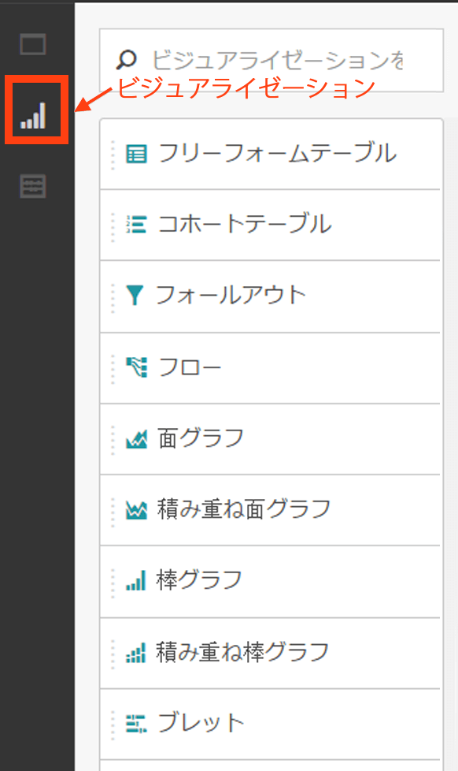
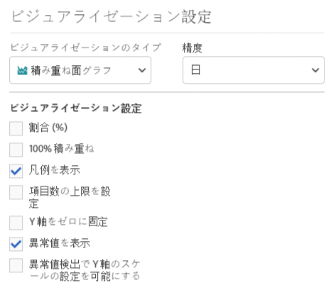
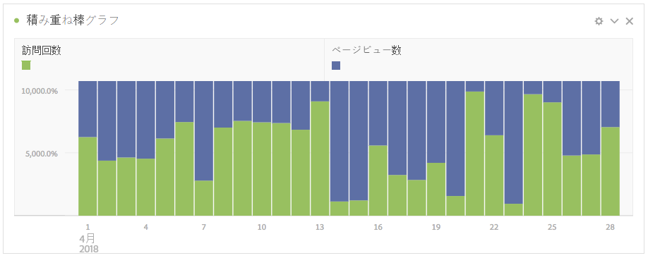
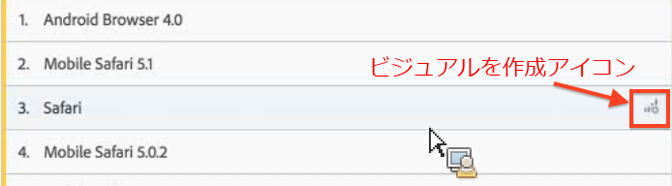
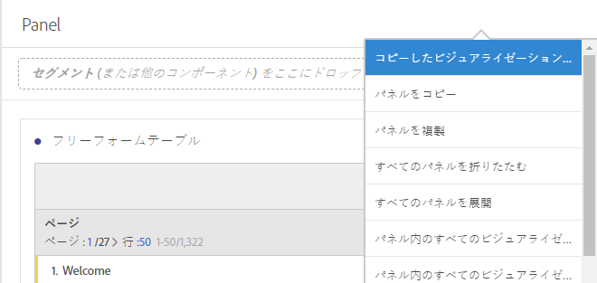
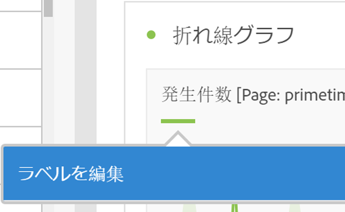

# ビジュアライゼーションの概要

Analysis Workspace のビジュアライゼーションおよびビジュアライゼーション設定について説明します。

[Visualization Types in Analysis Workspace on YouTube](https://www.youtube.com/watch?v=b1zLEywRa6w&index=39&list=PL2tCx83mn7GuNnQdYGOtlyCu0V5mEZ8sS) (2:57)

## Visualizations panel {#section_DC07F032FBEF4046A40F7B95C28DA018}

ビジュアライゼーションパネルを表示するには、サイドパネルで「**[!UICONTROL ビジュアライゼーション]」をクリックします。**

Adobe Analytics を使用したことのあるユーザーにとって、大半のビジュアライゼーションタイプ（面グラフ、棒グラフ、ドーナツグラフ、折れ線グラフなど）は馴染みのあるものです。しかし、Analysis Workspace にはビジュアライゼーション設定があり、インタラクティブ機能を備えた新しいまたは独自のビジュアライゼーションタイプを数多く揃えています。

## Visualization settings {#section_D3BB5042A92245D8BF6BCF072C66624B}

「[!UICONTROL ビジュアライゼーション設定]」にアクセスするには、[!UICONTROL フリーフォームパネル]にビジュアライゼーションをドラッグした後、[!UICONTROL ビジュアライゼーション設定]ギアアイコンをクリックします。

>[!IMPORTANT]
>
>表示されるビジュアライゼーション設定は、ビジュアライゼーションによって異なります。 すべてのビジュアライゼーションにすべての設定が適用されるわけではありません。さらに一部の詳細設定は、特定のビジュアライゼーションの場合に&#x200B;**のみ**&#x200B;表示されます（例えば[ヒストグラム設定](../../../analyze/analysis-workspace/visualizations/histogram.md#section_09D774C584864D4CA6B5672DC2927477)）。

<table id="table_E0695243886046979EE609FAE5D6EA00"> 
 <thead> 
  <tr> 
   <th colname="col1" class="entry"> 設定 </th> 
   <th colname="col2" class="entry"> 説明 </th> 
  </tr> 
 </thead>
 <tbody> 
  <tr> 
   <td colname="col1"> 
割合（％） 
 </td> 
   <td colname="col2"> 
値を割合で表示します。 
 </td> 
  </tr> 
  <tr> 
   <td colname="col1"> 
100% の積み重ね 
 </td> 
   <td colname="col2"> 
この設定は、積み重ね面、積み重ね棒または積み重ね横棒グラフのビジュアライゼーションを「100% の積み重ね」に変更します。例： 
 
 
 </td> 
  </tr> 
  <tr> 
   <td colname="col1"> 
凡例を表示 
 </td> 
   <td colname="col2"> 
数値の概要／変更概要ビジュアライゼーションのフィルター詳細テキストを隠すことができます。 
 </td> 
  </tr> 
  <tr> 
   <td colname="col1"> 
項目数の上限を設定 
 </td> 
   <td colname="col2"> 
ビジュアライゼーションで表示する項目の数を制限できます。 
 </td> 
  </tr> 
  <tr> 
   <td colname="col1"> 
Y 軸をゼロに固定 
 </td> 
   <td colname="col2"> 
 グラフに示されるすべての値がゼロよりもかなり上の場合、グラフのデフォルトでは、Y 軸の一番下はゼロ以外になります。このボックスをチェックすると、Y 軸は強制的にゼロになります（グラフは再描画されます）。 
 </td> 
  </tr> 
  <tr> 
   <td colname="col1"> 
正規化 
 </td> 
   <td colname="col2"> 
指標を均等な比率にします。See <a href="https://marketing.adobe.com/resources/help/en_US/reference/normalization.html" format="https" scope="external"> Normalization</a>. 
 </td> 
  </tr> 
  <tr> 
   <td colname="col1"> 
二重軸を表示 
 </td> 
   <td colname="col2"> 
Only applies if you have two metrics - you can have a y-axis on the left (for one metric) and on the right (for the other metric). 
 </td> 
  </tr> 
  <tr> 
   <td colname="col1"> 
異常値を表示 
 </td> 
   <td colname="col2"> 
折れ線グラフおよびフリーフォームテーブルを強化して、データの異常値を表示します。 
 </td> 
  </tr> 
 </tbody> 
</table>

## Create Visual icon {#section_9C11D9DEDC42413AA53E69A71A509DFC}

どのビジュアライゼーションが選択されているかわからない場合は、テーブルの行にある&#x200B;**[!UICONTROL ビジュアルを作成]アイコンをクリックします。**&#x200B;このアイコンは、テーブルの行の上にマウスポインターを置くと表示されます。クリックすると、データに最適なビジュアライゼーションを Analysis Workspace が学習に基づいて推測することの確認が表示されます。例えば、最大 3 セグメントを選択した場合、ベン図が作成されます。3 セグメントを超える場合、棒グラフが作成されいます。他のタイプのデータの場合、折れ線グラフなどが作成されます。

## Right-click visualization/panel menu {#section_05B7914D4C9E443F97E2BFFDEC70240C}

グラフのコンテキスト設定は、ビジュアライゼーションまたはパネルヘッダーの隣を右クリックするとアクセスできます。次の設定の一部またはすべてを利用できます。

| 設定 | 説明 |
|--- |--- |
| コピーしたビジュアライゼーション／パネルを挿入 | コピーした要素をプロジェクト内の別の場所、または完全に別のプロジェクトに貼り付ける（「挿入する」）ことができます。 |
| ビジュアライゼーション／パネルをコピー | 右クリックしてビジュアライゼーションまたはパネルをコピーできます。 |
| ビジュアライゼーション／パネルを複製 | 現在のビジュアライゼーションの厳密な複製を作成して、修正できます。 |
| すべてのパネルを折りたたむ | すべてのプロジェクトパネルを折りたたみます。 |
| パネル内のすべてのビジュアライゼーションを折りたたむ | そのプロジェクトパネルのすべてのビジュアライゼーションを折りたたみます。 |
| すべてのパネルを展開 | すべてのプロジェクトパネルを展開します。 |
| パネル内のすべてのビジュアライゼーションを展開 | そのプロジェクトパネルのすべてのビジュアライゼーションを展開します。 |
| 説明を編集 | ビジュアライゼーション／パネルの説明テキストを追加（または編集）します。この説明は、プロジェクト／プロジェクト情報および設定に表示されます。 |
| パネルリンクを取得 | プロジェクト内の特定のパネルに他のユーザーを誘導することができます。 |
| ビジュアライゼーションリンクを取得 | 他のユーザーをこのビジュアライゼーションに直接移動させるこのリンクをコピーして共有できます。ユーザーはログインする必要があります。 |
| やり直し | （フロー、ベン、ヒストグラムで動作）現在のビジュアライゼーションの設定を削除して、新しいパネルを開き、ビジュアライゼーションを再設定できます。 |

## Edit legend labels {#section_94F1988CB4B9434BA1D9C6034062C3DE}

使いやすくするために、ビジュアライゼーション凡例の系列名を変更できます（フォールアウト、面グラフ、積み重ね面グラフ、棒グラフ、積み重ね棒グラフ、ドーナツ、ヒストグラム、横棒グラフ、積み重ね横棒グラフ、折れ線グラフ、散布図、ベン図）。

凡例の編集は、ツリーマップ、ブレットグラフ、変更概要または数値の概要、テキスト、フリーフォーム、ヒストグラム、コホートまたはフローのビジュアライゼーションには&#x200B;**適用されません**。

折れ線グラフの凡例ラベルを編集するには、例えば、次のようにします。

1. 凡例ラベルの 1 つを右クリックします。
1. Click **[!UICONTROL Edit Label]**.

   

1. 新しいラベルテキストを入力します。
1. **[!UICONTROL Enter]キーを押して保存します。**

このトピックに関する[ビデオへのリンクはこちら](https://www.youtube.com/watch?v=mry3vDrTml0&index=61&list=PL2tCx83mn7GuNnQdYGOtlyCu0V5mEZ8sS)です。
