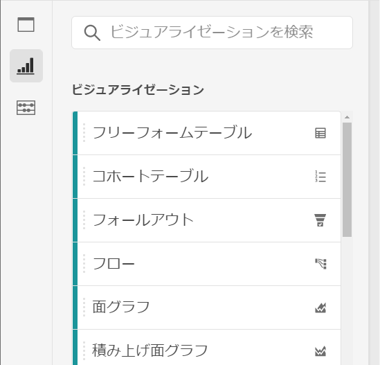
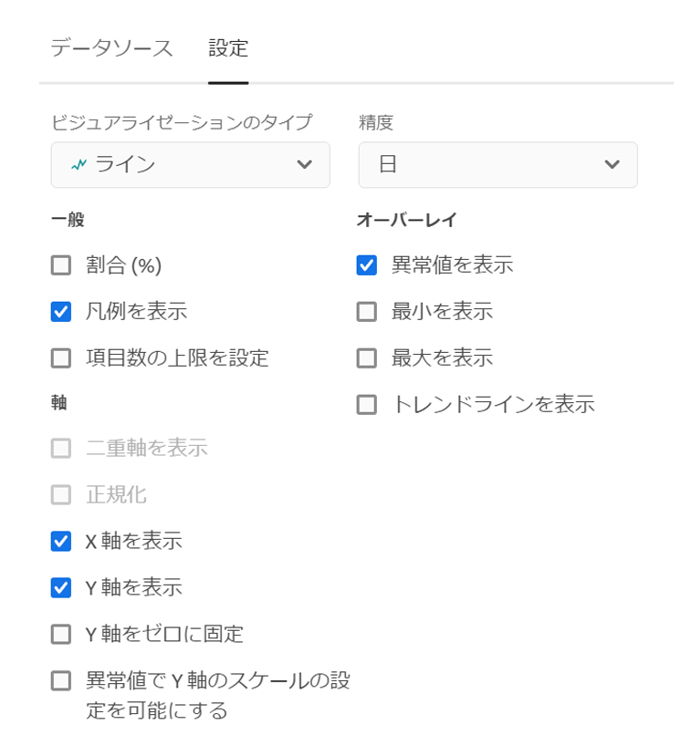
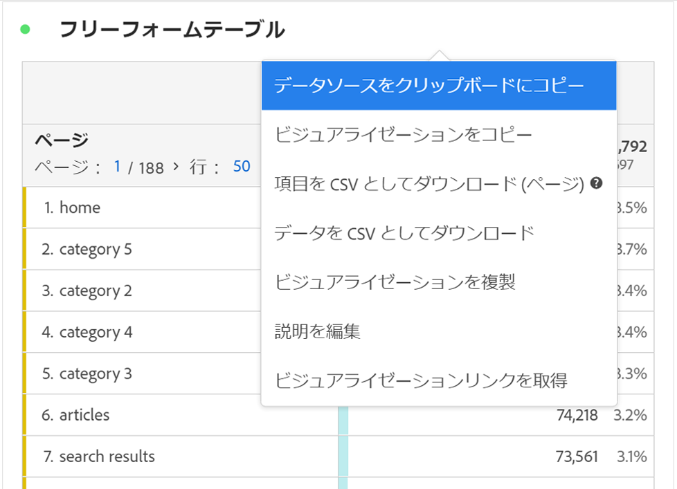
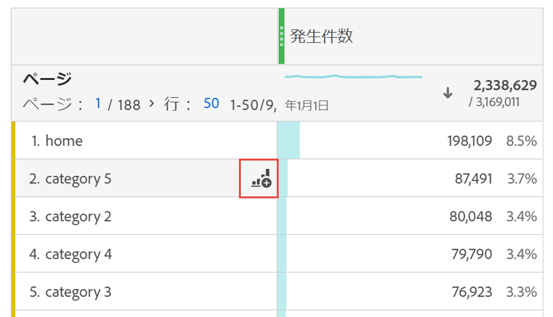

# ビジュアライゼーションの概要

Workspace オファーには、棒グラフ、ドーナツグラフ、ヒストグラム、折れ線グラフ、マップ、散布図など、データを視覚的に表現する様々なビジュアライゼーションがあります。Adobe Analyticsを使用すると、ほとんどのビジュアライゼーションタイプが見慣れています。 しかし、Analysis Workspace にはビジュアライゼーション設定があり、インタラクティブ機能を備えた新しいまたは独自のビジュアライゼーションタイプを数多く揃えています。

ビジュアライゼーションには、Workspaceの左上のアイコン、[空白のパネル](https://experienceleague.adobe.com/docs/analytics/analyze/analysis-workspace/panels/blank-panel.html?lang=ja)、またはワークフローの右クリックメニューからアクセスできます。

Analysis Workspaceでは、次のビジュアライゼーションタイプを使用できます。

| ビジュアライゼーション名 | 説明 |
| --- | --- |
| [面グラフ](/help/analyze/analysis-workspace/visualizations/area.md) | 折れ線グラフのように見えますが、線の下に色付きの領域があります。 指標が複数あり、2 個以上の指標の交差により表現される領域を視覚化する場合は、面グラフを使用します。 |
| [棒グラフ](/help/analyze/analysis-workspace/visualizations/bar.md) | 1 つ以上の指標の様々な値を表す縦棒グラフが表示されます。 |
| [ブレットグラフ](/help/analyze/analysis-workspace/visualizations/bullet-graph.md) | 目的の値が、他のパフォーマンス範囲（目標）と照らし合わせて、どのように比較または測定されるかを示します。 |
| [コホートテーブル](/help/analyze/analysis-workspace/visualizations/cohort-table/cohort-analysis.md) | *`cohort`* とは、特定の期間、共通の特性を共有する人々のグループのことです。コホート分析は、保持、変化、または遅延の分析に役立ちます。 |
| [ドーナツ](/help/analyze/analysis-workspace/visualizations/donut.md) | このビジュアライゼーションは、円グラフと同様に、データを全体の一部または断片として表示します。 |
| [フォールアウト](/help/analyze/analysis-workspace/visualizations/fallout/fallout-flow.md) | フォールアウトレポートは、事前に指定した一連のページ間で、訪問者が離脱した（フォールアウト）箇所や、次に進んだ（フォールスルー）箇所を表示します。最終的または正確なシーケンスに設定できます |
| [フロー](/help/analyze/analysis-workspace/visualizations/c-flow/flow.md) | Webサイトやアプリ内での正確な顧客パスを表示します。 |
| [フリーフォームテーブル](/help/analyze/analysis-workspace/visualizations/freeform-table/freeform-table.md) | フリーフォームテーブルは、単なるデータテーブルではなく、インタラクティブなビジュアライゼーションです。これは、Workspaceのデータ分析の基盤です。 |
| [ヒストグラム](/help/analyze/analysis-workspace/visualizations/histogram.md) | ヒストグラムグループは、指標の量に基づいて、訪問者、訪問またはヒットをグループにまとめます。 |
| [横棒グラフ](/help/analyze/analysis-workspace/visualizations/horizontal-bar.md) | 1 つ以上の指標の様々な値を表す横棒グラフが表示されます。 |
| [行](/help/analyze/analysis-workspace/visualizations/line.md) | 時間の経過に伴う値の変化を確認できるように、折れ線で指標が表されます。折れ線グラフは、X軸に沿った時間を使用します。 |
| [マップ](/help/analyze/analysis-workspace/visualizations/map-visualization.md) | 任意の指標（計算指標を含む）のビジュアルマップを作成できます。 |
| [散布図](/help/analyze/analysis-workspace/visualizations/scatterplot.md) | ディメンション項目と最大 3 つの指標の関係を表示します。 |
| [概要番号](/help/analyze/analysis-workspace/visualizations/summary-number-change.md) | 選択したセルを1つの大きな数値として表示します。 |
| [変更の概要](/help/analyze/analysis-workspace/visualizations/summary-number-change.md) | 選択したセル間の変化を1大きい数値/パーセントで表示します。 |
| [テキスト](/help/analyze/analysis-workspace/visualizations/text.md) | ユーザー定義のテキストを Workspace に追加できます。パネル/ビジュアライゼーションの説明に加えて、分析とインサイトに追加のコンテキストを追加するのに役立ちます。 |
| [ツリーマップ](/help/analyze/analysis-workspace/visualizations/treemap.md) | ネストされた長方形の集まりとして、（ツリー構造の）階層データが表示されます。 |
| [ベン](/help/analyze/analysis-workspace/visualizations/venn.md) | 円を使用して、最大3つのセグメントの指標の重なりを表現します。 |

## 設定 {#settings}

各ビジュアライゼーションには、管理可能な独自の設定があります。[!UICONTROL ビジュアライゼーション設定]にアクセスするには、[!UICONTROL ビジュアライゼーション設定]歯車アイコンをクリックします。

| 設定 | 説明 |
| --- | --- |
| ビジュアライゼーションタイプ | データを表現するために使用するビジュアルのタイプを変更します。 |
| 精度 | トレンドのビジュアライゼーションでは、時間の精度（日、週、月など）を 」をクリックします。 この変更は、データソーステーブルにも適用されます。 |
| 割合（％） | 値を割合で表示します。 |
| 100% の積み重ね | 積み重ね面グラフ、棒グラフ、横棒グラフの積み重ねビジュアライゼーションでこの設定を選択すると、グラフが「100%積み重ね」ビジュアライゼーションに変わります。 例： |
| 凡例を表示 | 数の概要/変更概要ビジュアライゼーションの詳細な凡例テキストを非表示にできます。 |
| 項目数の上限を設定 | ビジュアライゼーションで表示する項目の数を制限できます。 |
| Y 軸をゼロに固定 | グラフに示されるすべての値がゼロよりもかなり上の場合、グラフのデフォルトでは、Y 軸の一番下はゼロ以外になります。このボックスをチェックすると、Y 軸は強制的にゼロになります（グラフは再描画されます）。 |
| 正規化 | 指標を均等な比率にします。これは、プロットされた指標の大きさが非常に異なる場合に役立ちます。 |
| 二重軸を表示 | 2 つの指標がある場合にのみ適用されます。（ある指標の）Y 軸を左側に、（他の指標の）Y 軸を右側に表示できます。これは、プロットされた指標の大きさが非常に異なる場合に役立ちます。 |
| 異常値を表示 | 異常値検出を表示することで、折れ線グラフおよびフリーフォームテーブルを強化します。 線のビジュアライゼーションでの異常値検出には、期待値（破線）と期待範囲（影付きの帯）が含まれます。 |

## 凡例 {#legend}

ビジュアライゼーションの凡例を使用すると、ソーステーブルの日付をビジュアライゼーション内のプロットされたシリーズに関連付けることができます。 凡例はインタラクティブです。凡例項目をクリックして、ビジュアライゼーション内のシリーズの表示/非表示を切り替えることができます。 これは、視覚化するデータを簡略化する場合に便利です。

また、凡例ラベルの名前を変更して、ビジュアルをより消耗しやすくすることができます。 注意：凡例の編集は、****&#x200B;に適用されません：ツリーマップ、ブレット、変更概要/数値、テキスト、フリーフォーム、ヒストグラム、コホートまたはフローのビジュアライゼーション。

凡例ラベルを編集するには：

1. 凡例ラベルの 1 つを右クリックします。
1. 「**[!UICONTROL ラベルを編集]**」をクリックします。

   

1. 新しいラベルテキストを入力します。
1. **[!UICONTROL Enter]** キーを押して保存します。

このトピックに関する[ビデオへのリンクはこちら](https://docs.adobe.com/content/help/en/analytics-learn/tutorials/analysis-workspace/visualizations/series-label-editing.html)です。

## 右クリックメニュー {#right-click}

ビジュアライゼーションの追加機能は、ビジュアライゼーションのヘッダーを右クリックすると使用できます。 設定は、ビジュアライゼーションによって異なります。 次の設定を使用できます。

| 設定 | 説明 |
| --- | --- |
| コピーしたパネル／ビジュアライゼーションを挿入 | コピーした要素をプロジェクト内の別の場所、または完全に別のプロジェクトに貼り付ける（「挿入」する）ことができます。 |
| ビジュアライゼーションのコピー | 右クリックしてビジュアライゼーションをコピーし、プロジェクト内の別の場所に挿入したり、完全に別のプロジェクトに挿入したりできます。 |
| [項目を CSV としてダウンロード](https://experienceleague.adobe.com/docs/analytics/analyze/analysis-workspace/curate-share/download-send.html?#download-items) | 選択したディメンションの最大50,000個のディメンション項目をCSVとしてダウンロードできます。 |
| [データを CSV としてダウンロード](https://experienceleague.adobe.com/docs/analytics/analyze/analysis-workspace/curate-share/download-send.html?#download-data) | ビジュアライゼーションデータソースをCSVとしてダウンロードします。 |
| 重複ビジュアライゼーション | 現在のビジュアライゼーションの厳密な複製を作成して、修正できます。 |
| 説明を編集 | ビジュアライゼーションの追加説明テキストを編集（または編集）します。 |
| ビジュアライゼーションリンクを取得 | ユーザーをプロジェクト内の特定のビジュアライゼーションに誘導できます。 リンクをクリックすると、受信者は、リンク先の正確なビジュアライゼーションに導かれる前にログインする必要があります。 |
| やり直し | （フロー、ベン、ヒストグラムで機能）現在のビジュアライゼーションの設定を削除し、ゼロから再設定できるようにします。 |

## ビジュアルを作成アイコン {#quick-viz}

どのビジュアライゼーションを選択するかが不明な場合は、任意のテーブル行の&#x200B;**[!UICONTROL ビジュアルを作成]**&#x200B;アイコンをクリックします（カーソルを合わせたときに使用できます）。 これは、ビジュアライゼーションを追加する最も速い方法です。 クリックすると、データに最適なビジュアライゼーションを Analysis Workspace が学習に基づいて推測することの確認が表示されます。例えば、1行を選択した場合、トレンド折れ線グラフが作成されます。 3つのセグメント行を選択した場合は、ベン図が作成されます。

