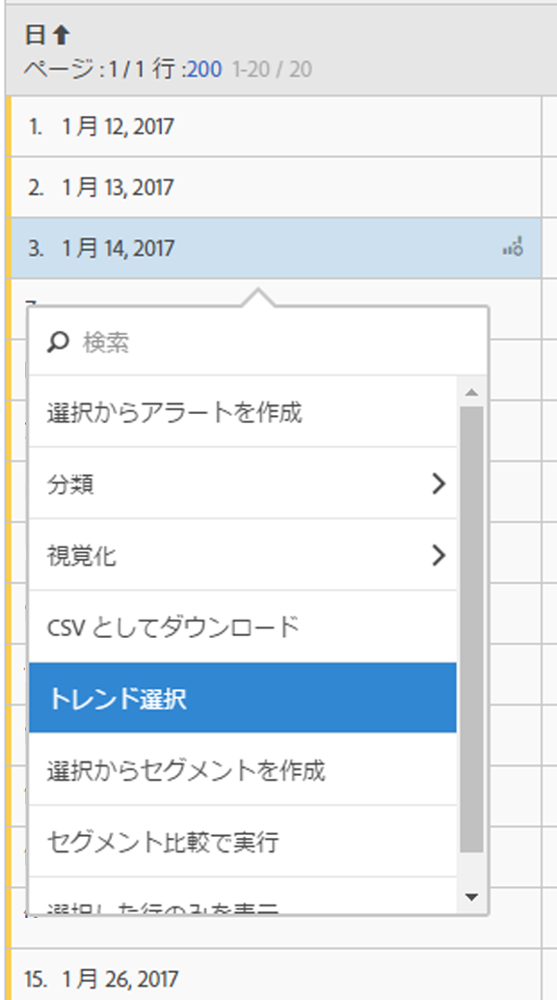

# フリーフォームテーブル

Analysis Workspace のデータテーブル（フリーフォームテーブル）は、単なるレポートデーブルではなく、インタラクティブなビジュアライゼーションです。個別の行、選択した複数の行またはテーブル全体を操作することができます。

テーブルに最大 400 行を表示できます。

独自の方法でテーブルを操作できます。

* テーブルの選択範囲からの[アラートの作成](/help/components/c-alerts/alert-builder.md)
* 実行[分類](../../../analyze/analysis-workspace/components/dimensions/t-breakdown-fa.md#task_B594DA2476E84DFDA8279E831F0BD9C4)の実行とインラインセグメントの作成（右クリック）
* Run [visualizations](../../../analyze/analysis-workspace/visualizations/freeform-analysis-visualizations.md#concept_09242627629147A88A68F1506954C276) on specific cells
* Export rows to [CSV](../../../analyze/analysis-workspace/curate-share/download-send.md#concept_BB548979F47F45739679B830428C3025)
* 選択したセルからの[トレンド](../../../analyze/analysis-workspace/analysis-workspace-features.md#section_34930C967C104C2B9092BA8DCF2BF81A)のビジュアライゼーションの実行
* 選択からの  [セグメント](../../../analyze/analysis-workspace/components/t-freeform-project-segment.md#task_11C6A2C7717B48049E5750B9D20FEC80)の作成
* [セグメント比較の実行](../../../analyze/analysis-workspace/c-panels/c-segment-comparison/segment-comparison.md#concept_74FAC1C6D0204F9190A110B0D9005793)
* 選択した行のみを表示

See [Create an Analysis Workspace project](../../../analyze/analysis-workspace/build-workspace-project/t-freeform-project.md#task_C2C698ACC7954062A28E4784911E6CF2) for more information.
