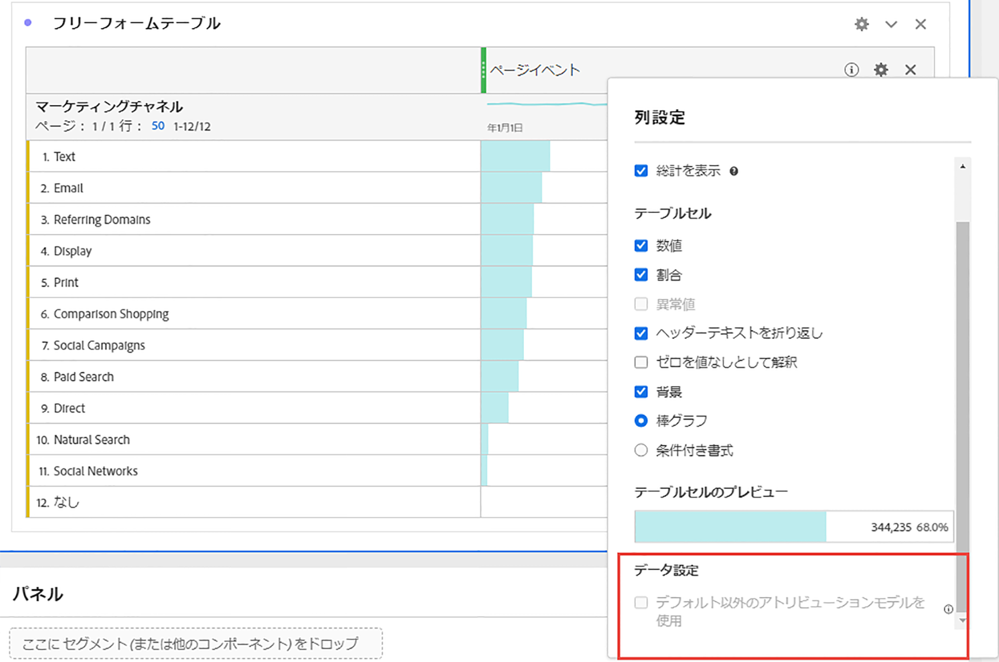
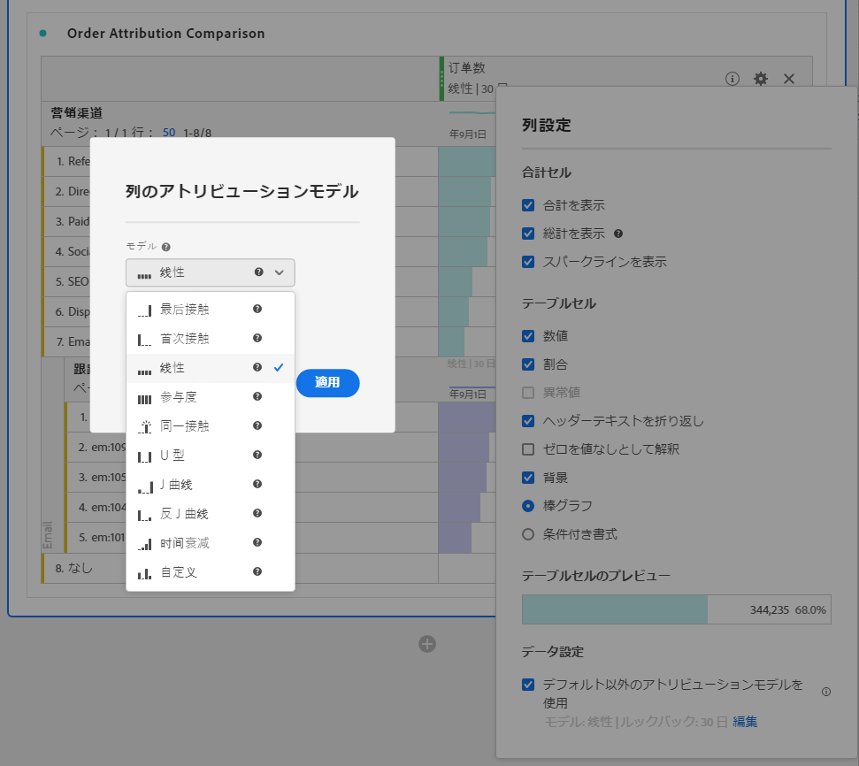

# 列設定

[!UICONTROL 列設定]では、列の書式を設定できます。一部の列には条件付き書式を設定することもできます。

>[!BEGINSHADEBOX]

デモビデオについて詳しくは、 [フリーフォームテーブルの行と列の設定](https://video.tv.adobe.com/v/328502/?quality=12&learn=on&captions=jpn){target="_blank"}を参照してください。

>[!ENDSHADEBOX]

[!UICONTROL 列設定]にアクセスするには、列見出しで  を選択します。

一度に複数の列の設定を編集できます。複数の列を選択し、選択した列のいずれかで「」を選択します。加えた変更が、選択されているセルを含むすべての列に適用されます。

| オプション | 説明 |
| --- | --- |
| **[!UICONTROL 合計を表示]** | 列のクライアントサイドの合計を表示します。この合計では、セッションやユーザーなどの指標を重複排除することは&#x200B;**ありません**。 |
| **[!UICONTROL 総計を表示]** | 列のサーバーサイドの合計を表示します。総計では、セッションやユーザーなどの指標を重複排除します。 |
| **[!UICONTROL スパークラインを表示]** | 列見出しに折れ線グラフを表示します。 |
| **[!UICONTROL 数値]** | セルに指標の数値を表示／非表示にするかどうかを決定します。例えば、指標がページビュー数の場合、数値は行項目のページ表示回数になります。 |
| **[!UICONTROL 割合]** | セルに指標の割合の値を表示／非表示にするかどうかを決定します。例えば、指標がページビュー数の場合、割合の値は行項目のページ表示回数を列の合計ページ表示回数で割った数になります。メモ：100％を超える割合は、正確であることが保証されます。上限を 1,000％に移動すると、列の幅が大きくなりすぎるのを防ぐことができます。 |
| **[!UICONTROL 異常値を表示]** | この列の値に対して異常値検出を実行するかどうかを決定します。 |
| **[!UICONTROL 予測を表示]** | この列に予測値を表示するかどうかを決定します。 |
| **[!UICONTROL ヘッダーテキストを折り返し]** | ヘッダーを読みやすく、またテーブルを共有しやすくするため、フリーフォームテーブルでヘッダーテキストを折り返します。折り返しは、PDF レンダリングや名前の長い指標に役立ちます。デフォルトで有効です。 |
| **[!UICONTROL ゼロを値なしとして解釈]** | 値が 0 のセルについて、0 と空白のどちらを表示するかを決定します。この解釈は、月の各日のデータを確認する際、一部の日が将来の日付である場合に役立ちます。将来の日付に、0 の代わりに空白のセルが表示されます。グラフにも、この設定が適用されます（つまり、グラフには値が 0 の折れ線や棒は表示されません）。 |
| **[!UICONTROL 背景]** | セルのすべての書式（棒グラフや条件付き書式など）をセルに表示／非表示にするかどうかを決定します。 |
| **[!UICONTROL 棒グラフ]** | 列の合計に相対的なセルの値を示す横棒グラフを表示します。 |
| **[!UICONTROL 条件付き書式]** | 条件付き書式を使用します。次の[節](#conditional-formatting)を参照してください。 |
| **[!UICONTROL テーブルのセルのプレビュー]** | 現在選択されている書式オプションを適用した、各セルの表示のプレビュー。 |
| **[!UICONTROL デフォルト以外のアトリビューションモデルを使用]** | デフォルト以外のアトリビューションモデルを使用します。次の[節](#use-non-default-attribution-model)を参照してください。 |

## 条件付き書式 {#conditional-formatting}

条件付き書式により、上限、中間点、下限を定義して書式を適用できます。また、[!UICONTROL カスタム]制限を選択した場合を除き、フリーフォームテーブル内での条件付き書式の適用も分類で自動的に有効になります。

| 条件付き書式オプション | 説明 |
| --- | --- |
| **[!UICONTROL 割合制限を使用]** | 絶対値ではなくパーセンテージに基づいて制限範囲を変更します。割合制限範囲は、割合にのみ基づく指標（バウンス率など）と、カウントと割合を持つ指標（ページビュー数など）に対して機能します。 |
| **[!UICONTROL 自動生成]** | データに基づいて自動的に上限／中間／下限を計算する。上限は、この列の最大値です。下限は最小値であり、中間点は上限と下限の平均値です。 |
| **[!UICONTROL カスタム]** | **[!UICONTROL 上限]**、**[!UICONTROL 中間点]**、**[!UICONTROL 下限]**&#x200B;を手動で割り当てます。制限により、列の値が良好、平均、不良になるタイミングを柔軟に決定できます。 |
| **[!UICONTROL 条件付き書式パレット]** | 事前設定済みのカラーセットをセルに適用します。選択した 4 つの使用可能なカラースキームに応じて、高い値、中間値、低い値に異なるカラーが割り当てられます。 テーブルのディメンションを置き換えると、条件付き書式の制限がリセットされます。指標を置き換えると、その列の制限が再計算されます（指標が X 軸、ディメンションが Y 軸で示される場合）。 |

## デフォルト以外のアトリビューションモデルの使用 {#use-non-default-attribution-model}

<!-- markdownlint-disable MD034 -->

>[!CONTEXTUALHELP]
>id="workspace_freeformtable_column_usenondefaultattributionmodel"
>title="デフォルト以外のアトリビューションモデルの使用"
>abstract="選択した列に対してデフォルト以外のアトリビューションモデルを有効にします。"

<!-- markdownlint-enable MD034 -->

<!-- markdownlint-disable MD034 -->

>[!CONTEXTUALHELP]
>id="workspace_freeformtable_column_usenondefaultattributionmodel_disabled"
>title="デフォルト以外のアトリビューションモデルの使用"
>abstract="この指標では、デフォルト以外のアトリビューションモードは使用できません。"

<!-- markdownlint-enable MD034 -->

>[!NOTE]
>
>コンポーネントのアトリビューションをデフォルト以外のアトリビューションモデルに更新する場合は、次の点を考慮してください。
>
>* ***単一のディメンション*を持つレポートでコンポーネントを使用する場合：**&#x200B;デフォルト以外のアトリビューションモデルを使用する場合、コンポーネントのアトリビューションでは配分モデルが無視されます。
>
>* ***複数のディメンション*を持つレポートでコンポーネントを使用する場合：**&#x200B;デフォルト以外のアトリビューションモデルを使用する場合、コンポーネントのアトリビューションでは配分モデルが保持されます。
>
>

Analysis Workspace の指標にデフォルト以外のアトリビューションモデルを使用するには：

1. 「**[!UICONTROL デフォルト以外のアトリビューションモデルを使用]**」を選択します。既に選択している場合は、**[!UICONTROL 編集]**&#x200B;を使用してアトリビューションモデルを編集します。または、選択解除して、デフォルトのアトリビューションモデルに戻ります。

   

2. **[!UICONTROL 列アトリビューションモデル]**&#x200B;で、「**[!UICONTROL モデル]**」と「**[!UICONTROL ルックバックウィンドウ]**」を選択します。ルックバックウィンドウでは、各コンバージョンに適用されるデータアトリビューションのウィンドウを決定します。

   

### アトリビューションモデル

{{attribution-models-details}}

### コンテナ

{{attribution-container}}

### ルックバックウィンドウ

{{attribution-lookback-window}}

### 例

{{attribution-example}}

>[!MORELIKETHIS]
>
>* [データソースの管理](/help/analyze/analysis-workspace/visualizations/t-sync-visualization.md)

>[!BEGINSHADEBOX]

デモビデオについて詳しくは、 [動的列](https://video.tv.adobe.com/v/38416?quality=12&learn=on&captions=jpn){target="_blank"}を参照してください。

>[!ENDSHADEBOX]

