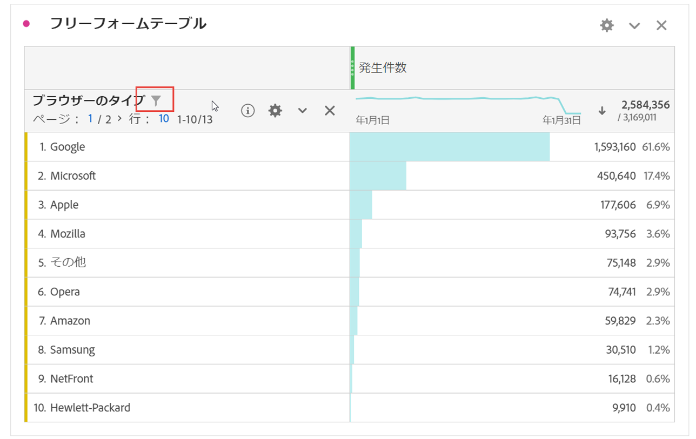
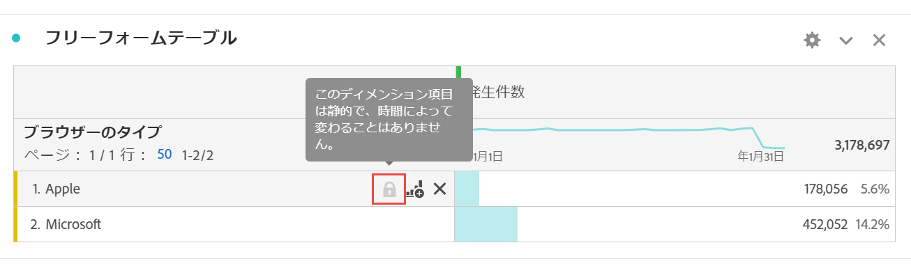
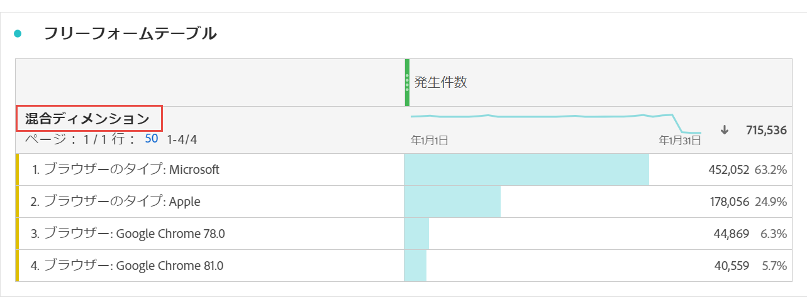

# フリーフォームテーブルの動的ディメンション項目と静的ディメンション項目

フリーフォームテーブルでは、行と列に様々なコンポーネント値を含めることができます。これらの値は、作成する分析に応じて、動的（時間に応じて変更）または静的（時間に応じて変更しない）にできます。

## 動的ディメンション項目

動的ディメンション項目は、時間と共に変化し、フリーフォームテーブルで並べ替えられている指標に依存します。特定の期間のトップ項目を分析する場合は、動的ディメンション項目をお勧めします。

フリーフォームテーブルにディメンションをドロップすると、動的な行が返されます。これらは、指定した指標と期間のディメンションに対応するトップ項目を表します。また、ディメンションをフリーフォームテーブルの列にドロップすると、ディメンションを自動的に上位 5 つのディメンション項目に展開します。

例えば、ブラウザータイプディメンションをテーブルにドラッグすると、上位のブラウザータイプディメンション項目（Microsoft、Apple、Google など） が動的にテーブル行に戻ります。列にドロップすると、上位 5 つのブラウザータイプディメンション項目が動的に返されます。

動的ディメンション項目には行フィルターオプションがありますが、ロックと X アイコンは&#x200B;**ありません**。

## 静的ディメンション項目

静的ディメンション項目は、時間と共に変化しません。これらは、常にフリーフォームテーブルに返される固定コンポーネントです。静的ディメンション項目は、同じ項目（特定のキャンペーンでも週の特定の曜日でも）を常に分析する場合にお勧めします。

特定のコンポーネント値（ディメンション、指標、セグメント、日付範囲）を手動で選択してテーブルにドロップすると、常に行または列の静的なリストが作成されます。静的ディメンション項目は、次のようにも作成できます。

* 行から右クリック／[!UICONTROL 選択した行のみ表示]
* 列から右クリック／[!UICONTROL 項目を静的にする]

例えば、Microsoft や Apple などの特定のブラウザータイプ項目にドラッグすると、その 2 つの特定の項目が常にテーブルに取り込まれます。

静的ディメンション項目には行フィルターオプションは&#x200B;**ありません**。代わりに、各項目にロックアイコンと X アイコンが表示されます。X アイコンをクリックして、テーブルからそのディメンション項目を削除します。

## 混在ディメンション項目

異なるディメンションのディメンション項目を同じテーブルに追加できます。この場合、行ヘッダーには「混在ディメンション」と表示されます。これらのディメンション項目は静的です。例えば、「ブラウザータイプ」ディメンションから特定のディメンション項目を追加し、「ブラウザー」ディメンションから他のディメンション項目を追加します。

## フリーフォームの合計行数

フリーフォーム合計行での動的な行と静的な行の動作は異なります。デフォルトでは:：

* 動的な行はサーバーサイドで合計され、訪問数や訪問者数などの指標の重複を取り除きます。
* 静的な行は、クライアントサイドで合計され、重複を取り除き&#x200B;**ません**。サーバーサイドの合計行を計算するには、「行」設定を「**総合計を表示**」に変更します。[詳細情報](https://docs.adobe.com/content/help/ja-JP/analytics/analyze/analysis-workspace/visualizations/freeform-table/workspace-totals.html)
