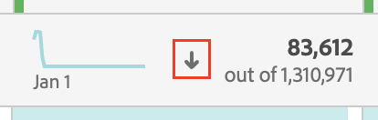

# フリーフォームテーブルのフィルタリングと並べ替え

Analysis Workspace のフリーフォームテーブルは、インタラクティブなデータ分析の基盤となります。そのため、何千行もの情報を含めることができます。データのフィルタリングと並べ替えは、最も重要な情報を効率的に表示するための重要な要素になる可能性があります。

## テーブルのフィルタリング

Analysis Workspace のフィルターは、最も重要な情報を表示するのに役立ちます。

>[!NOTE]
>
> 動的ディメンション項目のみを、この節で説明するようにフィルタリングできます。 静的ディメンション項目はフィルタリングできません。 詳しくは、[ フリーフォームテーブルの動的ディメンション項目と静的ディメンション項目 ](/help/analyze/analysis-workspace/visualizations/freeform-table/column-row-settings/manual-vs-dynamic-rows.md) を参照してください。

## フリーフォームテーブルの行のフィルタリング

いくつかの方法を使用して、フリーフォームテーブルの行をフィルタリングできます。 

- 行の「X」をクリックします
- テーブルフィルター
- セグメント化

各方法が与える影響 [ フリーフォームテーブルの合計 ](/help/analyze/analysis-workspace/visualizations/freeform-table/workspace-totals.md) を必ずお読みください。

### テーブルから特定の行をすばやく除外

フィルターダイアログを開かなくても、特定の行をテーブルからすばやく除外できます。

>[!NOTE]
>
>この節で説明するように行を除外する場合、詳細フィルターダイアログでは [!UICONTROL **常に項目を除外**] ルールが自動的に適用されます。 （適用されたルールを表示するには、フィルターアイコン、「詳細を表示 [**[!UICONTROL  の順に選択します ]**](#apply-a-simple-or-advanced-filter-to-a-table)。

フリーフォームテーブルから特定の行をすばやく除外するには、次の手順に従います。

1. 除外する行にポインタを合わせて、「x」アイコンを選択します。

   Shift キーを押しながら行の範囲を選択するか、Command キー（Macの場合）または Ctrl キー（Windows の場合）を押しながら複数の行を選択します。

<!--### Right-click > Delete selected rows

Note: this option does not seem to work. AN-338422

1. Select 1 or more rows. 
1. Right-click and select **[!UICONTROL Delete Selected Rows]**. 

   This action will remove the rows from the table and apply a table filter.-->

### テーブルへの単純フィルターまたは詳細フィルターの適用

フリーフォームテーブルでデータをフィルタリングするには：

1. フィルター処理するデータを含んだ列の上にマウスポインターを置きます。<!--only some types of columns show the filter... Which? Just Dimensions?-->

1. **フィルター**&#x200B;アイコンが表示されたら選択します。

   

   次のオプションがあります。

   | オプション | 関数 |
   |---------|----------|
   | [!UICONTROL **検索語句**] | フィルターに使用する単語または語句を指定します。 指定した単語または指定したとおりの語句を含んだ行のみが表示されます。 |
   | [!UICONTROL **未指定 (なし) を含む**] | テーブルのどのディメンションにも該当しないデータをテーブルに表示するには、このオプションを選択します。 <!--what is this?--> |

1. （オプション）異なる条件または複数の条件でフィルタリングする場合は、「[!UICONTROL **詳細を表示**]」を選択します。

   次の詳細フィルターオプションを使用できます。

   | オプション | 関数 |
   |---------|----------|
   | [!UICONTROL **未指定 (なし) を含む**] | テーブルのどのディメンションにも該当しないデータをテーブルに表示するには、このオプションを選択します。 <!--what is this?--> |
   | [!UICONTROL **次に一致**] | 
指定したすべての条件を満たすデータのみを表示するには、「[!UICONTROL **すべての条件を満たしている場合**]」を選択します。通常、このオプションを使用すると、データの精度が上がります。
 
指定したいずれかのフィルター条件を満たすデータを表示するには、「[!UICONTROL **いずれかの条件を満たしている場合**]」を選択します。通常、このオプションを選択すると、データの精度が下がります。
 |
   | [!UICONTROL **条件**] | 
次のフィルターオプションから選択します。

（複数のフィルター条件を追加するには、「[!UICONTROL **行を追加**]」を選択します。「[!UICONTROL **次に一致**]」セクションで選択するオプションによって、追加する条件のすべてを満たす必要があるか、いずれかを満たす必要があるかが決まります。）
<ul><li>
[!UICONTROL **語句を含む**]：指定したとおりの語句を含んだデータのみが、フィルタリング結果に含まれます。単語は、「[!UICONTROL **検索語句**]」フィールドで指定した順序になっている必要があります。
これは、簡易検索を行う場合のデフォルト設定です。

</li><li>
[!UICONTROL **いずれかの用語を含む**]：指定した語句の 1 つ以上の単語を含んだデータのみが、フィルタリング結果に含まれます。 
</li><li>
[!UICONTROL **すべての用語を含む**]：指定した語句のすべての単語を含んだデータのみが、フィルタリング結果に含まれます。単語は、「[!UICONTROL **検索語句**]」フィールドで指定した順序である必要はありません。
</li><li>
[!UICONTROL **いずれの用語も含まない**]：指定した語句の単語をまったく含まないデータのみが、フィルタリング結果に含まれます。 
</li><li>
[!UICONTROL **語句を含まない**]：指定したとおりの語句を含まないデータのみが、フィルタリング結果に含まれます。単語は、「[!UICONTROL **検索語句**]」フィールドで指定した順序になっている必要があります。
</li><li>
[!UICONTROL **次に等しい**]：指定した語句と完全に一致するデータのみが、フィルタリング結果に含まれます。 
</li><li>
[!UICONTROL **次に等しくない**]：指定した語句と完全には一致しないデータのみが、フィルタリング結果に含まれます。 
</li><li>
[!UICONTROL **次で始まる**]：指定した単語または指定したとおりの語句で始まるデータのみが、フィルタリング結果に含まれます。 
</li><li>
[!UICONTROL **次で終わる**]：指定した単語または指定したとおりの語句で終わるデータのみが、フィルタリング結果に含まれます。 
</li></ul> |
   | [!UICONTROL **常に項目を除外**] | フィルタリングされたデータから除外する項目の名前を指定します。 |

1. 「[!UICONTROL **適用**]」を選択して、データをフィルタリングします。

   フィルターがテーブルに適用されると、**フィルター**&#x200B;アイコン（）が青に変わります。

### セグメント化

詳しくは、[ セグメント化に関するドキュメント ](/help/components/segmentation/seg-home.md) を参照してください。

## テーブルの並べ替え

Analysis Workspaceの指標の列で、フリーフォームテーブルのデータを並べ替えることができます。

現在データの並べ替えに使用されている列のヘッダーに、下向き矢印アイコン（）が表示されます。

フリーフォームテーブルのデータを特定の列で並べ替えるには：

1. データを並べ替える列のタイトルの上にポインタを合わせます。

2. 下向き矢印アイコンが表示されたら選択します。

   

   テーブルのデータは、選択した列で並べ替えられます。
