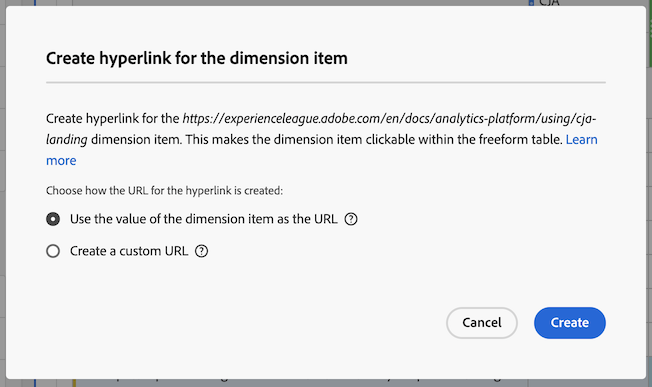

# ハイパーリンクを作成

ディメンション項目にハイパーリンクを作成して、Analysis Workspace のフリーフォームテーブル内でクリックできるようにします。

この機能は、次のタイプのディメンション項目のハイパーリンクを作成する際に特に便利です。

* URL 値を持つディメンション項目（例：ページ URL ディメンション）。

* URL 値を持つ分類を含むディメンション項目（例：ページ URL ディメンションの分類を持つページ名ディメンション）。

* URL の一部である値を持つディメンション項目または分類（例：URL の一部であるページ名ディメンション）。

>[!BEGINSHADEBOX]

デモビデオについては、[Hyperlinks for dimension](https://video.tv.adobe.com/v/3430411?quality=12&learn=on){target="_blank"} を参照してください。

>[!ENDSHADEBOX]

## ハイパーリンクの作成

1 つ以上のディメンション項目のハイパーリンクを作成する際は、次の点を考慮します。

* 作成したハイパーリンクは、Analysis Workspace プロジェクト内のフリーフォームテーブルに保存されます。別のテーブルまたは別のプロジェクトで同じディメンションまたはディメンション項目を使用する際、ハイパーリンクは保持されません。

* フリーフォームテーブルのレポートスイートを変更した場合でも、テーブル内のディメンションまたはディメンション項目に対して作成されたハイパーリンクを使用できます。 この機能では、ディメンションがレポートスイートにまだ存在することを前提としています。

* ハイパーリンクを作成する際に、URL の有効性は確認されません。また、

   * 無効な URL を持つハイパーリンクを作成するか、
   * URL 値を持たないディメンション項目を参照するハイパーリンクを作成すると（ディメンション項目を直接参照するか、`$value` 変数または `$breakdown` 変数を使用する）、

  次に、ハイパーリンクをクリックしたユーザーには、URL が無効であることを示すエラーメッセージが表示されます。

* 単一のディメンション項目に対して作成したハイパーリンクは、ディメンションに対して作成したハイパーリンクを上書きします。

* [ダウンロードした PDF ファイル](/help/analyze/analysis-workspace/curate-share/download-send.md)では、ハイパーリンクは機能しません。

1 つ以上のディメンション項目のハイパーリンクを作成するには：

1. Analysis Workspace のフリーフォームテーブルで、次のいずれかの操作を行います。

   * **単一のディメンション項目のハイパーリンクを作成：**&#x200B;ハイパーリンクを作成するテーブル内のディメンション項目を右クリックし、「[!UICONTROL **ハイパーリンクを作成**]」を選択します。

      1. ディメンション項目のコンテキストメニューを開きます。
      1. コンテキストメニューから「[!UICONTROL **ハイパーリンクを作成**]」を選択します。

         [!UICONTROL **ハイパーリンクを作成**]&#x200B;ダイアログが表示されます。ハイパーリンクを作成するディメンション項目の名前がダイアログに表示されます。

         

   * **ディメンション列内のすべてのディメンション項目にハイパーリンクを作成：**&#x200B;ディメンション列ヘッダーのディメンション名を右クリックし、「[!UICONTROL **すべてのディメンション項目にハイパーリンクを作成**]」を選択します。

      1. ディメンション列ヘッダーからコンテキストメニューを開きます。
      1. コンテキストメニューから「[!UICONTROL **すべてのディメンション項目のハイパーリンクを作成**]」を選択します。

         <!-- Do we really need a screenshot  -->

         [!UICONTROL **すべてのディメンション項目のハイパーリンクを作成**]&#x200B;ダイアログが表示されます。ハイパーリンクを作成するディメンションの名前がダイアログに表示されます。

         

1. 次のオプションから選択します。

   * [!UICONTROL **ディメンション項目の値をURLとして使用**]：ページ URL ディメンションなど、URL 値を持つディメンション項目の場合は、このオプションを選択します。

     例えば、各ディメンション項目の値が URL であるページ URL ディメンションを使用している場合、このオプションを選択すると、URL へのハイパーリンクが作成されます。

   * [!UICONTROL **カスタム URL を作成**]：静的または動的なカスタム URL を指定します。URL 値を持たないディメンション項目のハイパーリンクを作成するには、このオプションを選択します。

     例：各ディメンション項目の値がページ名（完全な URL ではない）であるページ名ディメンションを使用しています。次に、このオプションを選択して、ディメンション項目のリンクとして使用するハイパーリンクを指定します。

     複数のディメンション項目に対して動的な URL を作成する場合は、カスタム URL 内で `$value` 変数と `$breakdown` 変数を使用できます。詳しくは、以下の表を参照してください。

     カスタム URL を作成するには、次の情報を指定します。

     | フィールド | 説明 |
     |---------|----------|
     | [!UICONTROL **カスタム URL**] | ハイパーリンクに使用するカスタム URL を指定します。URL は、完全修飾 URL として入力する必要があります。例：<https://www.example.com>
作成するカスタム URL は、静的または動的にすることができます。
 <ul><li>**静的 URL：**&#x200B;すべてのディメンション項目を同じ URL にリンクする際は、単一のディメンション項目またはすべてのディメンション項目に対して静的 URL を指定できます。例：`https://wiki.internal.example.com/page_name#item_definition`
</li><li>**動的 URL：**&#x200B;複数のディメンション項目や、ディメンション列内のすべてのディメンション項目に対して一意のハイパーリンクを作成する場合は、動的 URL を作成できます。
カスタム URL を動的にするには、ディメンションの値または分類ディメンションの値に基づいて URL を変更する変数を URL に含めます。

変数を使用する際、URL で有効でない文字（スペースなど）を含むディメンション項目は、URL エンコードされます。

使用できる変数は次のとおりです（**メモ**：これらの変数は同じ URL 内で使用できますが、別々に使用する方が一般的です）。
 <ul><li>**`$value`：**&#x200B;指定した URL にディメンション項目の値を挿入できます。 
フリーフォームテーブル内のすべてのページ名ディメンション項目にハイパーリンクを作成するとします。各ディメンション項目の値は、web ページの URL の一部です。この場合、各ディメンション項目に対して動的に調整される単一のカスタム URL を作成できます。 例：`https://example.com/browse/product#\$value`

値が「ProductY」および「ProductZ」のページ名ディメンション項目にこのカスタム URL を適用すると、生成されるハイパーリンクは  `https://example.com/browse/product#ProductY` および  `https://example.com/browse/product#ProductZ` のようになります 

**ヒント**：カスタム URL フィールドに `$value` 変数のみを追加することは、URL の作成時に「[!UICONTROL **ディメンション項目の値を使用**]」オプションを選択することと同じです。
</li><li>**`$breakdown`：**&#x200B;指定した URL に分類ディメンション項目の値を挿入できます。`$breakdown` を使用すると、レポートでわかりやすい名前のディメンション（製品名ディメンションなど）を使用できます。次に、わかりやすくない可能性のある分類ディメンション（製品 ID やページ URL ディメンションなど）に基づいてハイパーリンクを生成します。
分類ディメンションを参照する際、特定のディメンション項目に対して分類項目が 1 つのみあるのが最も一般的です。特定のディメンション項目に複数の分類項目がある場合、最初の分類項目の値が URL で使用されます。分類項目が一覧表示されていない場合、URL は無効です。テーブルに適用されているのと同じ並べ替え順序が分類項目に適用されます。

以下の「[!UICONTROL **分類ディメンション**]」フィールドで分類ディメンションを指定します。
 
以下の「[!UICONTROL **分類ディメンション**]」フィールドの説明に従って、シナリオ例を考慮します。
</li></ul> |
     | [!UICONTROL **分類ディメンション（オプション）**] | 使用する分類ディメンションの名前の入力を開始し、ドロップダウンリストから選択します。 
このフィールドで分類ディメンションを選択した場合は、「[!UICONTROL **カスタム URL**]」フィールドで指定した URL で `$breakdown` 変数を使用して参照する必要があります。

フリーフォームテーブル内のすべての製品名ディメンション項目にハイパーリンクを作成するとします。各製品名ディメンション項目には、製品 ID ディメンションの分類が含まれています。

この場合、製品 ID 分類ディメンションの値を使用して、ユーザーを製品ページに誘導する各製品名ディメンションのハイパーリンクを作成できます。 

「[!UICONTROL **カスタム URL**]」フィールドで指定したカスタム URL の末尾に `$breakdown` 変数を追加します。例：

`https://example.com/browse/product/$breakdown`
製品名ディメンション項目（値が「ProductY」および「ProductZ」の分類ディメンション項目を持つ）にこのカスタム URL を適用すると、生成されるハイパーリンクは  `https://example.com/browse/product/ProductY` および  `https://example.com/browse/product/ProductZ` のようになります

次に、「[!UICONTROL **分類ディメンション**]」フィールドで製品 ID ディメンションを選択します 

 |

1. 「[!UICONTROL **作成**]」を選択します。

   フリーフォームテーブルを表示するユーザーには、ハイパーリンクされたディメンション項目が表示されます。ディメンション項目をクリックすると、ユーザーは別のブラウザータブでハイパーリンクされたページに移動します。

   <!-- add screenshot of a table with hyperlinks.-->

1. [プロジェクトを保存](/help/analyze/analysis-workspace/build-workspace-project/save-projects.md)して変更を保存します。

## ハイパーリンクの編集

フリーフォームテーブル内のディメンションまたはディメンション項目に作成されたハイパーリンクを編集できます。

1. Analysis Workspace のフリーフォームテーブルで、次のいずれかの操作を行います。

   * **単一のディメンション項目のハイパーリンクを編集：**

      1. ディメンション項目のコンテキストメニューを開きます。
      1. コンテキストメニューから「[!UICONTROL **ハイパーリンクを編集**]」を選択します。

     <!-- Do we really need a screenshot? -->

   * **ディメンション列内のすべてのディメンション項目のハイパーリンクを編集：**

      1. ディメンション列ヘッダーからコンテキストメニューを開きます。
      1. コンテキストメニューから「**[!UICONTROL すべてのディメンション項目のハイパーリンクを編集]**」を選択します。

     <!-- Do we really need a screenshot? -->

1. 右クリックメニューから「[!UICONTROL **すべてのディメンション項目のハイパーリンクを編集**]」を選択します。

   [!UICONTROL **ディメンション項目のハイパーリンクを編集**]&#x200B;ダイアログが表示されます。

1. ハイパーリンクを編集するための設定オプションについて詳しくは、上記の [1 つ以上のディメンション項目のハイパーリンクを作成](#create-hyperlinks-for-one-or-more-dimension-items)の節の手順 3 を参照し、更新が完了したら「[!UICONTROL **適用**]」を選択します。

1. [プロジェクトを保存](/help/analyze/analysis-workspace/build-workspace-project/save-projects.md)して変更を保存します。

## ハイパーリンクの削除

フリーフォームテーブル内のディメンション項目に作成されたハイパーリンクを削除できます。

>[!NOTE]
>
>フリーフォームテーブルで、ハイパーリンクを含むディメンションを削除した場合、同じディメンションをフリーフォームテーブルに追加しても、ハイパーリンクは保持されません。

ディメンション項目からハイパーリンクを削除するには：

1. Analysis Workspace のフリーフォームテーブルで、次のいずれかの操作を行います。

   * **単一のディメンション項目からハイパーリンクを削除：**

      1. ディメンション項目のコンテキストメニューを開きます。
      1. コンテキストメニューから「[!UICONTROL **ハイパーリンクを削除**]」を選択します。
         <!-- Do we really need a screenshot? -->

   * **ディメンション列内のすべてのディメンション項目からハイパーリンクを削除：**

      1. ディメンション列ヘッダーからコンテキストメニューを開きます。
      1. コンテキストメニューから「**[!UICONTROL すべてのディメンション項目のハイパーリンクを削除]**」を選択します。

     <!-- Do we really need a screenshot? [Remove hyperlink from a dimension](assets/hyperlink-dimension-remove.png)-->

   単一のディメンション項目を選択した場合、単一のディメンション項目からハイパーリンクが削除されます。または、ディメンション列ヘッダーでディメンション名を選択した場合は、すべてのディメンション項目から削除されます。

1. [プロジェクトを保存](/help/analyze/analysis-workspace/build-workspace-project/save-projects.md)して変更を保存します。
