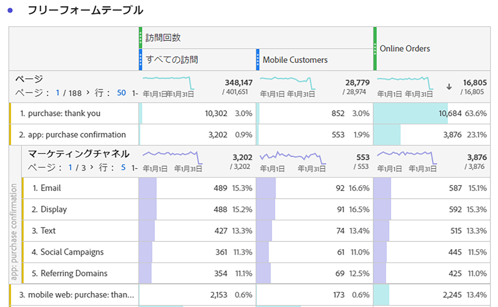
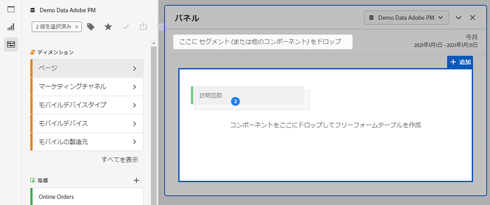
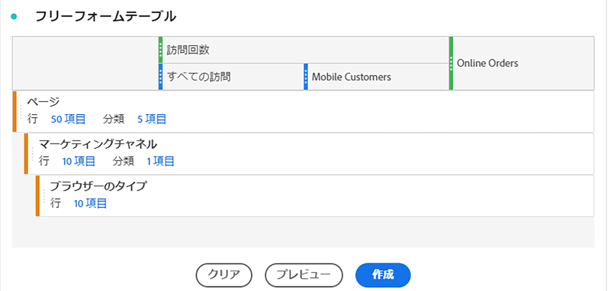
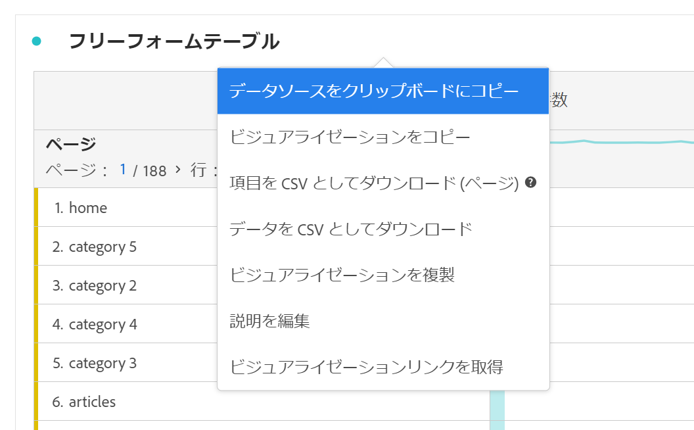

# フリーフォームテーブル

Analysis Workspaceでは、フリーフォームテーブルはインタラクティブなデータ分析の基盤となっています。[コンポーネント](https://docs.adobe.com/content/help/ja-JP/analytics/analyze/analysis-workspace/components/analysis-workspace-components.html)の組み合わせを行と列にドラッグ＆ドロップして、分析用のカスタムテーブルを作成できます。各コンポーネントが削除されると、テーブルは直ちに更新されるので、分析や掘り下げを迅速におこなうことができます。

## 自動化されたテーブル

テーブルを最もすばやく作成するには、空のプロジェクト、パネル、またはフリーフォームテーブルにコンポーネントを直接ドロップします。推奨される形式のフリーフォームテーブルが自動的に作成されます。[こちら](https://experienceleague.adobe.com/docs/analytics-learn/tutorials/analysis-workspace/building-freeform-tables/auto-build-freeform-tables-in-analysis-workspace.html?lang=ja-JP)から、チュートリアルをご覧ください。

## フリーフォームテーブルビルダー

最初に複数のコンポーネントをテーブルに追加し、次にデータをレンダリングすると、フリーフォームテーブルビルダーを有効にできます。ビルダーを有効にすれば、多くのディメンション、分類、指標およびセグメントをドラッグ＆ドロップして、より複雑な質問に回答するテーブルを作成できます。データはその場では更新されず、「**[!UICONTROL ビルド]**」をクリックすると更新されます。

## テーブルの操作

フリーフォームテーブルは、様々な方法で操作およびカスタマイズできます。

* **行**
   * プロジェクトの[表示密度](https://docs.adobe.com/content/help/ja-JP/analytics/analyze/analysis-workspace/build-workspace-project/view-density.html)を調整すると、1 つの画面に表示する行を増やすことができます。
   * 各ディメンション行は、ページネーションの前に最大 400 行を表示できます。「行」の横の数字をクリックすると、ページに行が表示されます。ヘッダーのページ矢印を使用して、別のページに移動します。
   * 行は、追加のコンポーネントで分類できます。複数の行を一度に分類するには、複数の行を選択し、次のコンポーネントを選択した行の上にドラッグします。[分類](https://docs.adobe.com/content/help/ja-JP/analytics/analyze/analysis-workspace/components/dimensions/t-breakdown-fa.html)について説明します。
   * 行を[フィルタリング](https://docs.adobe.com/content/help/ja-JP/analytics/analyze/analysis-workspace/visualizations/freeform-table/pagination-filtering-sorting.html)して、表示する項目数を減らすここができます。[行設定](https://docs.adobe.com/content/help/ja-JP/analytics/analyze/analysis-workspace/visualizations/freeform-table/column-row-settings/table-settings.html)で追加の設定を使用できます。

* **列**
   * 列内にコンポーネントを積み重ねて、セグメント化された指標やクロスタブ分析などを作成できます。
   * 各列の表示は、[列設定](https://docs.adobe.com/content/help/ja-JP/analytics/analyze/analysis-workspace/build-workspace-project/column-row-settings/column-settings.html)で調整できます。
   * [右クリックメニュー](https://docs.adobe.com/content/help/ja-JP/analytics-learn/tutorials/analysis-workspace/building-freeform-tables/using-the-right-click-menu.html)からは、いくつかの操作を実行できます。テーブルのヘッダー、行または列をクリックしたかどうかに応じて、このメニューに表示されるアクションが変わります。

## フリーフォームテーブルデータの書き出し

Analysis Workspace のすべてのデータエクスポートオプションについては、[こちら](https://experienceleague.adobe.com/docs/analytics/analyze/analysis-workspace/curate-share/download-send.html?lang=ja-JP)から確認できます。

* 右クリック >「**[!UICONTROL データソースをクリップボードにコピー]**」：表示されているテーブルデータを書き出します。テーブルを選択すると、このオプションが「**[!UICONTROL 選択範囲をクリップボードにコピー]**」に変わります。ホットキー **Ctrl+C** を使用して、選択したデータをコピーすることもできます。
* 右クリック >「**[!UICONTROL データを CSV 形式でダウンロード]**」：表示されているテーブルデータが CSV 形式でダウンロードされます。テーブルを選択すると、このオプションが「**[!UICONTROL 選択内容を CSV 形式でダウンロード]**」に変わります。
* 右クリック >**[!UICONTROL 「プロジェクト」>「項目を CSV 形式でダウンロード」]**：選択したディメンションの最大 50,000 個のディメンション項目がエクスポートされます。

Analysis Workspace のすべてのデータエクスポートオプションついては、[こちら](https://experienceleague.adobe.com/docs/analytics/analyze/analysis-workspace/curate-share/download-send.html)から確認できます。

