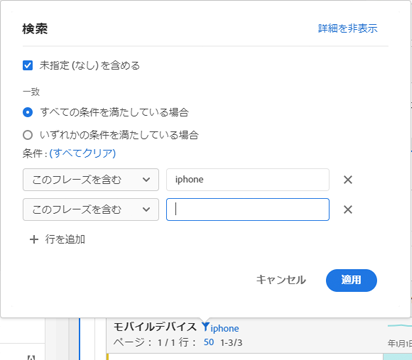

# テーブルのページネーション、フィルタリングおよび並べ替え

概要については、次のビデオチュートリアルを参照してください。

[Analysis Workspace のテーブルのページネーション、フィルタリングおよび並べ替え](https://docs.adobe.com/help/en/analytics-learn/tutorials/analysis-workspace/building-freeform-tables/pagination-filtering-sorting-tables.html)

## アドバンスフィルターオプション {#section_36E92E31442B4EBCB052073590C1F025}

フリーフォームテーブルのディメンションの隣にあるフィルターアイコンをクリックし、「アドバンスを表示」をクリックすると、次の条件を使用してフィルタリングできます。

* 次を含む
* doesNotContain
* すべての語句を含む
* いずれかの語句を含む
* フレーズを含む
* いずれの語句も含まない
* このフレーズを含まない
* 次と等しい
* 次と等しくない
* 次の語句で始まる
* 次の語句で終わる

