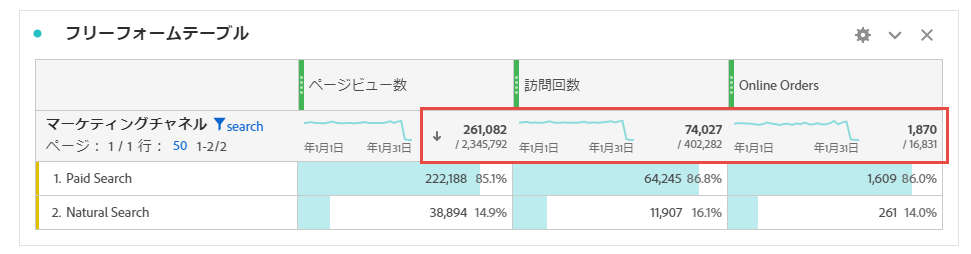
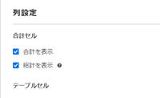
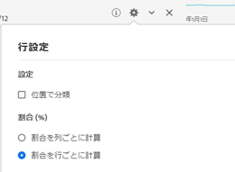

# Workspace の合計

フリーフォームテーブルでは、合計行が各分類レベルに表示され、2 つの合計を示すことができます。

* **[!UICONTROL 総計]**（灰色で表示されている「～中」の数） - この合計は、収集されたすべてのヒットを表し、「レポートスイートの合計」とも呼ばれます。セグメントがパネルレベルまたはフリーフォームテーブル内で適用されると、この合計は、セグメント条件に一致するすべてのヒットを反映するように調整されます。
* **[!UICONTROL テーブル合計]**（黒い数字） - 通常、この合計は[!UICONTROL 総計]と等しいか、またはそのサブセットです。「[!UICONTROL なしを含む]」オプションなど、フリーフォームテーブル内で適用されたすべてのテーブルフィルターを反映します。

## 合計設定を表示  {#display-total}

「**[!UICONTROL 列設定]**」の下に、「**[!UICONTROL 合計を表示]**」と「**[!UICONTROL 総計を表示]**」のオプションがあります。これらの設定がオフの場合、合計はテーブルから削除されます。これは、特定の[計算指標のシナリオ](https://docs.adobe.com/content/help/ja-JP/analytics/components/calculated-metrics/calcmetrics-reference/cm-totals.html)などで合計が意味をなさない場合に必要です。

## 静的な行の合計の設定  {#static-row-total}

[静的な行](https://experienceleague.adobe.com/docs/analytics/analyze/analysis-workspace/visualizations/freeform-table/column-row-settings/manual-vs-dynamic-rows.html?lang=ja-JP)の合計は、動作が異なり、「**[!UICONTROL 行設定]**」で制御されます。

* **[!UICONTROL 現在の行の合計として表示]** - テーブル内の行のクライアント側の合計を表示します。これは、合計で訪問回数や訪問者数などの指標の重複が排除&#x200B;**されない**&#x200B;ことを意味します。
* **[!UICONTROL 総計を表示]** - サーバー側の合計を表示します。つまり、合計で訪問回数や訪問者数などの指標の重複が排除されます。

## よくある質問

| 質問 | 回答 |
|---|---|
| 灰色の列の割合は、どの「合計」を基準にしていますか。 | これは、「**[!UICONTROL 行設定]**」で選択した「**[!UICONTROL パーセンテージ]**」の設定によって異なります。<ul><li>割合を列ごとに計算 - これがデフォルト設定です。割合は、テーブル合計に基づきます。</li><li>割合を行ごとに計算 - パーセントは総計に基づきます。</li></ul> |
| 「**[!UICONTROL 未指定 (なし) を含む]**」設定は、合計にどのように影響しますか。 | 「**[!UICONTROL 未指定 (なし) を含む]**」設定がオフの場合、「なし/未指定」の行はテーブル（テーブル合計）から削除され、[「合計」の指標タイプ](https://docs.adobe.com/content/help/ja-JP/analytics/components/calculated-metrics/calcmetric-workflow/m-metric-type-alloc.html)を使用する計算指標にも適用されます。 |
| フリーフォームテーブルにカスタムテーブルフィルターを適用する場合、そのフィルターに対してすべての計算指標と条件付き書式設定を利用できますか。 | 現在は利用できません。「**[!UICONTROL 未指定 (なし) を含む]**」は計上されますが、カスタムテーブルフィルターは次に影響しません。<ul><li>条件付き書式で使用される列の最大／最小範囲は、すべてのデータを対象とします。</li><li>**[!UICONTROL 総計]**&#x200B;指標タイプを利用する計算指標。</li><li>フリーフォームテーブルの行をまたいで計算する関数（例：Column Sum、Column max、Column min、Count、Mean、Median、Percentile、Quartile、Row Count、Standard Deviation、Variance、Cumulative、Cumulative Average、Regression variants、T-Score、T-Test、Z-Score、Z-Test）を使用する計算指標。</li></ul> |
| 「計算指標」で、「**[!UICONTROL 総計]**」指標タイプは何を反映していますか。 | 「**[!UICONTROL 総計]**」は引き続き「**[!UICONTROL 総計]**」を参照します。また、テーブルや&#x200B;**[!UICONTROL テーブル合計]**&#x200B;に適用されたフィルターは反映されません。 |
| フリーフォームテーブルからデータをコピーして貼り付けるか、CSV でデータをダウンロードすると、合計はどのように表示されますか。 | 合計行は、**[!UICONTROL テーブル合計]**&#x200B;のみを反映し、列の&#x200B;**[!UICONTROL 合計を表示]**&#x200B;設定に従います。 |

