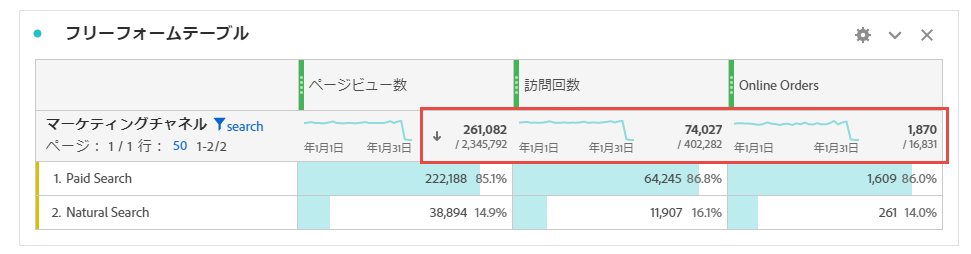

# 合計 {#workspace-totals}

>[!CONTEXTUALHELP]
>id="workspace_freeformtable_grandtotal"
>title="総計"
>abstract="静的な行を含むテーブルや分類では、総計はサポートされません。"

フリーフォームテーブルでは、合計行が各分類レベルに表示され、2 つの合計を示すことができます。

* **[!UICONTROL テーブル合計]** ➊ – この合計は通常、[!UICONTROL  グランド合計]と等しいか、サブセットです。 合計には、「[!UICONTROL なしを含む]」オプションを含む、フリーフォームテーブル内で適用された任意のテーブルフィルターが反映されます。
* **[!UICONTROL Grand total]** （**[!UICONTROL /]** *number*） ➋ – この合計は、収集されたすべてのイベントを表します。 フィルターがパネルレベルまたはフリーフォームテーブル内で適用されると、この合計は、フィルター条件に一致するすべてのイベントを反映するように調整されます。

## 合計の表示

 **[!UICONTROL 列設定]** には、「**[!UICONTROL 合計を表示]**」と「**[!UICONTROL 総計を表示]**」のオプションがあります。 これらの設定をオフにすると、合計がテーブルから削除されます。これは、合計が意味をなさない場合に行う必要があります。

[静的行](/help/analyze/analysis-workspace/visualizations/freeform-table/column-row-settings/manual-vs-dynamic-rows.md)を含むフリーフォームテーブルでは、合計の動作が異なります。  **[!UICONTROL 行設定]**&#x200B;を使用して制御されます。

| オプション | 説明 |
|---|---|
| **[!UICONTROL 現在の行の合計を合計として表示]** | テーブル内の行のクライアントサイドの合計を表示します。 この合計では、セッションやユーザーなどの指標を重複排除することは&#x200B;**ありません**。 |
| **[!UICONTROL 総計を表示]** | サーバーサイドの合計を表示します。 この合計では、セッションやユーザーなどの指標を重複排除します。 |

[フリーフォームテーブルの動的ディメンション項目と静的ディメンション項目](column-row-settings/manual-vs-dynamic-rows.md)を参照してください。

## よくある質問

| 質問 | 回答 |
|---|---|
| グレーの列の割合は、どの&#x200B;*合計*&#x200B;に基づいていますか？ | この&#x200B;*合計*&#x200B;は、**[!UICONTROL 行設定]**&#x200B;の&#x200B;**[!UICONTROL 割合]**&#x200B;の設定の選択によって異なります。<ul><li>列別に割合を計算 - この設定はデフォルトです。 割合は、テーブルの合計に基づきます。</li><li>行別に割合を計算 - 割合は総計に基づきます。</li></ul> |
| 「**[!UICONTROL 未指定 (なし) を含む]**」設定は、合計にどのように影響しますか。 | 「未指定を含める（なし）」設定がオフの場合、なし/未指定の行はテーブルの合計から削除され、[&#39;合計&#39;指標タイプ ](/help/components/calculated-metrics/workflow/c-build-metrics/m-metric-type-alloc.md)を使用する計算指標に引き継がれます。 |
| フリーフォームテーブルにカスタムテーブルフィルターを適用する場合、そのフィルターに対してすべての計算指標と条件付き書式設定を利用できますか。 | 現在は利用できません。 **[!UICONTROL Include Ubnspeficied （None）]**&#x200B;はアカウントですが、カスタムテーブルフィルターは次の項目には影響しません。<ul><li>条件付き書式で使用される列の最大／最小範囲は、すべてのデータを対象とします。</li><li>**[!UICONTROL 総計]**&#x200B;指標タイプを活用する計算指標。</li><li>フリーフォームテーブル内の行をまたいで計算する関数（列の合計値、列の最大値、列の最小値、カウント、平均、中央値、パーセンタイル、四分位数、行数、標準偏差、分散、累積、累積平均、回帰バリアント、t スコア、t 検定、z スコア、z 検定）を使用する計算指標。</li></ul> |
| 計算指標では、**[!UICONTROL 総計]**&#x200B;指標タイプで何が反映されますか？ | **[!UICONTROL 総計]**&#x200B;では引き続き&#x200B;**[!UICONTROL 総計]**&#x200B;を参照しますが、テーブルに適用されたフィルターや&#x200B;**[!UICONTROL テーブルの合計]**&#x200B;は反映されません。 |
| フリーフォームテーブルからデータをコピーして貼り付けるか、CSV でデータをダウンロードすると、合計はどのように表示されますか。 | 合計行には、**[!UICONTROL テーブルの合計]**&#x200B;のみが反映され、列の&#x200B;**[!UICONTROL 合計を表示]**&#x200B;設定が考慮されます。 |
