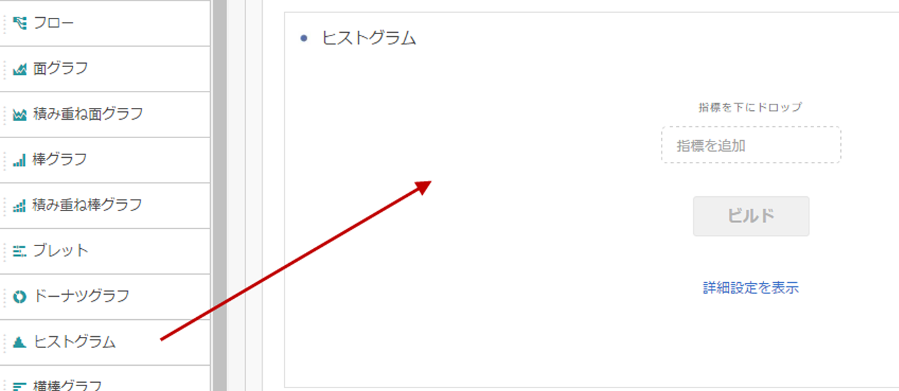
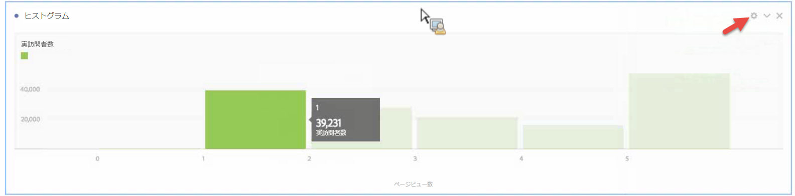
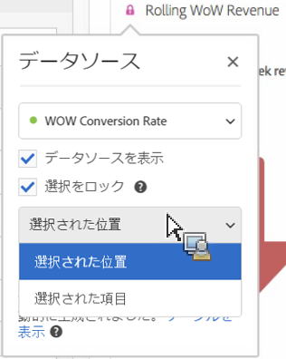
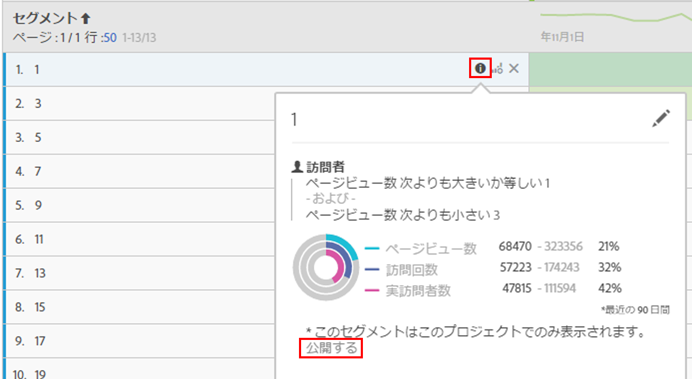

# ヒストグラム

ヒストグラムは、棒グラフに似ていますが、数を範囲（グループ）でグループ化します。Analytics は、数から範囲への「グループ化」を自動化しますが、[詳細設定](#section_09D774C584864D4CA6B5672DC2927477)で設定を変更できます。

## Build a histogram {#section_74647707CC984A1CB6D3097F43A30B45}

ヒストグラムを作成するには

1. 左側のレールで、**[!UICONTROL ビジュアライゼーション]をクリックします。**
1. **[!UICONTROL ヒストグラム]をパネルにドラッグします。**
1. Choose a Metric to drag to the Histogram visualization and click **[!UICONTROL Build]**.

>[!NOTE]
>
>ヒストグラムは、計算指標ではなく標準指標のみをサポートします。

ここでは、実訪問者数ごとにページビュー数指標を使用しました。最初の（左の）グループは、実訪問者数ごとの 1 ページビューに対応し、2 番目のグループは 2 ページビューに対応します（以下同様）。

## Advanced settings {#section_09D774C584864D4CA6B5672DC2927477}

ヒストグラム設定を調整するには、右上隅の設定（「ギア」）アイコンをクリックします。変更できる設定を次に示します。

| ヒストグラムの設定 | 説明 |
|---|---|
| 開始グループ | どのグループからヒストグラムが始まるかを決定します。1 がデフォルトです。開始の数を 0 から無限大まで（負の数はなし）設定できます。 |
| 指標グループ | データ範囲（グループ）の数を増減できます。グループの最大数は 50 です。 |
| 指標グループのサイズ | 各グループのサイズを設定できます。例えば、グループサイズを 1 ページビューから 2 ページビューに変更できます。 |
| カウント方法 | [訪問者](https://marketing.adobe.com/resources/help/en_US/reference/visitors.html)、[訪問](https://marketing.adobe.com/resources/help/en_US/reference/metrics_visit.html)または[ヒット](https://marketing.adobe.com/resources/help/en_US/reference/hit.html)から選択できます。例えば、訪問ごとのページビュー、訪問者ごとのページビュー、ヒットごとのページビューです。ヒットの場合、フリーフォームテーブルの y 軸指標として、「回数」が使用されます。 |

**例**：

* 開始グループ：1、指標グループ：5、指標グループのサイズ：2 は、1～2、3～4、5～6、7～8、9～10 というヒストグラムになります。
* 開始グループ：0、指標グループ：3、指標グループのサイズ：5 は、0～4、5～9、10～14 というヒストグラムになります。

## View and edit histogram data {#section_B2CD7CDF0F6B432F928103AE7AAA3617}

To view or change the data source for the histogram chart, click the dot next to the Histogram header to go to **[!UICONTROL Data Source Settings]** &gt; **[!UICONTROL Show Data Source]**.

テーブルに表示される事前に作成されたセグメントは、内部セグメントで、セグメントセレクターには表示されません。セグメント名の横にある「i」アイコンをクリックし、「**[!UICONTROL 公開する]」をクリックしてセグメントを公開します。**

データを分類するなど、フリーフォームデータテーブルおよびその他のビジュアライゼーションを管理するその他の方法を確認するには、[こちら](https://marketing.adobe.com/resources/help/en_US/analytics/analysis-workspace/freeform-analysis-visualizations.html)を参照してください。
