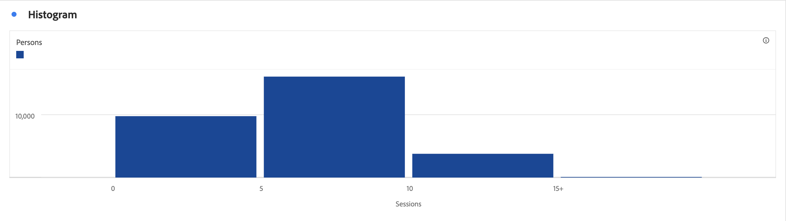

# ヒストグラム {#histogram}

<!-- markdownlint-disable MD034 -->

>[!CONTEXTUALHELP]
>id="workspace_histogram_button"
>title="ヒストグラム"
>abstract="数値データの分布を範囲のグループに表す、ヒストグラムのビジュアライゼーションを作成します。"

<!-- markdownlint-enable MD034 -->

>[!BEGINSHADEBOX]

_この記事では、_ _&#x200B;**Adobe Analytics** のヒストグラムビジュアライゼーションについて説明します。_ _この記事の_  _&#x200B;**Customer Journey Analytics** バージョンについて詳しくは、[ヒストグラム](https://experienceleague.adobe.com/ja/docs/analytics-platform/using/cja-workspace/visualizations/histogram)を参照してください。_

>[!ENDSHADEBOX]

 **[!UICONTROL ヒストグラム]**&#x200B;ビジュアライゼーションは、[!UICONTROL 棒グラフ]ビジュアライゼーションに似ていますが、数値を範囲（バケット）にグループ化します。Analytics は、数から範囲への「グループ化」を自動化しますが、[詳細設定](#advanced-settings)で設定を変更できます。

## 使用

ヒストグラムを作成するには

1.  **[!UICONTROL ヒストグラム]**&#x200B;ビジュアライゼーションを追加します。[パネルへのビジュアライゼーションの追加](freeform-analysis-visualizations.md#add-visualizations-to-a-panel)を参照してください。
1. **[!UICONTROL 指標]** コンポーネントリストから指標をドラッグするか、[!UICONTROL *指標を追加*] ドロップダウンメニューから指標を選択します。
1. （オプション）「**[!UICONTROL 詳細設定を表示]**」を選択します。[詳細設定](#advanced-settings)を参照してください。
1. 「**[!UICONTROL 作成]**」を選択します。

>[!NOTE]
>
>ヒストグラムは、計算指標ではなく、標準指標のみをサポートします。

次の例では、ヒストグラムを使用してセッションをユーザー数別のバケットに分類しています。ヒストグラムは、ほとんどの人が、選択した日付範囲で 16～21 のセッションを行っていることを示しています。

## 詳細設定

ビジュアライゼーションの一部として、特定のヒストグラム設定を使用できます。

| ヒストグラム設定 | 説明 |
|---|---|
| **[!UICONTROL 開始バケット]** | どのグループからヒストグラムが始まるかを決定します。1 がデフォルトです。開始の数を 0 から無限大まで（負の数はなし）設定できます。 |
| **[!UICONTROL 指標バケット]** | データ範囲（バケット）の数を増減できます。バケットの最大数は 50 です。 |
| **[!UICONTROL 指標バケットのサイズ]** | 各グループのサイズを設定できます。例えば、グループサイズを 1 ページビューから 2 ページビューに変更できます。 |
| **[!UICONTROL カウント方法]** | 「**[!UICONTROL ユーザー]**」、「**[!UICONTROL セッション]**」、「**[!UICONTROL イベント]**」から選択します。例えば、セッションごとのページビュー数、ユーザーごとのページビュー数、イベントごとのページビュー数などです。 |

<!--Russ or Meike - Check Hit Type link above. -->

**例**：

| 開始バケット | 指標バケット | 指標バケットのサイズ | 結果 |
|:----:|:--:|:--:|:--|
| 1 | 5 | 2 |  |
| 0 | 3 | 5 |  |

>[!MORELIKETHIS]
>
>[パネルへのビジュアライゼーションの追加](/help/analyze/analysis-workspace/visualizations/freeform-analysis-visualizations.md#add-visualizations-to-a-panel)
>[ビジュアライゼーション設定](/help/analyze/analysis-workspace/visualizations/freeform-analysis-visualizations.md#settings)
>[ビジュアライゼーションコンテキストメニュー](/help/analyze/analysis-workspace/visualizations/freeform-analysis-visualizations.md#context-menu)
>[ヒストグラムを使用して予期しないデータ値を識別する](https://experienceleaguecommunities.adobe.com/t5/adobe-analytics-blogs/using-histograms-to-identify-unexpected-data-values/ba-p/596168?profile.language=ja)

