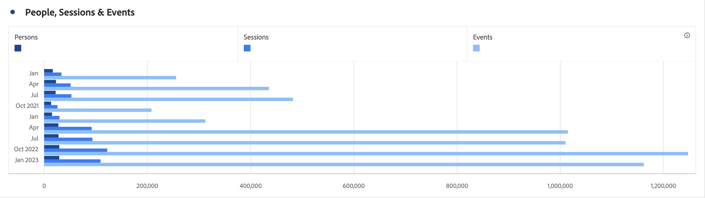

# 積み重ね横棒グラフ

>[!BEGINSHADEBOX]

_この記事では、{AdobeAnalytics](/help/assets/icons/AdobeAnalytics.svg) _**Customer Journey Analytics_ バージョンについては、 横棒グラフおよび積み重ね横棒グラフ** を参照してください。_

>[!ENDSHADEBOX]

横棒グラフビジュアライゼーションには、標準および積み重ねオプションがあります。

## 横棒グラフ {#horizontal-bar}

<!-- markdownlint-disable MD034 -->

>[!CONTEXTUALHELP]
>id="workspace_horizontalbar_button"
>title="横棒グラフ"
>abstract="1 つ以上の指標の様々な値を表す、横棒グラフのビジュアライゼーションを作成します。"

<!-- markdownlint-enable MD034 -->

この **[!UICONTROL 横棒グラフ]** ビジュアライゼーションでは、1 つ以上の指標の様々な値を表す横棒グラフが表示されます。

## 積み重ね横棒グラフ {#horizontal-bar-stacked}

<!-- markdownlint-disable MD034 -->

>[!CONTEXTUALHELP]
>id="workspace_horizontalbarstacked_button"
>title="積み重ね横棒グラフ"
>abstract="1 つ以上の指標の様々な値を表す、積み重ね横棒グラフのビジュアライゼーションを作成します。"

<!-- markdownlint-enable MD034 -->

**[!UICONTROL 積み重ね横棒グラフ]** のビジュアライゼーションは [!UICONTROL  横棒グラフ ] に似ていますが、棒は積み重なって表示されます。

 **[!UICONTROL 設定]** の「**[!UICONTROL 100% 積み重ね]**」オプションを使用して、グラフを 100% 積み重ねビジュアライゼーションに変換します。

>[!MORELIKETHIS]
>
>[ パネルへのビジュアライゼーションの追加 ](/help/analyze/analysis-workspace/visualizations/freeform-analysis-visualizations.md#add-visualizations-to-a-panel)
>[ビジュアライゼーション設定 ](/help/analyze/analysis-workspace/visualizations/freeform-analysis-visualizations.md#settings)
>[ビジュアライゼーションコンテキストメニュー ](/help/analyze/analysis-workspace/visualizations/freeform-analysis-visualizations.md#context-menu)
>

