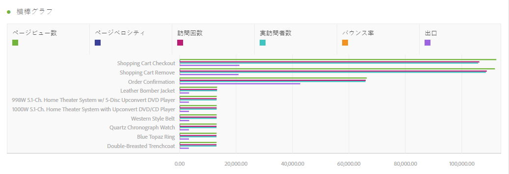
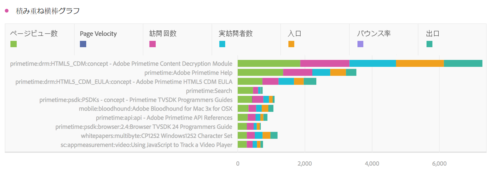
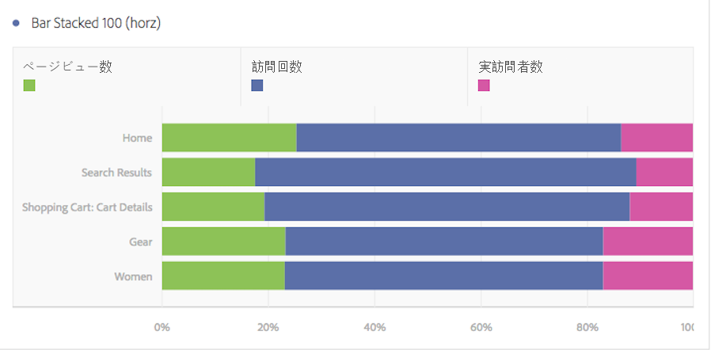

# 横棒グラフおよび積み重ね横棒グラフ

## 横棒グラフ {#section_73A4D6F6C8864045A97B0B32B5FFFEDB}

このビジュアライゼーションでは、1 つ以上の指標の様々な値を表す横棒グラフが表示されます。

## 積み重ね横棒グラフ  {#section_50C08E9E20A94024A6553BC352ADB597}

このビジュアライゼーションは[!UICONTROL 横棒グラフ]に似ていますが、系列棒グラフは積み重なって表示されます。

[!UICONTROL 積み重ね横棒グラフ]のビジュアライゼーションを「100% の積み重ね」に変更する新しい設定が追加されました。

