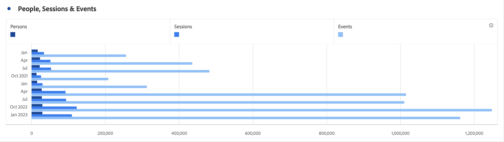
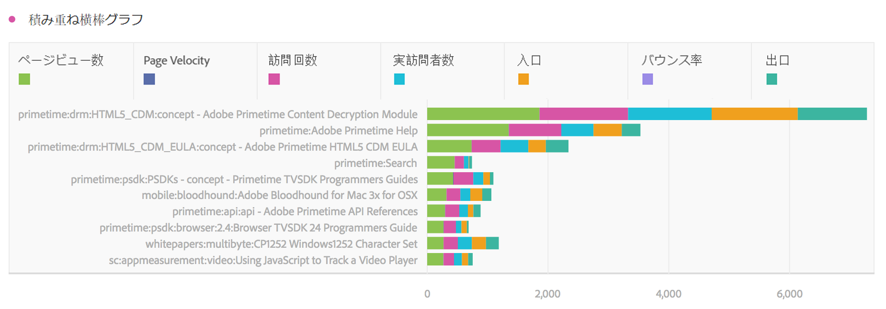

# 積み重ね横棒グラフ

>[!BEGINSHADEBOX]

_この記事では、この記事の_  _**Customer Journey Analytics**&#x200B;版の[横棒と横棒の積み重ね](/help/assets/icons/AdobeAnalytics.svg) _**Adobe Analytics**_ _で横棒と横棒の積み重ね](https://experienceleague.adobe.com/ja/docs/analytics-platform/using/cja-workspace/visualizations/horizontal-bar)を参照してください。__![

>[!ENDSHADEBOX]

横棒グラフビジュアライゼーションには、標準および積み重ねオプションがあります。

## 横棒グラフ {#horizontal-bar}

<!-- markdownlint-disable MD034 -->

>[!CONTEXTUALHELP]
>id="workspace_horizontalbar_button"
>title="横棒グラフ"
>abstract="1 つ以上の指標の様々な値を表す、横棒グラフのビジュアライゼーションを作成します。"

<!-- markdownlint-enable MD034 -->

この  **[!UICONTROL 横棒グラフ]**&#x200B;ビジュアライゼーションでは、1 つ以上の指標の様々な値を表す横棒グラフが表示されます。

## 積み重ね横棒グラフ {#horizontal-bar-stacked}

<!-- markdownlint-disable MD034 -->

>[!CONTEXTUALHELP]
>id="workspace_horizontalbarstacked_button"
>title="積み重ね横棒グラフ"
>abstract="1 つ以上の指標の様々な値を表す、積み重ね横棒グラフのビジュアライゼーションを作成します。"

<!-- markdownlint-enable MD034 -->

 **[!UICONTROL 積み重ね横棒グラフ]**&#x200B;ビジュアライゼーションは[!UICONTROL 横棒グラフ]に似ていますが、系列を表す棒は積み重ねられて表示されます。

 **[!UICONTROL 設定]**&#x200B;の「**[!UICONTROL 100％積み重ね]**」オプションを使用して、グラフを 100％積み重ねビジュアライゼーションに変換します。

>[!MORELIKETHIS]
>
>[ パネルへのビジュアライゼーションの追加](/help/analyze/analysis-workspace/visualizations/freeform-analysis-visualizations.md#add-visualizations-to-a-panel)
>[ビジュアライゼーション設定](/help/analyze/analysis-workspace/visualizations/freeform-analysis-visualizations.md#settings)
>[ビジュアライゼーションコンテキストメニュー](/help/analyze/analysis-workspace/visualizations/freeform-analysis-visualizations.md#context-menu)
>

