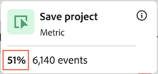
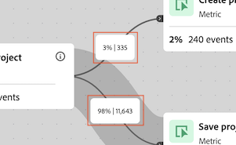
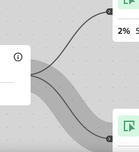

# ジャーニーキャンバスビジュアライゼーションの設定 {#configure-journey-canvas}

>[!BEGINSHADEBOX]

_この記事では、この記事の_  _**Adobe Analytics**のジャーニーキャンバスのビジュアライゼーションについて説明します。  _&#x200B;この記事の&#x200B;__**Customer Journey Analytics**版の[ジャーニーキャンバスのビジュアライゼーションの設定](https://experienceleague.adobe.com/ja/docs/analytics-platform/using/cja-workspace/visualizations/journey-canvas/configure-journey-canvas)を参照してください。_

>[!ENDSHADEBOX]

ジャーニーキャンバスビジュアライゼーションを使用すると、ユーザーやお客様に提供するジャーニーを分析し、深いインサイトを得ることができます。

## ジャーニーキャンバスの概要

次の内容を含む、ジャーニーキャンバスについて詳しくは、[ジャーニーキャンバスの概要](/help/analyze/analysis-workspace/visualizations/journey-canvas/journey-canvas.md)を参照してください。

* 主な特長

* 潜在的なインサイト

* ジャーニーキャンバスとフォールアウトの違い

* その他

## ジャーニーキャンバスビジュアライゼーションの作成の開始

1. プロジェクトに空白のパネルを追加し、左側のパネルの&#x200B;[!UICONTROL **ビジュアライゼーション**]&#x200B;アイコンを選択して、 [!UICONTROL **ジャーニーキャンバス**]&#x200B;ビジュアライゼーションをパネルにドラッグします。

   または

   [ビジュアライゼーションの概要](/help/analyze/analysis-workspace/visualizations/freeform-analysis-visualizations.md)の[パネルへのビジュアライゼーションの追加](/help/analyze/analysis-workspace/visualizations/freeform-analysis-visualizations.md#add-visualizations-to-a-panel)の節で説明されているいずれかの方法で、ジャーニーキャンバスビジュアライゼーションを追加します。

   

1. ジャーニーキャンバスを設定するには、次の基本情報を指定します。

   | フィールド | 関数 |
   |---------|----------|
   | [!UICONTROL **プライマリ指標**] | ジャーニーの各ノードで、パーセンテージと数値を計算する際に使用する指標を決定します。
**メモ**：各パーセンテージと数値に含まれるデータの範囲は、「**[!UICONTROL ジャーニーキャンバスコンテナ]**」フィールドで選択した指標によって決定されます。 例えば、コンテナを「**[!UICONTROL ユーザー]**」と設定している場合、ジャーニーに表示される統計は、特定のユーザーの複数のセッションにまたがります。 コンテナを「**[!UICONTROL セッション]**」と設定している場合、ジャーニーに表示される統計は、ある特定のユーザーに対して定義された、単一のセッションに制限されます。

プライマリ指標が各ノードのパーセンテージと数値に与える影響を示す、次の例について考えてみましょう。
<ul><li>プライマリ指標が「_人物_」で、コンテナが「_ユーザー_」の場合、ジャーニーの各連続ノードの条件に一致するイベントを持つ人物のみがジャーニー全体を移動します。 フォールアウトは、ユーザーがジャーニーのすぐ次のノードのいずれにも到達しなかった場合に、そのノードで発生します。 サイト上で他のアクションを実行した可能性がありますが、その直後のどのノードでも定義された条件を満たしていませんでした。</li><li>プライマリ指標が「_人物_」で、コンテナが「_セッション_」の場合、単一のセッション内でジャーニーの各ノードの条件に一致するイベントを持つ人物のみがジャーニー全体を移動します。 フォールアウトは、あるユーザーが単一のセッション内で、ジャーニーのすぐ次のノードのいずれにも到達しなかった場合に、そのノードで発生します。 これらのユーザーは、セッション内のサイト上で他のアクションを実行したかもしれませんが、その直後のどのノードでも定義された条件を満たしませんでした。</li></ul> 
プライマリ指標は、ジャーニーキャンバスビジュアライゼーションの次の側面に影響を与えます。
<ul><li>各ノードに表示される合計数。  
例えば、プライマリ指標が「イベント」の場合、各ノードには、そのノード（およびジャーニーのそのノードに至るまでの各前のノード）の条件に一致するイベントが発生した人数が表示されます。
</li><li>各ノードに表示されるパーセンテージ。 （ビジュアライゼーションを作成した後、**[!UICONTROL パーセンテージ値]**&#x200B;ドロップダウンメニューを使用して、合計のパーセンテージ、前のノードのパーセンテージ、開始ノードのパーセンテージのいずれかを表示するように選択できます）。
例えば、プライマリ指標が「イベント」の場合、各ノードには、そのノード（およびジャーニーのそのノードに至るまでの各前のノード）の条件に一致するイベントが発生した人物のパーセンテージが表示されます。
</li><li>ディメンションをビジュアライゼーションに追加すると、プライマリ指標に基づいて、ビジュアライゼーションの上位 3 つのノードが追加されます。</li></ul> |
   | [!UICONTROL **セカンダリ指標**] | ジャーニーの各ノードのパーセンテージと数値を計算する際に使用するセカンダリ指標を決定します。 セカンダリ指標はオプションです。 
**メモ**：各パーセンテージと数値に含まれるデータの範囲は、「**[!UICONTROL ジャーニーキャンバスコンテナ]**」フィールドで選択した指標によって決定されます。 例えば、コンテナを「**[!UICONTROL ユーザー]**」と設定している場合、ジャーニーに表示される統計は、特定のユーザーの複数のセッションにまたがります。 **[!UICONTROL セッション]**&#x200B;がコンテナとして設定されている場合、ジャーニーに表示される統計は、特定のユーザーに対して定義された単一のセッションに制限されます。

セカンダリ指標を設定すると、ジャーニーキャンバスビジュアライゼーションの次の側面に影響を与えます。
<ul><li>プライマリ指標の下の各ノードに表示される合計数。 
例えば、アカウントがセカンダリ指標である場合、ジャーニーでそのノードに到達したすべての人物のアカウント数がノードに表示されます。
</li><li>プライマリ指標の下の各ノードに表示されるパーセンテージ （ビジュアライゼーションを作成した後、合計のパーセンテージまたは開始ノードのパーセンテージのいずれかを表示するように選択できます）。</li>
例えば、セッションがセカンダリ指標である場合、各ノードには、ジャーニーでそのノードに到達したセッションのパーセンテージ（合計のパーセンテージまたは開始ノードのパーセンテージのいずれか）が表示されます。
</li></ul> |

1. （オプション）「[!UICONTROL **詳細設定を表示**]」を選択して、次の情報を指定します。

   | フィールド | 関数 |
   |---------|----------|
   | [!UICONTROL **ジャーニーキャンバスコンテナ**] | ジャーニー全体で対象となるコンテナを選択します。 選択したコンテナによって、ジャーニーで取得されるデータの範囲が決定します。 これは、ビジュアライゼーションに表示される統計に影響を与えます （コンテナ名が以下に示すデフォルト名と異なる場合は、レポートスイートでカスタマイズされます）。<ul><li>**セッション：**&#x200B;ビジュアライゼーションの統計を、特定のユーザーに対する単一の定義済みセッション内に収まるように制限します。 つまり、各ノードに表示される数値とパーセンテージ（プライマリ指標とセカンダリ指標に基づく）は、各ユーザーの 1 回のセッション内で発生する必要があります。 つまり、1 人のユーザーを 1 つのジャーニーで複数回表示できます。
このコンテナでは、セッション指標を使用します。
</li><li>**ユーザー：**（デフォルト）ビジュアライゼーションの統計が、特定のユーザーに対する複数のセッションをまたぐことを許可します。 つまり、各ノードに表示される数値とパーセンテージ（プライマリ指標とセカンダリ指標に基づく）は、セッションが同じユーザーに属している限り、任意の数のセッションをまたいで発生する場合があります。 つまり、1 人のユーザーを 1 つのジャーニーで 1 回のみ表示できます。
このコンテナでは、人物指標を使用します。
</li></ul> |

1. 「[!UICONTROL **作成**]」を選択します。

1. 「[ ビジュアライゼーション設定の設定](#configure-visualization-settings)」の説明に従って、ジャーニーを設定します。

## ビジュアライゼーション設定の指定 {#configure-visualization-settings}

<!-- markdownlint-disable MD034 -->

>[!CONTEXTUALHELP]
>id="aa_journeycanvas_percentage_value"
>title="パーセンテージの計算方法を選択"
>abstract="各ノードに表示されるパーセンテージは、設定したプライマリ指標とセカンダリ指標に基づいています。 パーセンテージを、開始ノード、前のノードまたはレポートスイート内のすべてのデータに関連付けるかを選択できます。"

<!-- markdownlint-enable MD034 -->

ジャーニーキャンバスヘッダーでは、様々な設定オプションが使用できます。

ジャーニーキャンバスビジュアライゼーションの設定を指定するには：

1. Analysis Workspace で、既存のジャーニーキャンバスビジュアライゼーションを開くか、[新しいビジュアライゼーションの作成を開始](#begin-building-a-journey-canvas-visualization)します。

   ジャーニーキャンバスビジュアライゼーションを設定できるオプションは、ヘッダーで使用できます。

   

1. ビジュアライゼーションの上部に表示される次の設定を指定します。

   | 設定 | 関数 |
   |---------|----------|
   | [!UICONTROL **パーセンテージ値**] | ジャーニーの各ノードに表示されるパーセンテージ値。

 
ジャーニーのノードに表示されるパーセンテージ値を設定する際は、次の点を考慮してください。
<ul><li>プライマリ指標の各ノードにパーセンテージが表示されます。 また、セカンダリ指標を設定する際は、そのパーセンテージも表示されます （プライマリ指標とセカンダリ指標の設定について詳しくは、[ジャーニーキャンバスビジュアライゼーションの作成の開始](#begin-building-a-journey-canvas-visualization)を参照してください）。</li><li>パーセンテージには、パネルの日付範囲内でレポートスイートに含まれるすべてのユーザーまたはセッションが含まれます。 _人物_&#x200B;または&#x200B;_セッション_&#x200B;のどちらを使用するかは、コンテナ設定によって異なります （コンテナ設定について詳しくは、[ジャーニーキャンバスビジュアライゼーションの作成の開始](#begin-building-a-journey-canvas-visualization)を参照してください）。</li></ul> 
次のオプションから選択します。
 <ul><li>[!UICONTROL **開始ノードの割合**]：開始ノードに関して各ノードに表示されるパーセンテージを計算します。 パーセンテージは、選択したプライマリ指標とセカンダリ指標に基づきます。 
_開始ノード_&#x200B;とは、その前に接続されたノードがないノードです。

ジャーニーには、複数の開始ノードを含めることができます。 ただし、共通ノードにつながる 2 つ以上の開始ノードがジャーニーに含まれている場合は、[!UICONTROL **合計の割合**]&#x200B;が使用されます。 [!UICONTROL **開始ノードの割合**]&#x200B;を使用する場合は、ジャーニー内の各ノードを単一の開始ノードまで遡ることができるようにジャーニーを更新します。
</li><li>[!UICONTROL **前のノードの割合**]：前のノードに関して各ノードに表示されるパーセンテージを計算します。 パーセンテージは、選択したプライマリ指標とセカンダリ指標に基づきます。</li><li>[!UICONTROL **合計の割合**]: レポートスイート内のすべてのデータに関連して、各ノードに表示される割合を計算します。 パーセンテージは、選択したプライマリ指標とセカンダリ指標に基づきます。</li></ul> |
   | [!UICONTROL **矢印の設定**] | ジャーニーキャンバスのノード間に表示される矢印は、カスタムラベルと値を表示するように設定できます。 

_ラベル_&#x200B;は、[矢印のラベルを追加または更新する](#add-or-update-a-label-on-an-arrow)の説明に従って、ジャーニーキャンバス内に追加できるカスタム名です。</li></ol>
_値_&#x200B;は、矢印上に表示される数値とパーセンテージで、ジャーニーのあるノードから次のノードに移動した人物またはセッションを示します （つまり、特定のステップでジャーニーから離脱しなかった人物）。 

次のオプションがあります。
<ul><li>[!UICONTROL **ラベルなし**]: ジャーニーの矢印にラベルが表示されません。  このオプションは、ジャーニーがで変更された場合にのみ使用できます </li><li>[!UICONTROL **ラベルのみ**]：ラベルはジャーニーの矢印に表示されます。</li></ul> |
   | [!UICONTROL **フォールアウトを表示**] | フォールアウトデータは、ジャーニーの各ノードからフォールアウトしたパーセンテージと数を示します。 フォールアウトデータは、ジャーニーのコンテナ設定に関連付けられた指標に基づいています。プライマリ指標やセカンダリ指標に基づいていません。 

デフォルトでは、コンテナは&#x200B;_ユーザー_&#x200B;なので、フォールアウトデータに使用される指標は&#x200B;_人物_&#x200B;です。 コンテナを&#x200B;_セッション_&#x200B;に変更した場合、フォールアウトデータに使用される指標は&#x200B;_セッション_&#x200B;などです。

例えば、コンテナ設定として&#x200B;_ユーザー_&#x200B;を使用すると、フォールアウトには、ジャーニーの各ノードですぐ次のノードのいずれにも到達しなかった人物のパーセンテージと数が表示されます。 サイト上で他のアクションを実行した可能性がありますが、その直後のどのノードでも定義された条件を満たしていませんでした。
 
ジャーニーキャンバスコンテナ設定について詳しくは、[ジャーニーキャンバスビジュアライゼーションの作成の開始](#begin-building-a-journey-canvas-visualization)を参照してください。 |
   | **ズームコントロール** | キャンバスの右上隅には、次のズームコントロールが用意されています。<ul><li>**ズームイン** ：ビジュアライゼーションの特定の領域を拡大します。
また、トラックパッドをピンチするなど、マウスコントロールを使用することもできます。</li><li>**ズームアウト** ：ビジュアライゼーションを縮小して、キャンバスの領域を広くします。
また、トラックパッドをピンチするなど、マウスコントロールを使用することもできます。
</li><li>**画面に合わせる** ：現在のズームとパンの設定を調整して、完全なビジュアライゼーションを画面いっぱいに表示します。</li></ul>
ズームインまたはズームアウトした後にキャンバスでパンするには、マウスをクリックして目的の場所までドラッグします。
 |

1. [ノードの追加](#add-nodes)に進みます。

## ノードの追加

ジャーニーキャンバスビジュアライゼーションのノードは、ユーザージャーニーのイベントまたはアクションを表します。

ノードを作成するには：Workspace コンポーネントを左側のパネルからキャンバスにドラッグする、ジャーニーキャンバスで既存のノードに基づいて上位の次のノードまたは前のノードを選択できるようにする、または既存のノードを複製します。

### 左側のパネルからのコンポーネントのドラッグ

1. Analysis Workspace で、既存のジャーニーキャンバスビジュアライゼーションを開くか、[新しいビジュアライゼーションの作成を開始](#begin-building-a-journey-canvas-visualization)します。

1. 左側のパネルからキャンバスに、指標、ディメンション、ディメンション項目、セグメントまたは日付範囲をドラッグします。 ただし、計算指標はサポートされていません。

   左側のパネルで複数のコンポーネントを選択するには、Shift キーを押すか、Command キー（Mac の場合）または Ctrl キー（Windows の場合）を押します。

   プライマリ指標に基づいて、ビジュアライゼーションは次のように更新されます（コンポーネントタイプと、配置するキャンバスの領域に応じて異なります）。

   | コンポーネントの種類 | コンポーネントの配置 | ノードの追加後のビジュアライゼーションの更新 |
   |---------|----------|----------|
   | 指標 | キャンバスの空白領域 | ノードは、コンポーネントがドロップされた場所に表示され、既存のノードとは接続されません。 |
   | 指標 | 既存のノード | コンポーネントは、既存のノードと自動的に組み合わされます。 （詳しくは、[ノードの組み合わせ](#combine-nodes)を参照してください）。 |
   | 指標 | 2 つの既存のノード間の矢印 | ノードは、コンポーネントがドロップされた 2 つの既存ノードの間に表示され、両方の既存ノードに接続されます （詳しくは、[ノードの接続](#connect-nodes)を参照してください）。 |
   | ディメンション | キャンバスの空白領域 | コンポーネントがドロップされた上位 3 つのディメンション項目に対して 3 つのノードが作成され、既存のノードとは接続されません （**メモ：** 1 つまたは 2 つのノードのみが表示される場合は、ディメンション項目の 1 つまたは 2 つに対してのみデータが使用できることを意味します。 ノードが表示されない場合は、どのディメンション項目にもデータが使用できないことを意味します。 この場合は、ジャーニーの別のポイントに追加したり、ビジュアライゼーションの日付範囲を調整したり、別のディメンションを選択したりしてみてください）。
ディメンションをキャンバスにドロップする際に Shift キーを押したままにすると、3 つのディメンション項目を含む単一のノードとして追加されます。
 |
   | ディメンション | 既存のノード | 上位 5 つのディメンション項目が表示され、ノードに分類が自動的に適用されます。<!--what happens if you hold Shift?-->
新しいフリーフォームテーブルビジュアライゼーションで分類を表示するには、ノードの&#x200B;[!UICONTROL **フリーフォームテーブルで開く**]&#x200B;リンクを選択します。
 |
   | ディメンション | 2 つの既存のノードを接続する矢印 | 最初のノードの後の最初のイベントに続く上位 3 つのディメンション項目に対して 3 つのノードが作成されます（最終的に 2 番目のノードに到達する人物／セッション）。 ノードは、コンポーネントがドロップされた 2 つの既存ノードの間に表示され、各ノードは両方の既存のノードに接続されます （**メモ：** 1 つまたは 2 つのノードのみが表示される場合は、ディメンション項目の 1 つまたは 2 つに対してのみデータが使用できることを意味します。 ノードが表示されない場合は、どのディメンション項目にもデータが使用できないことを意味します。 この場合は、ジャーニーの別のポイントに追加したり、ビジュアライゼーションの日付範囲を調整したり、別のディメンションを選択したりしてみてください）。
ディメンションをキャンバスにドロップする際に Shift キーを押したままにすると、3 つのディメンション項目を含む単一のノードとして追加されます。 （詳しくは、[ノードの接続](#connect-nodes)を参照してください）。
 |
   | ディメンション項目 | キャンバスの空白領域 | ノードは、コンポーネントがドロップされた場所に表示され、既存のノードとは接続されません。 |
   | ディメンション項目 | 既存のノード | コンポーネントは、既存のノードと自動的に組み合わされます。 |
   | ディメンション項目 | 2 つの既存のノードを接続する矢印 | ノードは、コンポーネントがドロップされた 2 つの既存ノードの間に表示され、両方の既存ノードに接続されます （詳しくは、[ノードの接続](#connect-nodes)を参照してください）。 |
   | セグメント | キャンバスの空白領域 | ノードは、コンポーネントがドロップされた場所に表示され、他のノードとは接続されません。
ノードに表示される数値とパーセンテージには、選択したセグメントごとにセグメント化されたプライマリ指標の合計が含まれます。
 
例えば、ジャーニーのプライマリ指標として「人物」を選択した場合、キャンバスの空白領域に今日のセグメントを追加すると、今日イベントが発生したすべての人物が表示されます。
 |
   | セグメント | 既存のノード | セグメントを既存のノードに適用します。 |
   | セグメント | 2 つのノードを接続する矢印 | ノードは、コンポーネントがドロップされた 2 つの既存ノードの間に表示され、両方の既存ノードに接続されます （詳しくは、[ノードの接続](#connect-nodes)を参照してください）。
コンポーネントがドロップされたパス上のポイントにセグメントを適用します。
 |
   | 日付範囲 | キャンバスの空白領域 | ノードは、コンポーネントがドロップされた場所に表示され、他のノードとは接続されません。
ノードに表示される数値とパーセンテージには、選択した日付範囲ごとにセグメント化されたプライマリ指標の合計が含まれます。
 
例えば、ジャーニーのプライマリ指標として「人物」を選択した場合、キャンバスの空白領域に今月の日付範囲を追加すると、今月中にイベントが発生したすべての人物が表示されます。
 |
   | 日付範囲 | 既存のノード | 日付範囲を既存のノードに適用します。 |
   | 日付範囲 | 2 つのノードを接続する矢印 | ノードは、コンポーネントがドロップされた 2 つの既存ノードの間に表示され、両方の既存ノードに接続されます （詳しくは、[ノードの接続](#connect-nodes)を参照してください）。
コンポーネントがドロップされたパス上のポイントに日付範囲を適用します。
 |
   | 複数のコンポーネント | キャンバスの空白領域 | **コンポーネントのいずれもディメンションでない場合：**
各コンポーネントは、コンポーネントがドロップされた個別のノードとして表示され、既存のノードとは接続されません。

コンポーネントをキャンバスにドロップする際に Shift キーを押したままにすると、コンポーネントが 1 つの組み合わせノードとして追加されます。 

**追加するコンポーネントのいずれかがディメンションである場合：**

各コンポーネントは、コンポーネントがドロップされた個別のノードとして表示され、既存のノードとは接続されません。

一度に追加できるディメンションは 1 つだけです。 ディメンションを追加すると、コンポーネントがドロップされた上位 3 つのディメンション項目に対して 3 つのノードが作成されます。

コンポーネントをキャンバスにドロップする際に Shift キーを押したままにすると、コンポーネントが 1 つの組み合わせノードとして追加されます。 上位 3 つのディメンション項目が各ノードで組み合わされます （詳しくは、[ノードの組み合わせ](#combine-nodes)を参照してください）。
 |
   | 複数のコンポーネント | 既存のノード | すべてのコンポーネントは、既存のノードと組み合わされます。
追加するコンポーネントのいずれかがディメンションである場合、上位 3 つのディメンション項目がノードで組み合わされます。
 
一度に追加できるディメンションは 1 つだけです。
 |
   | 複数のコンポーネント | 2 つの既存のノードを接続する矢印 | **コンポーネントのいずれもディメンションでない場合：**
各コンポーネントは、コンポーネントがドロップされた個別のノードとして表示され、各ノードは両方の既存のノードに接続されます。 （詳しくは、[ノードの接続](#connect-nodes)を参照してください）。
コンポーネントをキャンバスにドロップする際に Shift キーを押したままにすると、コンポーネントが 1 つの組み合わせノードとして追加されます。 （コンポーネントは、単一のノードに組み合わせるには、同じタイプである必要があります）。 （詳しくは、[ノードの組み合わせ](#combine-nodes)を参照してください）。

**追加するコンポーネントのいずれかがディメンションである場合：**

各コンポーネントは、コンポーネントがドロップされた個別のノードとして表示され、各ノードは両方の既存のノードに接続されます。

一度に追加できるディメンションは 1 つだけです。 ディメンションを追加すると、最初のノードの後の最初のイベントに続く上位 3 つのディメンション項目に対して 3 つのノードが作成されます（最終的に 2 番目のノードに到達する人物／セッション）。 各ノードは、両方の既存のノードに接続されます （詳しくは、[ノードの接続](#connect-nodes)を参照してください）。

コンポーネントをキャンバスにドロップする際に Shift キーを押したままにすると、コンポーネントが 1 つの組み合わせノードとして追加されます。 上位 3 つのディメンション項目は各ノードと組み合わされ、各ノードは両方の既存のノードに接続されます （詳しくは、[ノードの組み合わせ](#combine-nodes)を参照してください）。
 |

   ノードは、次の情報を含む長方形のボックスとして表示されます。

   * コンポーネント名

   * コンポーネントタイプ（指標、ディメンションなど）

   * プライマリ指標の統計（合計および割合）

   * セカンダリ指標の統計（合計および割合）

   点滅または光るノードは、そのノードにデータが読み込まれていることを示します。

1. このプロセスを繰り返して、引き続きノードを追加し、ジャーニーを作成します。

1. 以下の節の説明に従って、引き続きジャーニーをカスタマイズします。 ノードの接続、ノード名の変更、分類の適用、時間制約の追加などができます。

### 既存のノードに基づいた上位のノードの表示

キャンバス上に既に存在するノードに基づいて、上位の即時ノードを自動的に表示できます。 上部ノードをジャーニーキャンバスに追加したり、フリーフォームテーブルで表示したりできます。

ジャーニーキャンバスでは、表示するノードを決定する際に、プライマリ指標を使用します。

このオプションは、キャンバス上の次のオブジェクトで使用できます。

* 個々のノード

* ノード間の矢印

#### 既存のノードの後の上位ノードの表示

ノードを選択し、ジャーニーでそのノードの直後に続く上位のディメンション項目を表示できます。 上位 3 つのディメンション項目を個別のノードとしてジャーニーキャンバスに追加したり、上位のすべてのディメンション項目をフリーフォームテーブルで表示したりできます。

1. ジャーニーでそのノードの後にある上位のディメンション項目を表示するノードを右クリックします。

   ノードは、ジャーニーで既存のノードを送信することはできません。

1. 「[!UICONTROL **このノードの後の上位ノードを表示**]」を選択します。

1. ディメンション項目を表示する次の場所を選択します。

   * [!UICONTROL **ジャーニーキャンバス内**]：ジャーニーでこのノードの後にある上位 3 つのノードをキャンバスに追加します。 各ノードは、キャンバス上で個別の分岐として選択したノードに接続されます。

   * [!UICONTROL **フリーフォームテーブル内**]：ジャーニーでこのノードの後にある上位のすべてのディメンション項目を表示するフリーフォームテーブルビジュアライゼーションを作成します。

1. ディメンションのリストから目的のディメンションを選択します。

   前の手順で選択した内容に応じて、上位 3 つのディメンション項目が 3 つの個別のノードとしてキャンバスに追加されるか、上位のすべてのディメンション項目がフリーフォームテーブルに表示されます。

#### 既存のノードの前の上位ノードの表示

ノードを選択し、ジャーニーでそのノードの直前に続く上位のディメンション項目を表示できます。 上位 3 つのディメンション項目を個別のノードとしてジャーニーキャンバスに追加したり、上位のすべてのディメンション項目をフリーフォームテーブルで表示したりできます。

1. ジャーニーでそのノードの前にある上位のディメンション項目を表示するノードを右クリックします。

   このノードは、ジャーニーで既存のノードを受信することはできません。

1. 「[!UICONTROL **このノードの前の上位ノードを表示**]」を選択します。

1. ディメンション項目を表示する次の場所を選択します。

   * [!UICONTROL **ジャーニーキャンバス内**]：ジャーニーでこのノードの前にある上位 3 つのノードをキャンバスに追加します。 各ノードは、キャンバス上で個別の分岐として選択したノードに接続されます。

   * [!UICONTROL **フリーフォームテーブル内**]：ジャーニーでこのノードの前にある上位のすべてのディメンション項目を表示するフリーフォームテーブルビジュアライゼーションを作成します。

1. ディメンションのリストから目的のディメンションを選択します。

   前の手順で選択した内容に応じて、上位 3 つのディメンション項目が 3 つの個別のノードとしてキャンバスに追加されるか、上位のすべてのディメンション項目がフリーフォームテーブルに表示されます。

#### 既存のノード間の上位ノードの表示

矢印を選択し、ジャーニーで既存の 2 つのノードの間にある上位のディメンション項目を表示できます。 上位 3 つのディメンション項目を個別のノードとしてジャーニーキャンバスに追加したり、上位のすべてのディメンション項目をフリーフォームテーブルで表示したりできます。

1. 上位のディメンション項目を表示する 2 つのノード間の矢印を右クリックします。

1. 「[!UICONTROL **これらのノード間の上位ノードを表示**]」を選択します。

1. ディメンション項目を表示する次の場所を選択します。

   * [!UICONTROL **ジャーニーキャンバス内**]：既存の 2 つのノードの間にある上位 3 つのノードをキャンバスに追加します。 各ノードは、キャンバス上で個別の分岐として周囲のノードに接続されます。

   * [!UICONTROL **フリーフォームテーブル内**]：既存の 2 つのノード間にある上位のすべてのディメンション項目を表示するフリーフォームテーブルビジュアライゼーションを作成します。

1. ディメンションのリストから目的のディメンションを選択します。

   前の手順で選択した内容に応じて、上位 3 つのディメンション項目が 3 つの個別のノードとしてキャンバスに追加されるか、上位のすべてのディメンション項目がフリーフォームテーブルに表示されます。

### ノードの複製

複製するオプションは、キャンバス上の次のオブジェクトで使用できます。

* 個々のノード

* 複数のノード

ノードを複製するには：

1. 複製するノードを 1 つ以上選択します。

   複数のノードを選択するには、Command キー（Mac の場合）または Ctrl キー（Windows の場合）を押します。

1. 選択したノードの 1 つを右クリックし、「[!UICONTROL **複製**]」を選択します。

## ジャーニーのデザイン

ノードの順序とノード間の接続は、ジャーニーキャンバスデータに影響を与えます。 ジャーニーは、レポートするイベントのシーケンスを視覚的に正確に反映する必要があります。

ノードをキャンバスに追加した後は、ノードの並べ替え、組み合わせ、接続、ノード間での時間的制約の追加を行うことができます。

### ノードの並べ替え

ジャーニーキャンバスのジャーニーは、イベント、ディメンション項目およびセグメントの任意の組み合わせを表すノードと矢印の柔軟なグラフで構成されます。

キャンバス上のノードをドラッグして、ジャーニーのイベントと条件を並べ替えることができます。

ジャーニーのノードの順序を並べ替えると、それに応じてデータが更新されます。

### ノードの組み合わせ

ジャーニーキャンバスの組み合わせノードは、ロジックを通じて結合された 2 つ以上のコンポーネントを含む、ユーザージャーニー（ノード）の単一のポイントです。

#### 組み合わせノードの作成

ジャーニーキャンバスでノードを組み合わせるには、次のいずれかの操作を行います。

* 左側のパネルから、1 つのコンポーネントをキャンバスのノードにドラッグします。

* 左側のパネルから、複数のコンポーネントをキャンバスのノードに同時にドラッグします。

* 左側のパネルから、Shift キーを押しながら複数のコンポーネントをキャンバスの空白の領域に同時にドラッグします。

<!-- * On the canvas, select the nodes that you want to combine, right-click one of the selected nodes, then select **Combine**. Is there a limit on how many you can combine? -->

#### ノードを組み合わせる際のロジック

ノードを組み合わせる際に適用されるロジックは、組み合わせるコンポーネントタイプに応じて次のように異なります。

>[!TIP]
>
>ノードを右クリックし、「[!UICONTROL **ノードからセグメントを作成**]」を選択すると、組み合わせノードのロジックを表示できます。 ロジックは、「[!UICONTROL **定義**]」セクションに表示されます。

| 組み合わせるコンポーネントタイプ | 使用されるロジック（演算子） |
|---------|----------|
| 指標 + 指標 | OR で結合 |
| ディメンション項目 + ディメンション項目（同じ親ディメンションから） | OR で結合 |
| ディメンション項目 + ディメンション項目（異なる親ディメンションから） | AND で結合 |
| セグメント + セグメント | AND で結合 |
| ディメンション + 指標、日付範囲またはセグメント | AND で結合 |
| 日付範囲 + 指標、セグメントまたはディメンション | AND で結合 |
| セグメント + 指標、日付範囲またはディメンション | AND で結合 |

### ノードの接続

既にキャンバス上に存在するノードを接続するか、キャンバスに追加する際にノードを接続できます。

ノードを接続して、ジャーニーのイベントのシーケンスを定義します。

#### ノード間の矢印

ノードは矢印で接続されます。 矢印の方向と幅はどちらも重要です。

* **方向**：ジャーニーのイベントのシーケンスを示します

* **幅**：ノード間のボリュームのパーセンテージを示します

  

#### ノードを接続する際のロジック

ジャーニーキャンバスでノードを接続する際、THEN 演算子を使用して接続されます。 これは、[順次セグメント化](/help/components/segmentation/segmentation-workflow/seg-sequential-build.md)とも呼ばれます。

ノードは「最終的なパス」として接続されます。つまり、2 つのノード間で発生するイベントに関係なく、訪問者が最終的に 1 つのノードから別のノードに移動する限り、訪問者はカウントされます。 ユーザーがパスに沿って移動するために割り当てられた時間は、コンテナの設定によって決まります。<!-- It can also be controlled by [adding a time constraint](#add-a-time-constraint-between-nodes). -->

ノードを右クリックし、「[!UICONTROL **ノードからセグメントを作成**]」を選択すると、接続されたノードのロジックを表示できます。 ロジックは、「[!UICONTROL **定義**]」セクションに表示されます。

#### 既存のノードの接続

ジャーニーは、循環的ではなく、以前に接続したノードにループバックできません。

ジャーニーキャンバスでノードを接続するには：

1. ジャーニーキャンバスビジュアライゼーションで、別のノードに接続するジャーニーシーケンスの最初のノードにポインタを合わせます。

   選択したノードの両側に 4 つの青いドットが表示されます。

1. 4 つの青いドットのいずれかを、接続先のノードの 4 つの側面のいずれかにドラッグします。

   矢印が表示され、2 つのノードが接続されます。 詳しくは、[ノード間の矢印](#arrows-between-nodes)を参照してください。

#### ノードを追加する際のノードの接続

キャンバスにノードを追加する際、接続する 2 つのノードの間にノードを配置できます。 ノードは、既存の 2 つのノード間のジャーニーのフローに追加されます。

詳しくは、[ノードの追加](#add-nodes)を参照してください。

<!--

### Add a time constraint between nodes

>[!AVAILABILITY]
>
>This feature is not yet available.

You can set a time constraint between nodes. When a time constraint is in place, people are considered to have fallen out of the journey if they follow the defined journey but take longer than the allotted time period to move between the nodes.

The option to add a time constraint is available for the following objects on the canvas:

* The arrow between nodes

To add a time constraint:

1. In a Journey canvas visualization, right-click the arrow between 2 nodes, then select [!UICONTROL **Add time constraint**].

from Travis: You can set time to be within X amount of time or after X amount of time (those are the only two options I think, but we can check with Brandon). 
1. Choose from the following options: 

-->

## ノードまたは矢印の管理

<!--

### Change the color of a node or arrow

>[!AVAILABILITY]
>
>This feature is not yet available.

You can visually customize a journey by changing the color of any node or arrow on the canvas. For example, you could adjust colors to indicate a desirable or undesirable event.

The option to change the color is available for the following objects on the canvas:

* Individual nodes

* The arrow between nodes

To change the color of a node or arrow:

1. In a Journey canvas visualization, right-click the node or arrow whose color you want to change.

1. Select [!UICONTROL **Change color**]. 

1. Select the desired color. 

   The following colors are available: 

-->

### ノードの名前変更

コンポーネントをジャーニーキャンバスビジュアライゼーションにドラッグすると、コンポーネント名と同じ名前のノードが作成されます。 ノードが表すジャーニーのステップに合わせてノードを名前変更できます。

名前変更するオプションは、キャンバス上の次のオブジェクトで使用できます。

* 個々のノード

ノードを名前変更するには：

1. ジャーニーキャンバスビジュアライゼーションで、名前変更するノードを右クリックします。

1. 「[!UICONTROL **名前変更**]」を選択します。

1. 新しい名前を指定し、Enter キーを押します。<!--is that right?-->

### 矢印のラベルの追加または更新

ジャーニーキャンバスのノード間に表示される矢印は、カスタムラベルと値を表示するように設定できます。

ラベルは、矢印に表示されるカスタム名です。 特定の矢印には、1 つのラベルのみが表示されます。

矢印に表示されるラベルと値について詳しくは、[ビジュアライゼーション設定の指定](#configure-visualization-settings)の「矢印の設定」を参照してください。

ラベルを追加または更新するオプションは、キャンバス上の次のオブジェクトで使用できます。

* ノード間の矢印

矢印にラベルを追加するには：

1. ジャーニーキャンバスビジュアライゼーションで、ラベルを追加する矢印を右クリックします。

1. 「**[!UICONTROL ラベルを追加]**」を選択します。

1. ラベルの名前を指定し、Enter キーを押します。

   現在、矢印の設定がラベルを非表示にするように設定されている場合は、ラベルを表示するように求めるプロンプトが表示されます。

矢印の既存のラベルを更新するには：

1. ジャーニーキャンバスビジュアライゼーションで、ラベルを追加する矢印を右クリックします。

1. 「**[!UICONTROL ラベルを更新]**」を選択します。

1. ラベルの名前を指定し、Enter キーを押します。

   現在、矢印の設定がラベルを非表示にするように設定されている場合は、ラベルを表示するように求めるプロンプトが表示されます。

### 分類の適用

データに分類を適用するオプションは、キャンバス上の次のオブジェクトで使用できます。

* 個々のノード

* 複数のノード

* ノード間の矢印

* ノード間の複数の矢印

* フォールアウトデータ（ノードにフォールアウトが表示される場合）

分類を適用する際は、次の点を考慮します。

* 分類はプライマリ指標に適用されます。 セカンダリ指標は影響を受けません。

* 分類を適用しても、ジャーニーは変更されません。 代わりに、適用したノードのデータの分類が表示されるだけです。

* ノードに既に分類がある場合、新しい分類を適用すると、既存の分類が置き換えられます。

* ジャーニーの以前のポイントで変更が行われると、分類データが更新されます。

#### ノード、矢印、フォールアウトデータへの分類の適用

1. ジャーニーカンバスビジュアライゼーションで、次のいずれかの操作を行います。

   * 分類を適用するノード（フォールアウトが表示されている場合）から発生するフォールアウトを右クリックします。

   * 分類を適用する1つ以上のノードを選択し、選択したノードのいずれかを右クリックします。

   * 分類を適用する2つのノード間の1つ以上の矢印を選択し、選択した矢印のいずれかを右クリックします。

     複数のノードまたは矢印を選択するには、Command キー（Mac の場合）または Ctrl キー（Windows の場合）を押します。

1. 「[!UICONTROL **分類**]」を選択します。

1. 分類を表示する場所を選択します。

   * [!UICONTROL **ジャーニーキャンバス内**]

   * [!UICONTROL **フリーフォームテーブル内**]

1. 分類に使用するディメンションを選択します。

   ジャーニーキャンバスで分類の表示を選択した場合、上位 5 つのディメンション項目がノードに表示されます。 ノードのオプションを使用して、フリーフォームテーブルで分類を開くことができます。

   フリーフォームテーブルで分類の表示を選択した場合、上位のディメンション項目は、新しいフリーフォームテーブルの、ジャーニーキャンバスビジュアライゼーションのすぐ上に表示されます。

#### 個々のノードへの分類の適用

左側のパネルから、分類を適用するキャンバス上のノードにディメンションをドラッグできます。

詳しくは、[ノードの追加](#add-nodes)を参照してください。

#### 分類の削除

適用された分類を削除するには：

1. 分類が適用されているノードを右クリックします。

1. 「**[!UICONTROL 分類を削除]**」を選択します。

### トレンドデータの表示

トレンドデータは、ジャーニーキャンバスのオブジェクトの折れ線グラフで表示できます。<!--, with some prebuilt anomaly detection data (this is the definition in Fallout) -->

トレンドにするオプションは、キャンバス上の次のオブジェクトで使用できます。

* 個々のノード

* 複数のノード

* ノード間の矢印

* ノード間の複数の矢印

* フォールアウトデータ（ノードにフォールアウトが表示される場合）

トレンドデータを表示するには：

1. ジャーニーカンバスビジュアライゼーションで、次のいずれかの操作を行います。

   * トレンドデータを表示するノード（フォールアウトが表示されている場合）から発生するフォールアウトを右クリックします。

   * トレンドデータを表示する1つ以上のノードを選択し、選択したノードのいずれかを右クリックします。

   * トレンドデータを表示する2つのノード間の1つ以上の矢印を選択し、選択した矢印のいずれかを右クリックします。

     複数のノードまたは矢印を選択するには、Command キー（Mac の場合）または Ctrl キー（Windows の場合）を押します。

1. 「[!UICONTROL **トレンド**]」を選択します。

### ノード、矢印またはフォールアウトに基づくセグメントの作成

セグメントを作成するオプションは、キャンバス上の次のオブジェクトで使用できます。

* 個々のノード

* ノード間の矢印

* フォールアウトデータ（ノードにフォールアウトが表示される場合）

セグメントを作成したら、Analysis Workspace の任意の場所で使用できます。

ジャーニーキャンバスから作成したセグメントでは、[順次セグメント化](/help/components/segmentation/segmentation-workflow/seg-sequential-build.md)を使用します。 つまり、セグメントは THEN 演算子を使用して、選択したノードまたは矢印に至るまでの、人物がフローした一連のイベントのシーケンス（ジャーニー）を一緒にリンクします。 選択したノードまたは矢印に一致するすべてのイベントがセグメントに含まれます。

複数のパスがフローするノードに基づいてセグメントを作成すると、すべてのパスがセグメントに含まれます。 個別のパスは、OR 演算子で結合されます。

セグメントを作成するには：

1. ジャーニーキャンバスのビジュアライゼーションで、セグメントの作成に使用するノード、矢印またはフォールアウトデータを右クリックします。

1. [!UICONTROL **ノードからセグメントを作成**]、[!UICONTROL **矢印からセグメントを作成**]、または&#x200B;[!UICONTROL **フォールアウトからセグメントを作成**]&#x200B;を選択します。

   セグメントビルダーが表示されます。 「[!UICONTROL **定義**]」セクションでは、選択したノードまたは矢印と、ジャーニー内のコンテキストに基づいてセグメント定義が作成されます。

1. セグメントのタイトルを指定し、その他の変更を行います。 セグメントの作成について詳しくは、[セグメントビルダー](/help/components/segmentation/segmentation-workflow/seg-build.md)を参照してください。

1. 「[!UICONTROL **保存**]」を選択してセグメントを保存します。

### ノードの削除

ジャーニー内では、一度に 1 つ以上のノードを削除できます。 ジャーニー内の 2 つのノード間に接続されているノードを削除すると、残りの 2 つのノードは直接接続されます。

ジャーニーキャンバスでノードを削除するには：

1. ジャーニーキャンバスビジュアライゼーションで、削除する 1 つ以上のノードを選択し、選択したノードのいずれかを右クリックします。

1. 「[!UICONTROL **削除**]」を選択します。

### ノードを除外

ジャーニーからノードを除外すると、ジャーニーデータが更新され、そのノードを経由したジャーニーが除外されます。 ジャーニーのセグメント定義も更新され、そのノードを通過したジャーニーが除外されます。

ジャーニーからノードを除外するには：

1. ジャーニーカンバスビジュアライゼーションで、除外するノードを右クリックします。

1. 「[!UICONTROL **ジャーニーから除外**]」を選択します。

除外されたノードをジャーニーに再び含めるには：

1. ジャーニーカンバスビジュアライゼーションで、除外されたノードを右クリックします。

1. 「[!UICONTROL **ジャーニーの除外を削除**]」を選択します。

### ノード間の矢印の削除

ジャーニー内では、一度に 1 つ以上の矢印を削除できます。 2 つのノード間の矢印を削除すると、そのノードは接続されなくなります。 矢印が長いパスの一部であった場合、そのパスは切断されます。

ジャーニーキャンバスでノード間の矢印を削除するには：

1. ジャーニーキャンバスビジュアライゼーションで、削除する 2 つのノード間の 1 つ以上の矢印を選択し、選択した矢印のいずれかを右クリックします。
1. 「[!UICONTROL **削除**]」を選択します。
