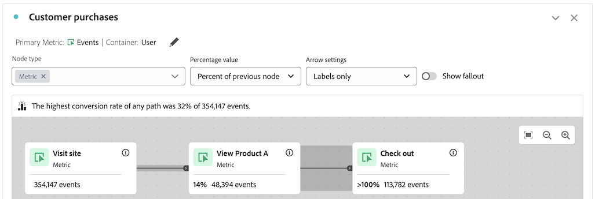
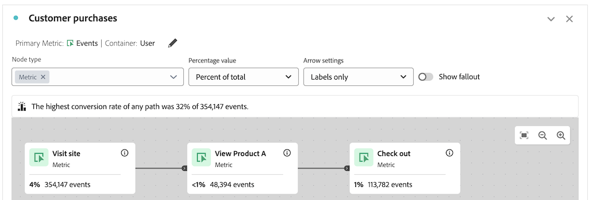

# ジャーニーキャンバスのトラブルシューティング

>[!BEGINSHADEBOX]

_この記事では、この記事の_  _&#x200B;**Customer Journey Analytics**&#x200B;版について、_Adobe Analytics [Adobe Analytics_ _&#x200B;**ジャーニー**  _ジャーニーキャンバスの概要](https://experienceleague.adobe.com/en/docs/analytics-platform/using/cja-workspace/visualizations/journey-canvas/journey-canvas-troubleshooting)を参照してください。

>[!ENDSHADEBOX]

ジャーニーキャンバスのビジュアライゼーションを使用すると、ユーザーやお客様に提供するジャーニーを分析し、深いインサイトを得ることができます。

ジャーニーキャンバスについて詳しくは、[ジャーニーキャンバスの概要](/help/analyze/analysis-workspace/visualizations/journey-canvas/configure-journey-canvas.md)および[ジャーニーキャンバスビジュアライゼーションの設定](/help/analyze/analysis-workspace/visualizations/journey-canvas/configure-journey-canvas.md)を参照してください。

次の情報は、ジャーニーの後半に発生するノードで、ジャーニーの前半に発生するノードよりも高いパーセンテージや数値が表示されるなど、予期しない結果が表示された場合のトラブルシューティングに役立ちます。

## 前のノードよりも高いパーセンテージや値が表示されるノード

ジャーニーキャンバスでは、ジャーニーの後半に発生するノードで、ジャーニーの前半に発生するノードよりも高いパーセンテージや数値が表示される可能性があります。

つまり、常にファネル型（ステップごとにパーティシペーションが減少）であるフォールアウトビジュアライゼーションとは異なり、ジャーニーキャンバスビジュアライゼーションでは、ジャーニーの後半のステップの方が前半のステップよりもパーティシペーションが高くなる場合があります。

これは、次のシナリオで発生する場合があります。

* 人物やセッション以外のプライマリ指標を使用する場合

* 複数のパスが 1 つのノードに収束する場合

### ジャーニーでは、人物またはセッション以外の主要指標を使用します

ジャーニーキャンバスでは、任意の指標をプライマリ指標として使用できるので、ジャーニーの後半に発生するノードで、ジャーニーの前半に発生するノードよりも高いパーセンテージや数値が表示される場合があります。

次のシナリオで使用するジャーニーは、次の設定で指定されます。

* **[!UICONTROL ユーザー]**&#x200B;がコンテナとして指定される

* **[!UICONTROL イベント]**&#x200B;がプライマリ指標として指定される

#### シナリオ 1：ユーザー A は、最初のセッションでジャーニーパスに従います。 その後のセッションで、ユーザーには後半のノードにのみ一致するイベントが発生します。

例えば、ユーザー A がサイトを訪問し、ジャーニーを完了したとします（ノード 1：「サイトを訪問」／ノード 2：「製品 A を表示」／ノード 3：「チェックアウト」）。 ユーザー A には、ジャーニーの各ノードに順番に一致するイベントが発生したので、ジャーニーの各ノードでイベントがカウントされます。

ここで、ユーザー A が後半のセッションで再度サイトを訪問したとします。 ユーザー A は、ジャーニーパスに従って前半のセッションで既にジャーニーを完了しているので、ユーザー A がジャーニー内のいずれかのノードに一致するイベントが発生するたびに（ユーザー A が現在のセッションでジャーニーのパスに従っていなくても）、ジャーニーの関連ノードでイベントがカウントされます。 例えば、ユーザー A がチェックアウトすると、「チェックアウト」ノードでイベントがカウントされます。 これにより、「チェックアウト」ノードのパーセンテージと数値が、前半のノード「製品 A を表示」よりも高くなる場合があります。

この例では、ジャーニーのコンテナ設定「ユーザー」が、3 番目のノード（「チェックアウト」）のイベントがその後のセッションでカウントされることを決定する際に重要な役割を果たします。

また、コンテナ設定が「セッション」に設定されていた場合、ジャーニーに表示される統計は特定のユーザーに対して定義された単一のセッションに制限されるので、その後の訪問で 3 番目のノードでのみ発生したイベントはジャーニーにカウントされません。 コンテナ設定について詳しくは、[ジャーニーキャンバスビジュアライゼーションの作成を開始](/help/analyze/analysis-workspace/visualizations/journey-canvas/configure-journey-canvas.md#begin-building-a-journey-canvas-visualization)の記事[ジャーニーキャンバスビジュアライゼーションの設定](/help/analyze/analysis-workspace/visualizations/journey-canvas/configure-journey-canvas.md)を参照してください。

<!-- The time allotted for users to move along the path is determined by the container setting. Because "Person" is selected as the container setting in this example, people who followed the journey's path in one session (moving from Node 1 to Node 2 and to Node 3) met the criteria of the journey. On any subsequent visits to the site, any event they have that matches any node on the journey is counted on that node. -->

#### シナリオ 2：ユーザー B がジャーニーからフォールアウトします

例えば、ユーザー B がサイトを訪問したが、ジャーニーを完了しなかった（サイトを訪問し、製品 B を表示し、チェックアウトした）とします。 この場合、ジャーニーの開始ノード「サイトを訪問」に対してイベントがカウントされますが、残りのノードに対してはイベントがカウントされず、ユーザー B はジャーニーからフォールアウトします。 ユーザー B がチェックアウトしたにもかかわらず、ユーザー B がチェックアウト前に製品 A を表示してジャーニーを完了しなかったので、3 番目のノード（「チェックアウト」）ではイベントはカウントされません。

これは、人物がジャーニーの「最終的なパス」に従った場合にのみ、各ノードのイベントがカウントされるからです。 つまり、2つのノード間で発生するイベントに関係なく、人物が最終的に1つのノードから他のノードに移動した場合にのみ、イベントがカウントされます。

### ジャーニーに 1 つのノードに収束する複数のパスがある

ジャーニーキャンバスを使用すると、1 つのジャーニーに複数の開始ノードを含めることができ、複数のパスが生成されます。 これらのパスは共通ノードに収束する場合があり、その結果、ジャーニーの後半に発生するノードで、ジャーニーの前半に発生するノードよりも高いパーセンテージや数値が表示されます。

<!--

The journey used in the following scenarios is configured with the following settings:

* **[!UICONTROL Person]** is set as the container

* **[!UICONTROL Event]** is set as the primary metric

#### Scenario 

When a journey contains multiple paths that converge into a single node, the two paths are combined into the single node using the OR operator. This can result in the

-->

### ジャーニーのパーセンテージ

ジャーニーの各ノードに表示される数値は、「**[!UICONTROL パーセンテージ値]**」フィールドで選択した内容に関係なく一定ですが、パーセンテージ自体は変化する場合があります。

次の節では、「**[!UICONTROL パーセンテージ値]**」フィールドで選択したオプションに応じて、同じジャーニーのパーセンテージがどのように変化するかを示します。

+++開始ノードの割合

「**[!UICONTROL パーセンテージ値]**」フィールドが&#x200B;**[!UICONTROL 開始ノードの割合]**&#x200B;に設定されている場合、このジャーニーのノードには次の統計が含まれます。

| ノード | 統計 |
|---------|----------|
| ノード 1 - 「サイトを訪問」 | このジャーニーでは、ジャーニーの開始ノード「サイトを訪問」に示されているように、レポートの日付範囲内でサイト上で 354,147 件のイベントが発生しました。 |
| ノード 2 -「製品 A を表示」 | 開始ノードに表示されたイベントの合計数のうち、14％（48,394）のイベントがジャーニーの 2 番目のノード「製品 A を表示」の条件に一致しました。 |
| ノード 3 -「チェックアウト」 | 開始ノードに表示されたイベントの合計数のうち、32％（113,782）のイベントがジャーニーの 3 番目のノード「チェックアウト」の条件に一致しました。 |

+++

+++前のノードの割合

「**[!UICONTROL パーセンテージ値]**」フィールドが&#x200B;**[!UICONTROL 前半のノードの割合]**&#x200B;に設定されている場合、このジャーニーのノードには次の統計が含まれます。

| ノード | 統計 |
|---------|----------|
| ノード 1 - 「サイトを訪問」 | このジャーニーでは、ジャーニーの開始ノード「サイトを訪問」に示されているように、レポートの日付範囲内でサイト上で 354,147 件のイベントが発生しました。 |
| ノード 2 -「製品 A を表示」 | 前半のノードに表示されたイベントの合計数のうち、14％（48,394）のイベントがジャーニーの 2 番目のノード「製品 A を表示」の条件に一致しました。 |
| ノード 3 -「チェックアウト」 | 前半のノードに表示されたイベントの合計数のうち、100％（113,782）を超えるイベントが、ジャーニーの 3 番目のノード「チェックアウト」の条件に一致しました。 |

+++

+++合計の割合

「**[!UICONTROL パーセンテージ値]**」フィールドが&#x200B;**[!UICONTROL 合計の割合]**&#x200B;に設定されている場合、このジャーニーのノードには次の統計が含まれます。

| ノード | 統計 |
|---------|----------|
| ノード 1 - 「サイトを訪問」 | このジャーニーでは、ジャーニーの開始ノード「サイトを訪問」に示されているように、レポートの日付範囲内でサイト上で 354,147 件のイベントが発生しました。 |
| ノード 2 -「製品 A を表示」 | イベントの合計数のうち、1％未満（48,394）のイベントがジャーニーの 2 番目のノード「製品 A を表示」の条件に一致しました。 |
| ノード 3 -「チェックアウト」 | イベントの合計数のうち、1％（113,782）のイベントが、ジャーニーの 3 番目のノード「チェックアウト」の条件に一致しました。 |

+++

## コンテナ指標とプライマリ指標の互換性

ジャーニーキャンバスコンテナを、ユーザー（人物指標を使用）またはセッション（セッション指標を使用）に設定できます。

現在選択されているコンテナ指標と互換性のあるプライマリ指標を選択してください。 ほとんどの指標は、使用可能なコンテナ指標と互換性があります。 ただし、コンテナ指標とプライマリ指標の一部の組み合わせは回避する必要があります。

例えば、ユーザーをコンテナとして使用し、セッションをプライマリ指標として使用すると、意図しない結果が生じる場合があります。

<!--

## Percentages that exceed 100%

The following configurations can result in nodes that show percentages that exceed 100%:

* When the **[!UICONTROL Percentage value]** field is set to **[!UICONTROL Percent of total]** or **[!UICONTROL Percent of start node]**, and a primary metric is selected that results in less data for the start node than on subsequent nodes.

  For example, if Revenue is selected as the primary metric, and no revenue is being realized on the primary metric, then on any node where revenue is being realized will show as exceeding 100%. 

-->
