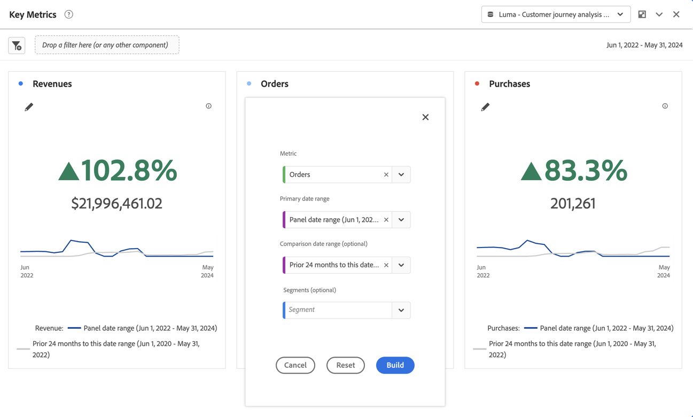

# 主要指標の概要 {#key-metric-summary}

<!-- markdownlint-disable MD034 -->

>[!CONTEXTUALHELP]
>id="workspace_keymetricsummary_button"
>title="主要指標の概要"
>abstract="折れ線グラフ、変更概要グラフおよび数値の概要グラフを組み合わせたビジュアライゼーションを作成します。このビジュアライゼーションを使用すると、2 つの期間での重要な指標のトレンドを比較できます。"

<!-- markdownlint-enable MD034 -->

>[!BEGINSHADEBOX]

_この記事では、_**Adobe Analytics_ の主要指標の概要ビジュアライゼーションについて説明します**。_ _この記事の [CustomerJourneyAnalytics](https://experienceleague.adobe.com/en/docs/analytics-platform/using/cja-workspace/visualizations/key-metric)_ _**Customer Journey Analytics](/help/assets/icons/CustomerJourneyAnalytics.svg) バージョンについては、![ 主な指標の概要** を参照してください。_

>[!ENDSHADEBOX]

**[!UICONTROL 主要指標の概要]** ビジュアライゼーションを使用すると、1 つの期間内で重要な指標のトレンドを確認できます。 また、2 つの期間にわたる指標のパフォーマンスを比較することもできます。次のような複数のビジュアライゼーションが 1 つのビジュアライゼーションに統合されるメリットがあります。

* **[!UICONTROL 折れ線グラフ]** ビジュアライゼーションは、プライマリ日付範囲と比較日付範囲での指標のトレンドを表示します

* **[!UICONTROL 変化率の概要]** プライマリ日付範囲と比較日付範囲の間の指標の増減を表示します

* 指標の現在の合計値（[!UICONTROL **数値概要**]）

## ユースケース

このビジュアライゼーションは、次のような様々な一般的なユースケースに対応しています。

* アナリストは前年の同じ期間と比較して今月の機会創出の様相を把握しようとしています。

* マーケターは特定のリードタイプのリードジェネレーションが今月から先月にかけてどのように変化したかを調べています。

* エグゼクティブは新規予約が今四半期から前四半期にどのように変化したかを理解したいと考えています。

## 使用

1. **[!UICONTROL 主要指標の概要]** ビジュアライゼーションを追加します。 [ パネルへのビジュアライゼーションの追加 ](freeform-analysis-visualizations.md#add-visualizations-to-a-panel) を参照してください。

1. **[!UICONTROL 指標]**、**[!UICONTROL プライマリ日付範囲]** **[!UICONTROL 、{ 比較日付範囲]** （オプション）および **[!UICONTROL フィルター]** （オプション）を選択して、ビジュアライゼーションを設定します。

   

   | オプション | 説明 |
   | --- | --- |
   | **[!UICONTROL 指標]** | 調査の対象となる指標を選択します。すべての指標がサポートされています。 |
   | **[!UICONTROL プライマリ日付範囲]** | フリーフォームテーブルの現在の日付範囲。
データビューで使用可能な日付範囲から選択します。
 
ビジュアライゼーションがあるパネルで使用されているのと同じ日付範囲を使用する場合は、「[!UICONTROL **パネルの日付範囲**]」を選択します。
 |
   | **[!UICONTROL 比較日付範囲]** | プライマリ日付範囲と比較する日付範囲。 |
   | **[!UICONTROL フィルター（オプション）]** | この概要で関心のあるフィルター。 |

   {style="table-layout:auto"}

   >[!NOTE]
   >
   >[!UICONTROL **プライマリの日付範囲**] フィールドが [!UICONTROL **パネルの日付範囲**] に設定されている場合、**[!UICONTROL 比較日付範囲]** は、選択した **[!UICONTROL 比較日付範囲]** オプションがプライマリ日付範囲に対するもの固定であるかどうかに応じて、自動的に更新されます。
   >
   >* **相対的：** **[!UICONTROL 比較日付範囲]** フィールドがプライマリ日付範囲（[!UICONTROL **前日**]、[!UICONTROL **先週の同じ日**]、[!UICONTROL **4 週間前の同じ日**] など）を基準としたオプションに設定されている場合、[!UICONTROL **プライマリ日付範囲**] フィールドを更新すると、**[!UICONTROL 比較日付範囲]** がパネルの日付範囲の直後の期間に自動更新されます。
   >* **固定：** [!UICONTROL **比較日付範囲**] フィールドが固定日付範囲（**2023 年 2 月 3 日（PT）** など）に設定されている場合、[!UICONTROL **プライマリ日付範囲**] フィールドまたはパネル日付範囲に加えた変更は、[!UICONTROL **比較日付範囲**] には影響しません。 ただし、パネルの日付範囲を更新すると、[!UICONTROL **プライマリの日付範囲**] が自動更新されます。

1. 「**[!UICONTROL 作成]**」を選択します。

主要指標の概要の出力は次のようになります。

出力を表示する際は、次の点に注意してください。

* **[!UICONTROL 前の期間]** 折れ線グラフ（常にグレーで表示）は、設定手順の **[!UICONTROL 比較日付範囲]** に対応しています。

* 比較日付範囲が設定時に指定されていない場合やビジュアライゼーション設定で非表示になっている場合は、プライマリ日付範囲の折れ線グラフのみが表示されます。 変更の概要は非表示です。

* ここから、折れ線グラフの上にマウスポインターを置くと、個々の日の統計情報を表示できます。

## 設定

ビジュアライゼーションを作成したら、元の設定を編集できます。

1. ビジュアライゼーションの上部にある「**[!UICONTROL ビジュアライゼーションを設定]**」を選択します。

   元の設定ダイアログに戻ります。

1. 必要に応じて設定を変更します。 現在の設定をリセットするには、「**[!UICONTROL リセット]**」を選択します。 **[!UICONTROL ビルド]** を選択して、ビジュアライゼーションを再構築します。

## 設定

ビジュアライゼーション設定の一部として、特定の主要指標の概要設定を使用できます。

| 設定 | 説明 |
| --- | --- |
| **[!UICONTROL 変化率を強調]** | ビジュアライゼーションの中央に目立つ太字で変更概要を表示します |
| **[!UICONTROL 数値を強調]** | ビジュアライゼーションの中央に目立つ太字で数値概要を表示します |
| **[!UICONTROL 凡例を表示]** | ビジュアライゼーションの下部に凡例を表示または非表示にします |
| **[!UICONTROL 注釈を表示]** | 管理者に追加された注釈を表示または非表示にします |
| **[!UICONTROL タイトルを非表示]** | ビジュアライゼーションのタイトルを非表示にします。 |
| **[!UICONTROL 割合 (％)]** | ビジュアライゼーションを数値ではなくパーセンテージで表示します。 |
| **[!UICONTROL トレンドラインを表示]** | ビジュアライゼーションにトレンドラインを表示します。 |
| **[!UICONTROL トレンドラインに最大値と最小値を表示]** | プライマリ折れ線グラフと比較折れ線グラフの最小値と最大値を表示または非表示 |
| **[!UICONTROL 比較率とトレンドラインを表示]** | 比較データを表示または非表示にします。 非表示にすると、比較折れ線グラフと変更概要オブジェクトの両方が非表示になります。 |
| **[!UICONTROL 合計数を表示]** | 数値概要を表示または非表示 |
| **[!UICONTROL 生の差異を表示]** | プライマリ日付範囲とセカンダリ日付範囲の指標の合計値の生の差異を表示または非表示 |
| **[!UICONTROL 値を短縮]** | 数値をインテリジェントに短縮するには、「**[!UICONTROL 値を短縮]**」を選択します。 選択した場合、省略形の量を定義する数字を入力します。 次に例を示します。 <table><tr><td>**元の値**</td><td>**略語**</td><td>**結果**</td></tr><tr><td>$12,011,141.25</td><td>未選択</td><td align="right">$12,011,141.25</td></tr><tr><td>$12,011,141.25</td><td>選択済み、1 に設定</td><td align="right">12 百万ドル）</td></tr><tr><td>$12,011,141.25</td><td>選択済み、2 に設定</td><td align="right">1200 万ドル</td></tr><tr><td>$12,011,141.25</td><td>選択済み、2 に設定</td><td align="right">12011 万ドル</td></tr><tr><td>$12,011,141.25</td><td>を選択し、3 に設定します。</td><td align="right">12011 万ドル</td></tr></table> |

## ビジュアライゼーションの編集

ビジュアライゼーションを作成した後でも、元の設定を編集できます。

1. ビジュアライゼーションの右上隅（設定の歯車アイコンの横）にある鉛筆アイコンをクリックします。

   

   元の設定ビューに戻ります。

1. 必要に応じて、指標、プライマリ日付範囲、比較日付範囲またはフィルターを変更します。

>[!MORELIKETHIS]
>
>[ パネルへのビジュアライゼーションの追加 ](/help/analyze/analysis-workspace/visualizations/freeform-analysis-visualizations.md#add-visualizations-to-a-panel)
>[ビジュアライゼーション設定 ](/help/analyze/analysis-workspace/visualizations/freeform-analysis-visualizations.md#settings)
>[ビジュアライゼーションコンテキストメニュー ](/help/analyze/analysis-workspace/visualizations/freeform-analysis-visualizations.md#context-menu)

