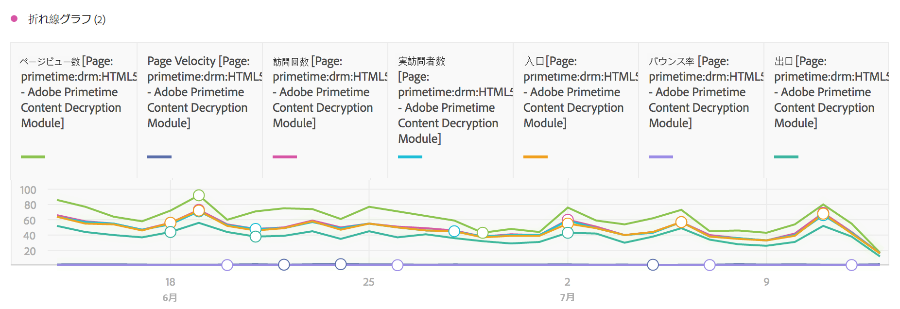
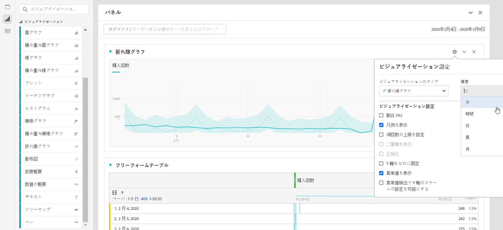

# 行

このビジュアライゼーションでは、時間の経過に伴う値の変化を確認できるように、折れ線で指標が表されます。折れ線グラフは、時間がディメンションとして使用される場合にのみ使用できます。

[ビジュアライゼーション設定](../../../analyze/analysis-workspace/visualizations/freeform-analysis-visualizations.md#section_D3BB5042A92245D8BF6BCF072C66624B)の精度ドロップダウンにより、トレンドビジュアライゼーション（折れ線、棒など）を日別から週別、月別などに変更できます。

