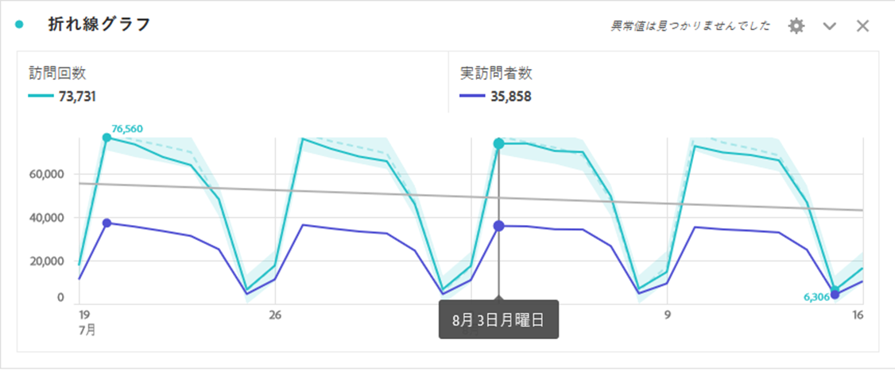
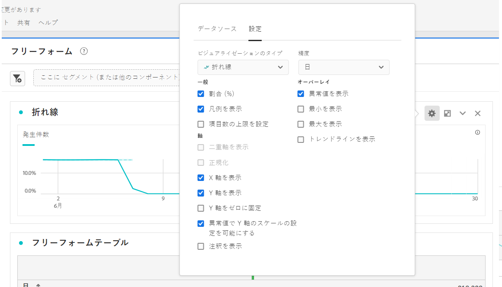
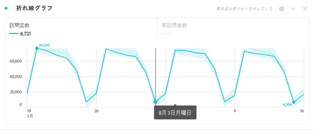
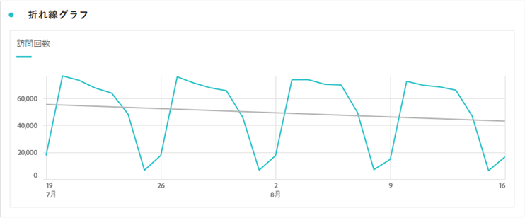

# 行

線のビジュアライゼーションは、ある期間の値の変化を示すために線を使用して指標を表します。 折れ線グラフは、時間がディメンションとして使用される場合にのみ使用できます。

>[!IMPORTANT]
>
>現在、「 [!UICONTROL 近似曲線を表示」などの一部の線のビジュアライゼーション設定は]、制限付きのテストになっています。 [詳細情報](/help/landing/an-releases.md)

行ビジュアライゼーションの右上にある歯車アイコンをクリックして、 [**使用可能なビジュアライゼーション設定にアクセスします**](freeform-analysis-visualizations.md) 。 設定は次の分類に分類されます。

* **一般**:ビジュアライゼーションタイプ間で共通の設定
* **軸**:線のビジュアライゼーションのXまたはY軸に影響する設定
* **オーバーレイ**:行のビジュアライゼーションに表示されるシリーズに、追加のコンテキストを追加するオプションです。

## 精度の変更

[ビジュアライゼーション設定](freeform-analysis-visualizations.md)の精度ドロップダウンにより、トレンドビジュアライゼーション（折れ線、棒など）を日別から週別、月別などに変更できます。データソーステーブルの精度も更新されます。

## 最小または最大を表示

ビジュアライ **[!UICONTROL ゼーション設定]** / **[!UICONTROL Overlays]** /Show min/max ****（最小値/最大値を表示）で、最小値と最大値のラベルをオーバーレイして、指標内のピークと谷をすばやく強調できます。 注意：最小/最大値は、ディメンション内の値の完全なセットではなく、ビジュアライゼーション内の表示されたデータポイントから得られます。

## 近似曲線オーバーレイを表示

ビジュア **[!UICONTROL ライゼーション設定]** / **[!UICONTROL オーバーレイ]** /近似曲線を表示 **[!UICONTROL (Show trendline]**)で、回帰近似曲線を線系列に追加することを選択できます。 近似曲線は、データにより明確なパターンを表現するのに役立ちます。

すべてのモデルは、通常の最小二乗を使用してフィットします。

| モデル | 説明 |
| --- | --- |
| 線形 | 単純な線形データセットに対して最適な直線を作成します。この直線は、データが一定の速度で増減する場合に便利です。 数式： `y = a + b * x` |
| 対数 | 最適な曲線を作成し、データの変化率が急速に増減し、次にレベルアウトする場合に便利です。 対数近似曲線には、負の値と正の値を使用できます。 数式： `y = a + b * log(x)` |
| 指数関数的 | 曲線を作成します。データが絶え間なく増加する速度で上昇または下降する場合に便利です。 データに0または負の値が含まれる場合は、このオプションを使用しないでください。 数式： `y = a + e^(b * x)` |
| 冪 | 曲線を作成します。これは、特定の速度で増加する測定値を比較するデータセットに役立ちます。 データに0または負の値が含まれる場合は、このオプションを使用しないでください。 数式： `y = a * x^b` |
| 二次 | 放物線（上または下に凹面）のような形状のデータセットに最適なデータを検索します。 数式： `y = a + b * x + c * x^2` |
