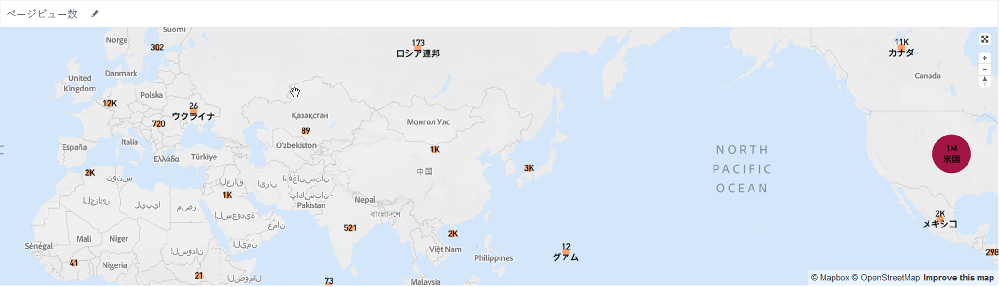

# マップ {#map}

<!-- markdownlint-disable MD034 -->

<!-- markdownlint-disable MD034 -->

>[!CONTEXTUALHELP]
>id="workspace_map_button"
>title="マップ"
>abstract="このビジュアライゼーションでは、指標をマップにオーバーレイして表示します。 このビジュアライゼーションは、様々な地域にまたがるデータを識別する場合に役立ちます。"

<!-- markdownlint-enable MD034 -->

<!-- markdownlint-disable MD034 -->

>[!CONTEXTUALHELP]
>id="workspace_map_bubbles"
>title="バブル"
>abstract="バブルを使用してイベントをプロットします。"

<!-- markdownlint-enable MD034 -->

<!-- markdownlint-disable MD034 -->

>[!CONTEXTUALHELP]
>id="workspace_map_heatmap"
>title="ヒートマップ"
>abstract="ヒートマップを使用してイベントをプロットします。"

<!-- markdownlint-enable MD034 -->

>[!BEGINSHADEBOX]

_この記事では、この記事の_  _**Adobe Analytics**_ _のマップビジュアライゼーションについて説明します。_  _**Customer Journey Analytics**&#x200B;版の[Map](https://experienceleague.adobe.com/en/docs/analytics-platform/using/cja-workspace/visualizations/map)を参照してください。_

>[!ENDSHADEBOX]

Analysis Workspace の  **[!UICONTROL マップ]**&#x200B;ビジュアライゼーション

* 任意の指標（計算指標を含む）のビジュアルマップを作成できます。
* 様々な地域にまたがる指標データを識別および比較する場合に役立ちます。
* モバイルの使用状況からの緯度／経度または web の使用状況の地理的ディメンションの 2 つのデータソースをサポートできます。
* PDF の書き出しをサポートします。
* グラフィックの表示に WebGL を活用します。 お使いのグラフィックドライバーが WebGL レンダリングをサポートしていない場合、ドライバーの更新が必要になる可能性があります。

>[!BEGINSHADEBOX]

デモビデオについて詳しくは、 [Analysis Workspace のマップビジュアライゼーション](https://experienceleague.adobe.com/en/docs/analytics-learn/tutorials/analysis-workspace/visualizations/map-visualization){target="_blank"}を参照してください。

>[!ENDSHADEBOX]

## 使用

1.  [!UICONTROL マップ]ビジュアライゼーションを追加します。 [パネルへのビジュアライゼーションの追加](freeform-analysis-visualizations.md#add-visualizations-to-a-panel)を参照してください。 マップビジュアライゼーションは、フリーフォームテーブルの上にのみドラッグできます。

   {width="50%"}

1. ドロップダウンリストから、指標を選択します。 または、指標のリスト（計算指標を含む）から指標にドラッグします。
1. 描画するデータソースを指定します。 このダイアログは、モバイルアプリデータの場所のトラッキングを有効にしている場合にのみ表示されます。

   | ソース | 説明 |
   | --- | --- |
   | **[!UICONTROL モバイルの緯度／経度]** | このオプションは、モバイルアプリデータを表します。 このオプションが表示されるのは、 [!UICONTROL Analytics]／[!UICONTROL 管理者]／[!UICONTROL レポートスイート]／（レポートスイートを選択）／[!UICONTROL 設定を編集]／[!UICONTROL モバイル管理]／[!UICONTROL 位置追跡を有効にする] で、レポートスイートに対して有効にした場合のみです。 この設定はデフォルトです（場所のトラッキングが有効な場合）。 |
   | **[!UICONTROL 地理的ディメンション]** | このオプションは、訪問者の IP アドレスに基づいた訪問者の場所に関する地理セグメンテーションデータを表します。 このデータは、 [!UICONTROL 国]、 [!UICONTROL 地域] および [!UICONTROL 市区町村] に変換されます。 DMA または郵便番号レベルには変換されません。 ほとんどすべてのレポートスイートで、このディメンションが有効になっています。 お客様が使用していない場合は、Adobe カスタマーケアに連絡して、地理的レポートを有効にしてもらいます。 |

1. 「**[!UICONTROL 作成]**」を選択します。

   バブルを使用した世界マップビジュアライゼーションが生成されます。

   

1. 次のことができるようになりました。

   * このマップに&#x200B;**ズーム**&#x200B;して、マップをダブルクリックするか、スクロールホイールを使用して特定の領域を拡大します。 マップは、カーソルを配置した場所に応じてズームされます。 ズームインタラクションを使用すると、ズームレベルに基づいて、必要なディメンション（国/州/都市）が自動的に更新されます。
   * 同じプロジェクトの 2 つ以上のマップのビジュアライゼーションを横に並べて **比較** します。
   * **期間ごとの比較（前年比など）を表示**:

      * 負の数値を表示：例えば、前年比指標をプロットする場合、マップはニューヨークよりも–33%表示されます。
      * *パーセント*&#x200B;タイプの指標では、クラスタリングでパーセンテージがまとめて平均化されます。
      * 緑/赤の配色：肯定的/否定的

   * **Ctrl] キーを押しながらマップを移動すると、マップを2Dまたは3Dで**&#x200B;回転できます。[!UICONTROL 

   * **以下に説明する[設定](/help/analyze/analysis-workspace/visualizations/map-visualization.md#section_5F89C620A6AA42BC8E0955478B3A427E)を使用して、ヒートマップなどの別のビューに**&#x200B;切り替えます。 バブル表示がデフォルト設定であることに注意してください。

1. **すべてのマップ設定（座標、ズーム、回転）を保存するプロジェクトを**&#x200B;保存します。
1. ビジュアライゼーションの下にあるフリーフォームテーブルには、左側のパネルから場所のディメンションと指標をドラッグしてデータを入力できます。

## 設定

マップビジュアライゼーションを再設定するには、「」を選択します。

## 設定

ビジュアライゼーションの設定を定義するには、「」を選択します。

| 設定 | 説明 |
|--- |--- |
| **[!UICONTROL マップタイプ]** | |
| **[!UICONTROL 吹き出し] | バブルを使用してイベントをプロットします。 バブルチャートとは、散布図とプロポーショナルエリアチャートの間のクロス図である多変数グラフです。 この表示はデフォルトです。 |
| [!UICONTROL  ヒートマップ ] | ヒートマップを使用してイベントをプロットします。 ヒートマップとは、マトリックスに含まれる個々の値が色で表されるデータのグラフィック表現です。 |
| **[!UICONTROL スタイル]** | |
| [!UICONTROL カラーテーマ] | ヒートマップと泡のカラースキームを表示します。 Coral、Reds、Greens、Bluesから選択できます。 デフォルトはコーラルです。 |
| [!UICONTROL マップスタイル] | 「ベーシック」、「ストリート」、「ブライト」、「ライト」、「ダーク」、「サテライト」から選択できます。 |
| **[!UICONTROL クラスター半径]** | 指定したピクセル数内にあるデータポイントをグループ化します。 デフォルトは 50 です。 |
| **[!UICONTROL カスタム最大値]** | マップの最大値のしきい値を変更できます。この値を調節すると、カスタム最大値セットに対してバブル／ヒートマップの値（色とサイズ）を調整します。 |

<!--
## Build a time-parting heatmap

Here is a video on the topic:

>[!VIDEO](https://experienceleague.adobe.com/en/docs/analytics-learn/tutorials/analysis-workspace/visualizations/build-a-time-parting-heatmap)

-->

