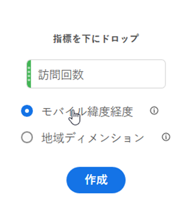

# マップ

## 概要 {#section_19F740FAF08D47B1AF1EF239A74FC75C}

Analysis Workspace のマップのビジュアライゼーションの特徴を次に示します。

* 任意の指標（計算指標を含む）のビジュアルマップを作成できます。
* 様々な地域にまたがる指標データを識別および比較する際に役立ちます。
* モバイルの使用状況からの緯度／経度または Web の使用状況の地域ディメンションの 2 つのデータソースをサポートします。
* PDF の書き出しをサポートします。
* グラフィックの表示に WebGL を利用します。グラフィックドライバーが WebGL レンダリングをサポートしない場合、ドライバーを更新する必要がある可能性があります。

以下は、このトピックの概要に関するビデオです。

>[!VIDEO](https://video.tv.adobe.com/v/23559/?quality=12)

## マップのビジュアライゼーションの作成 {#section_61BBFA3A7BFD48DA8D305A69D9416299}

1. ビジュアライゼーションのリストからフリーフォームパネルに **[!UICONTROL マップ]** をドラッグします。

   

1. 指標のリスト（計算指標を含む）から指標にドラッグします。
1. 描画するデータソースを指定します（このダイアログは、モバイルアプリデータのロケーションの追跡を有効にしている場合にのみ、表示されます）。

| 設定 | 説明 |
| --- | --- |
| [!UICONTROL モバイルの緯度／経度] | このオプションは、モバイルアプリデータを表します。このオプションが表示されるのは、 [!UICONTROL Analytics]／[!UICONTROL 管理者]／[!UICONTROL レポートスイート]／（レポートスイートを選択）／[!UICONTROL 設定を編集]／[!UICONTROL モバイル管理]／[!UICONTROL 位置追跡を有効にする] で、レポートスイートに対して有効にした場合のみです。これがデフォルト設定です（位置追跡が有効な場合）。 |
| [!UICONTROL 地理的ディメンション] | このオプションは、訪問者の IP アドレスに基づいた訪問者の場所に関する地理セグメンテーションデータを表します。このデータは、 [!UICONTROL 国]、 [!UICONTROL 地域] および [!UICONTROL 市区町村] に変換されます。DMA または郵便番号レベルには変換されません。このディメンションは、ほぼすべてのレポートスイートで有効になっています。有効になっていない場合は、アドビカスタマーケアに連絡して、地域レポートを有効にしてもらってください。 |

1. 「**[!UICONTROL 作成]**」をクリックします。

   最初に表示されるのは、次のような、バブルマップ付きの世界地図です。

   

1. 次のことができます。

   * マップをダブルクリックするか、スクロールホイールを使用して、このマップを&#x200B;**ズーム**&#x200B;し、特定の領域を拡大します。マウスポインターのある場所に従って、マップがズームします。ズーム操作の間、ズームレベルに基づいて必要なディメンション（国／都道府県／市区町村）が自動的に更新されます。
   * 同じプロジェクトの 2 つ以上のマップのビジュアライゼーションを横に並べて **比較** します。
   * **対前年比などの前期比を表示します**。

      * 例えば、前年比指標のグラフを表示するときに、ニューヨークの上に -33% と表示することができます。
      * 「割合」タイプの指標の場合、クラスタリングで割合がまとめて平均化されます。
      * 緑／赤の色スキーム：ポジティブ／ネガティブ
   * [!UICONTROL Ctrl] キーを押しながらマップを動かし、2D または 3D のマップを&#x200B;**回転**&#x200B;します。

   * 後述の[設定](/help/analyze/analysis-workspace/visualizations/map-visualization.md#section_5F89C620A6AA42BC8E0955478B3A427E)を使用して、ヒートマップなど、別の表示に&#x200B;**切り替え**&#x200B;ます。バブル表示がデフォルト設定です。

1. プロジェクトを&#x200B;**保存**&#x200B;して、すべてのマップ設定（座標、ズーム、回転）を保存します。
1. 左側のパネルから場所のディメンションと指標をドラッグすることで、フリーフォームテーブル（以下のビジュアライゼーション）を設定できます。

   

## マップのビジュアライゼーション設定 {#section_5F89C620A6AA42BC8E0955478B3A427E}

マップに 2 セットの設定が存在します。

右上にある&#x200B;**レンチアイコン**&#x200B;で最初のダイアログに戻り、指標およびデータソースを変更できます。

**歯車アイコン** をクリックすると、次のビジュアライゼーション設定が表示されます。

| 設定 | 説明 |
|--- |--- |
| バブル | バブルを使用してイベントのグラフを描画します。バブルチャートは、散布図と比例する面グラフの中間の複数変数のグラフです。これはデフォルトの表示です。 |
| ヒートマップ | ヒートマップを使用してイベントのグラフを描画します。ヒートマップは、データのグラフィカル表示で、マトリックスに含まれる個々の値が色で表されます。 |
| スタイル：カラーテーマ | ヒートマップおよびバブルのカラースキームを表します。コーラル、赤、緑または青から選択できます。デフォルトはコーラルです。 |
| スタイル：マップスタイル | 基本、通り、明るい、薄い、暗いおよびサテライトから選択できます。 |
| クラスター半径 | 指定したピクセル数内にあるデータポイントをグループ化します。初期設定は 50 です。 |
| カスタム最大値 | マップの最大値のしきい値を変更できます。この値を調節すると、カスタム最大値セットに対してバブル／ヒートマップの値（色とサイズ）を調整します。 |

## 時間分割ヒートマップの作成

以下は、このトピックに関するビデオです。

>[!VIDEO](https://video.tv.adobe.com/v/26991/?quality=12)
