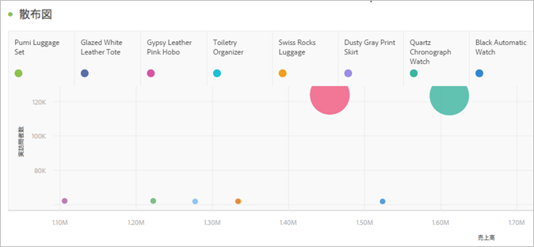

# 散布図

インプレッションや、これらのインプレッションを表示した個別ユーザー数を表示します。

各データポイントのサイズによって、閲覧者が広告を表示した平均回数を視覚的に推測できます。サイズとデータは、選択したディメンション、日付範囲、フィルターによって異なります。

>[!NOTE]
>
>散布図に関連付けられたテーブルには、少なくとも2つの列が必要です。最初の列では X 軸を定義し、2 番目の列では Y 軸を定義します。3 番目の列がある場合は、散布図ではこれを使用して、点の半径を決定します。つまり、列 *1*、*2*、*3*&#x200B;は、*X 軸*、*Y 軸*、*点の半径*&#x200B;に対応します。

