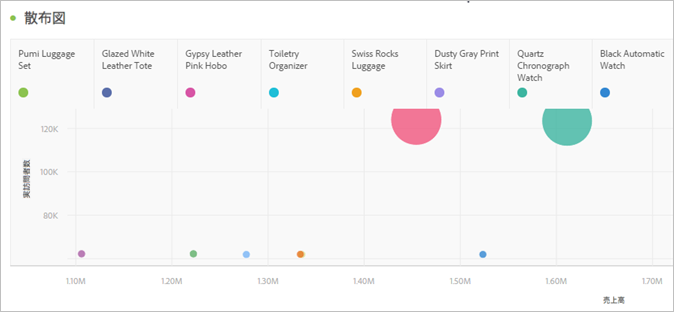

# 散布図 {#scatter}

<!-- markdownlint-disable MD034 -->

>[!CONTEXTUALHELP]
>id="workspace_scatter_button"
>title="散布図"
>abstract="ディメンション項目と最大 3 つの指標の関係を示す、散布図のビジュアライゼーションを作成します。"

<!-- markdownlint-enable MD034 -->

>[!BEGINSHADEBOX]

_この記事では、この記事の_  _&#x200B;**Adobe Analytics**&#x200B;_ _で散布図を作成します。この記事の_  _&#x200B;**Customer Journey Analytics** バージョンについては、[散布図](https://experienceleague.adobe.com/ja/docs/analytics-platform/using/cja-workspace/visualizations/scatterplot)を参照してください。_

>[!ENDSHADEBOX]

 **[!UICONTROL Scatter]** ビジュアライゼーションは、データ内の異なる指標間の相関関係とパターンを特定するのに役立ちます。 ビジュアライゼーションには、ディメンション項目と3つまでの指標の関係が表示されます。 ビジュアライゼーションには 3 つのコンポーネントが必要で、最大 4 つのコンポーネントの視覚化をサポートします。

* 行コンポーネント（通常はディメンション）は、グラフ上の各ポイントを表します。 それぞれの行が、異なる色のドットで表示されます。
* 一番左の列（通常は指標）には、Y 軸（垂直方向）上の点の位置が描画されます。
* 2 番目の列には、X 軸（水平方向）上の点の位置が描画されます。
* 3 番目の列は、ドットの半径を決定します。
* フリーフォームテーブルの後続の列は、散布図のビジュアライゼーションでは無視されます。

>[!BEGINSHADEBOX]

デモビデオについて詳しくは、 [散布図ビジュアライゼーション](https://experienceleague.adobe.com/ja/docs/analytics-learn/tutorials/analysis-workspace/visualizations/scatterplot-visualization){target="_blank"}を参照してください。

>[!ENDSHADEBOX]

>[!NOTE]
>
>散布図で表示するように凡例を[設定すると、](/help/analyze/analysis-workspace/visualizations/freeform-analysis-visualizations.md#settings)は、データソースに限られた数の（選択した）ディメンション項目が含まれている場合にのみ表示されます。

>[!MORELIKETHIS]
>
>[&#x200B; パネルへのビジュアライゼーションの追加](/help/analyze/analysis-workspace/visualizations/freeform-analysis-visualizations.md#add-visualizations-to-a-panel)
>[ビジュアライゼーション設定](/help/analyze/analysis-workspace/visualizations/freeform-analysis-visualizations.md#settings)
>[ビジュアライゼーションコンテキストメニュー](/help/analyze/analysis-workspace/visualizations/freeform-analysis-visualizations.md#context-menu)
>
