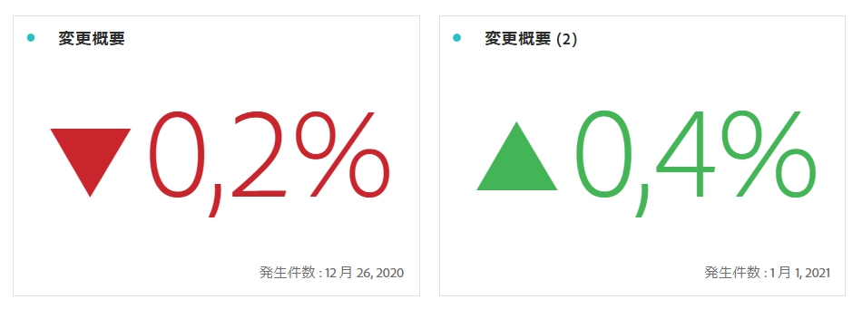

# 数の概要と変更の概要

## 数値の概要ビジュアライゼーション  {#summary-number}

概要番号ビジュアライゼーションを使用して、プロジェクトで重要な大きな数を強調表示します。このビジュアライゼーションは、次のように動作します。

* セルが選択されていない場合、列の合計が選択されます。
* 1 つのセルが選択されている場合、そのセルの概要が表示されます。
* 2 つ以上のセルが選択されている場合、選択された最初のセルについて表示されます。
* 列が選択されている場合、列に含まれている先頭のセルの値が選択されます。

右上の「**ビジュアライゼーション設定**」の歯車をクリックして、概要番号の設定を指定します。

| 設定 | 定義 |
|--- |--- |
| 割合（％） | 生の番号ではなく割合を表示します。 |
| 凡例を表示 | 表示された指標に関する情報を表示します。 |
| 値を短縮 | 値の省略形として、小数点以下 3 桁まで表示できます。 |
| 値の要約基準 | データの選択範囲の最大値、最小値、平均値、中央値または合計を表示するかどうかを選択します。 |

右上の「**ビジュアライゼーション設定**」の歯車をクリックして、概要番号の設定を指定します。

| 設定 | 定義 |
|--- |--- |
| 割合（％） | 生の番号ではなく割合を表示します。 |
| 凡例を表示 | 表示された指標に関する情報を表示します。 |
| 値を短縮 | 値の省略形として、小数点以下 3 桁まで表示できます。 |
| 値の要約基準 | データの選択範囲の最大値、最小値、平均値、中央値または合計を表示するかどうかを選択します。 |

## 変更概要ビジュアライゼーション {#summary-change}

変更概要ビジュアライゼーションを使用して、2 つの数値の差分（変化）を表示します。変更概要の緑と赤は、[カスタムイベントの極性](https://docs.adobe.com/content/help/ja-JP/analytics/admin/admin-tools/success-events/success-event.html)、または計算指標の「[上昇傾向を表示](https://docs.adobe.com/content/help/ja-JP/analytics/components/calculated-metrics/calcmetric-workflow/cm-build-metrics.html)」オプションを使用して制御できます。

このビジュアライゼーションは、次のように動作します。

* セルが選択されていない場合、列に含まれている最初の 2 つのセル値が比較されます。
* 1 つのセルが選択されている場合、0 が表示されます。これは、そのセル値自体との比較がおこなわれるからです。
* 2 つのセルが選択されている場合、最初に選択したセルが分子、2 番目のセルが分母として処理されます。
* 3 つ以上のセルが選択されている場合、最初の 2 つのセルのみが比較の対象になります。
* 一定範囲のセルが選択されている場合、選択された範囲内の最初と最後のセルが比較されます。
* 列が選択されている場合、先頭の値がそれ自体と比較されます。その結果、変更は 0 と表示されます。

右上の&#x200B;**ビジュアライゼーション設定**&#x200B;の歯車をクリックして、変更概要の設定を指定します。

| 設定 | 定義 |
|--- |--- |
| 割合（％） | 生の番号ではなく割合を表示します。 |
| 凡例を表示 | 表示された指標に関する情報を表示します。 |
| 変化率を表示 | 2 つの数値の変化率を表示します。 |
| 生の差異を表示 | 2 つの数の間の生の差異を表示します。また、値の省略形を使用し、小数点以下 3 桁まで表示できます。 |
