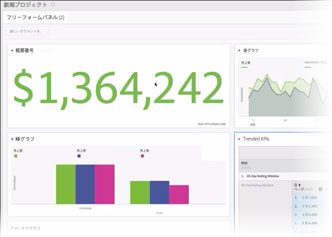

# 数値の概要と変更概要

## 数値の概要ビジュアライゼーション

* セルが選択されていない場合、列の合計が選択されます。
* 1 つのセルが選択されている場合、そのセルの概要が表示されます。
* 2 つ以上のセルが選択されている場合、選択された最初のセルについて表示されます。
* 列が選択されている場合、列に含まれている先頭のセルの値が選択されます。

## 変更の概要ビジュアライゼーション

* セルが選択されていない場合、列に含まれている最初の 2 つのセル値が比較されます。
* 1 つのセルが選択されている場合、0 が表示されます。これは、そのセル値自体との比較がおこなわれるからです。
* 2 つのセルが選択されている場合、最初に選択したセルが分子、2 番目のセルが分母として処理されます。
* 3 つ以上のセルが選択されている場合、最初の 2 つのセルのみが比較の対象になります。
* 一定範囲のセルが選択されている場合、選択された範囲内の最初と最後のセルが比較されます。
* 列が選択されている場合、先頭の値がそれ自体と比較されます。その結果、変更は 0 と表示されます。
* 変更概要の緑と赤の部分は、以下の方法で制御できます。

   * [カスタムイベントの極性](https://marketing.adobe.com/resources/help/en_US/reference/success_event.html)。
   * 計算指標の「[上昇傾向を次の形式で表示](https://marketing.adobe.com/resources/help/en_US/analytics/calcmetrics/cm_build_metrics.html)」オプション。

## Summary Change settings {#section_2581AC0107634FB4990AB8347E5897AA}

ビジュアライゼーションの横にあるギアアイコンをクリックすると、概要の設定をおこなえます。

| 設定 | 定義 |
|--- |--- |
| 割合（％） | 生の番号ではなく割合を使用します。 |
| 凡例を表示 | 使用した指標を表示します。 |
| 数値の概要オプション：値を短縮 | 短縮された値の小数点以下桁数を 0 ～ 3 から選択できます。 |
| 変更概要オプション：変化の割合 | 2 つの数の間の変化を％で表示します。 |
| 変更概要オプション：生の差異データ | 2 つの数の間の生の差異を表示します。 |