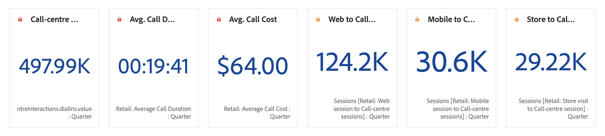

# 数と変更の概要

>[!BEGINSHADEBOX]

_この記事は、_ AdobeAnalyticsAdobe Analytics _&#x200B;**の数値概要と変更概要のビジュアライゼーションについて説明します**。_ _この記事の [CustomerJourneyAnalytics](https://experienceleague.adobe.com/ja/docs/analytics-platform/using/cja-workspace/visualizations/summary-number-change)_  版については、_&#x200B;**数値概要と変更概要** を参照してください。_

>[!ENDSHADEBOX]

>[!BEGINSHADEBOX]

デモビデオについて詳しくは、 [数値の概要と変更の概要ビジュアライゼーション](https://video.tv.adobe.com/v/335564/?quality=12&learn=on){target="_blank"}を参照してください。

>[!ENDSHADEBOX]

## 数値の概要 {#summary-number}

<!-- markdownlint-disable MD034 -->

>[!CONTEXTUALHELP]
>id="workspace_summarynumber_button"
>title="数値の概要"
>abstract="合計と小計を表示するビジュアライゼーションを作成します。"

<!-- markdownlint-enable MD034 -->

 **[!UICONTROL 数値の概要]**&#x200B;ビジュアライゼーションを使用して、プロジェクト内の重要な多数の数値をハイライト表示します。このビジュアライゼーションは、関連付けられたデータソースを使用して、次のように動作します。

* セルが選択されていない場合、列の合計が選択されます。
* 1 つのセルが選択されている場合、そのセルの概要が表示されます。
* 2 つ以上のセルが選択されている場合、選択された最初のセルについて表示されます。
* 列が選択されている場合、列に含まれている先頭のセルの値が選択されます。

ビジュアライゼーション設定の一部として、特定の数値の概要オプションを使用できます。

| オプション | 定義 |
|--- |--- |
| **[!UICONTROL 値を短縮]** | 数値をインテリジェントに短縮するには、「**[!UICONTROL 値を短縮]**」を選択します。選択した場合、短縮の量を定義する数値を入力します。次に例を示します。 <table><tr><td>**元の値**</td><td>**短縮の値**</td><td>**結果**</td></tr><tr><td>$12,011,141.25</td><td>未選択</td><td  align="right">$12,011,141.25</td></tr><tr><td>$12,011,141.25</td><td>選択済み、`0` に設定</td><td align="right">$12M</td></tr><tr><td>$12,011,141.25</td><td> 選択済み、`1` に設定</td><td  align="right">$12.0M</td></tr><tr><td>$12,011,141.25</td><td>選択済み、`2` に設定</td><td align="right">$12.01M</td></tr><tr><td>$12,011,141.25</td><td>選択済み、`3` に設定</td><td align="right">$12.011M</td></tr></table> |
| **[!UICONTROL 値の要約基準]** | 選択したデータの最大値、最小値、平均値、中央値または合計値の表示を選択します。 |

## 変更の概要 {#summary-change}

<!-- markdownlint-disable MD034 -->

>[!CONTEXTUALHELP]
>id="workspace_summarychange_button"
>title="変更の概要"
>abstract="2 つの数値間の差分（変化）を表示するビジュアライゼーションの作成"

<!-- markdownlint-enable MD034 -->

 **[!UICONTROL 変更の概要]** ビジュアライゼーションを使用すると、2 つの数値間の差分（変化）を表示できます。<!-- This is applicable for AA, not CJA: The green and red color of the Summary Change can be controlled through [custom event polarity](/help/admin/tools/success-events/success-event.md) or a calculated metric's [Show Upward Trend As](/help/components/calculated-metrics/workflow/cm-build-metrics.md) option.-->

<!--
The green and red color of the Summary Change can be controlled through [custom event polarity](/help/admin/tools/manage-rs/edit-settings/conversion-var-admin/c-success-events/success-event.md.md) or a calculated metric's [Show Upward Trend As](/help/components/calculated-metrics/calcmetric-workflow/cm-build-metrics.md) option.
-->

このビジュアライゼーションは、次のように動作します。

* セルが選択されていない場合、列に含まれている最初の 2 つのセル値が比較されます。
* 1 つのセルが選択されている場合、0 が表示されます。これは、そのセル値自体との比較がおこなわれるからです。
* 2 つのセルが選択されている場合、最初に選択したセルが分子、2 番目のセルが分母として処理されます。
* 3 つ以上のセルが選択されている場合、最初の 2 つのセルのみが比較の対象になります。
* 一定範囲のセルが選択されている場合、選択された範囲内の最初と最後のセルが比較されます。
* 列が選択されている場合、先頭の値がそれ自体と比較されます。その結果、変更は 0 と表示されます。

ビジュアライゼーション設定の一部として、特定の&#x200B;**[!UICONTROL 変更の概要オプション]**&#x200B;を使用できます。

| オプション | 定義 |
|--- |--- |
| **[!UICONTROL 変化率を表示]** | 2 つの数値間の変化率を表示します。 |
| **[!UICONTROL 生の差異を表示]** | 2 つの数値間の生の差異を表示します。また、値の省略形を使用し、小数点以下 3 桁まで表示できます。 |
| **[!UICONTROL 値を短縮]** | 変更した値をインテリジェントに短縮するには、「**[!UICONTROL 値を短縮]**」を選択します。選択した場合、短縮の量を定義する数値を入力します。次に例を示します。 <table><tr><td>**元の値**</td><td>**短縮の値**</td><td>**結果**</td></tr><tr><td>$12,011,141.25</td><td>未選択</td><td  align="right">$12,011,141.25</td></tr><tr><td>$12,011,141.25</td><td>選択済み、`0` に設定</td><td align="right">$12M</td></tr><tr><td>$12,011,141.25</td><td> 選択済み、`1` に設定</td><td  align="right">$12.0M</td></tr><tr><td>$12,011,141.25</td><td>選択済み、`2` に設定</td><td align="right">$12.01M</td></tr><tr><td>$12,011,141.25</td><td>選択済み、`3` に設定</td><td align="right">$12.011M</td></tr></table> |

>[!MORELIKETHIS]
>
>[パネルへのビジュアライゼーションの追加](/help/analyze/analysis-workspace/visualizations/freeform-analysis-visualizations.md#add-visualizations-to-a-panel)
>&#x200B;>[ビジュアライゼーション設定](/help/analyze/analysis-workspace/visualizations/freeform-analysis-visualizations.md#settings)
>&#x200B;>[ビジュアライゼーションコンテキストメニュー](/help/analyze/analysis-workspace/visualizations/freeform-analysis-visualizations.md#context-menu)
>
