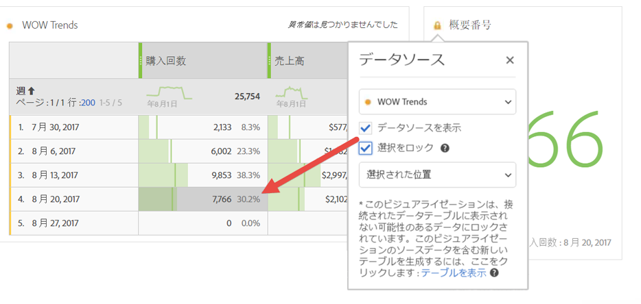

# データソースの管理

ビジュアライゼーションを同期することで、ビジュアライゼーションに対応するデータテーブルまたはデータソースを制御できます。

**ヒント：** どのビジュアライゼーションがタイトルの横の点の色によって関連しているかを知ることができます。 色が一致すると、ビジュアライゼーションは同じデータソースに基づいています。

データソースを管理すると、データソースを表示したり、選択をロックしたりできます。 これらの設定は、新しいデータが入ってきたときにビジュアライゼーションがどのように変化するか（または変化しないか）を決定します。

1. データテーブルと[ビジュアライゼーション](/help/analyze/analysis-workspace/visualizations/freeform-analysis-visualizations.md)を使用して[プロジェクトを作成](/help/analyze/analysis-workspace/build-workspace-project/t-freeform-project.md)します。
1. データテーブルで、ビジュアライゼーションに関連付けたいセル（データソース）を選択します。
1. In the visualization, click the dot next to the title to bring up the **[!UICONTROL Data Source]** dialog. またはを **[!UICONTROL Show Data Source]** 選択しま **[!UICONTROL Lock Selection]**&#x200B;す。

   

   ビジュアライゼーションをテーブルのセルに同期すると、新しい（非表示の）テーブルと、そのテーブルに同期したビジュアライゼーションのカラーコードが作成されます。

| 要素 | 説明 |
|--- |--- |
| リンクされたビジュアライゼーション | フリーフォームテーブルまたはコホートテーブルに接続されたビジュアライゼーションがある場合は、左上の点で接続済みのビジュアライゼーションを一覧表示でき、テーブルの表示／非表示を切り替える「表示」チェックボックスオプションが表示されます。リンクされたビジュアライゼーションがホバーでハイライト表示され、クリックするとそのビジュアライゼーションが表示されます。 |
| データソースを表示 | ビジュアライゼーションに対応するデータテーブルを表示（チェックボックスを有効にして）または非表示（無効にして）できます。 |
| 選択をロック | この設定を有効にすると、対応するデータテーブルで現在選択されているデータにビジュアライゼーションがロックされます。 有効にしたら、次のいずれかを選択します。  <ul><li>**選択した位置**:対応するデータテーブルで選択した位置でビジュアライゼーションをロックしたままにする場合は、このオプションを選択します。 これらの位置に含まれる特定の項目が変更されても、これらの位置は引き続きビジュアライゼーションされます。 例えば、上位 5 つのキャンペーン名が何であろうと、このビジュアライゼーションで上位 5 つのキャンペーン名を常に表示する場合は、このオプションを選択します。</li> <li>**選択した項目**:対応するデータテーブルで現在選択されている特定の項目でビジュアライゼーションをロックしたままにする場合は、このオプションを選択します。 これらの項目は、テーブル内の項目間のランクが変更された場合でも、引き続きビジュアライゼーションの対象となります。 例えば、このビジュアライゼーションで同じ5つの特定のキャンペーン名を、キャンペーン名のランクにかかわらず常に表示する場合は、このオプションを選択します。</li></ul> |

このアーキテクチャは、以前 Analysis Workspace にあった、ロックした選択が格納される非表示の複製テーブルを作成するアーキテクチャとは異なります。これで、データソースは、ビジュアライゼーションの作成元のテーブルを参照します。

**使用例：**

* 概要ビジュアライゼーションを作成し、作成元のテーブルのセルにロックできます。 「データソースを表示」を有効にすると、この情報が表のどこから来たかが正確に表示されます。 ソースデータは灰色表示になります。

   >
* 次に示すように、多くのビジュアライゼーションを追加し、同じ表の異なるセルからそれらをソース化できます。 表は上の例と同じですが、ソースのセル（および指標）は異なります。

   >
* 左上のドット（データソースの設定）をクリックすると、フリーフォームまたはコホートテーブルにビジュアライゼーションが接続されているかどうかを確認できます。 リンクされたビジュアライゼーションをホバーするとハイライト表示され、クリックすると表示されます。

   >
