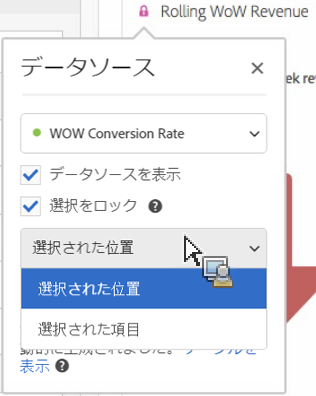

# データソースの管理

ビジュアライゼーションを同期することで、ビジュアライゼーションに対応するデータテーブルまたはデータソースを制御できます。

**ヒント：**&#x200B;タイトルの横の点の色で、どのビジュアライゼーションが関連しているかがわかります。色が一致していると、ビジュアライゼーションが同じデータソースに基づいていることを意味します。

データソースを管理すると、データソースを表示したり、選択をロックしたりできます。これらの設定は、新しいデータが入ってきた際にどのようにビジュアライゼーションを変更するか（または変更しないか）を決定します。

1. データテーブルと[ビジュアライゼーション](/help/analyze/analysis-workspace/visualizations/freeform-analysis-visualizations.md)を使用して[プロジェクトを作成](//help/analyze/analysis-workspace/home.md)します。
1. データテーブルで、ビジュアライゼーションに関連付けたいセル（データソース）を選択します。
1. ビジュアライゼーションでタイトルの横にある点をクリックすると、**[!UICONTROL データソース]**&#x200B;ダイアログが表示されます。「**[!UICONTROL データソースを表示]**」または「**[!UICONTROL 選択をロック]**」を選択します。

   

   ビジュアライゼーションのテーブルセルへの同期によって、新しい（非表示の）テーブルと、テーブルに同期されたビジュアライゼーションのカラーコードが作成されます。

| 要素 | 説明 |
|--- |--- |
| リンクされたビジュアライゼーション | フリーフォームテーブルまたはコホートテーブルに接続されたビジュアライゼーションがある場合は、左上の点で接続済みのビジュアライゼーションを一覧表示でき、テーブルの表示／非表示を切り替える「表示」チェックボックスオプションが表示されます。カーソルを合わせるとリンク済みのビジュアライゼーションが強調表示され、クリックするとそこにアクセスできます。 |
| データソースを表示 | ビジュアライゼーションに対応するデータテーブルを表示したり（チェックボックスをオン）、非表示にしたり（チェックボックスをオフ）できます。 |
| 選択をロック | この設定を有効にすると、ビジュアライゼーションを、対応するデータテーブルで現在選択されているデータにロックできます。チェックボックスをオンにすると、次のいずれかを選択できます。  <ul><li>**選択した位置**：対応するデータテーブルで選択されている位置にビジュアライゼーションをロックした状態で固定するには、このオプションを選択します。これらの位置に配置された特定のアイテムが変更されても、これらの位置は引き続きビジュアライゼーションの対象になります。例えば、上位 5 つのキャンペーン名が何であろうと、このビジュアライゼーションで上位 5 つのキャンペーン名を常に表示する場合は、このオプションを選択します。</li> <li>**選択した項目**：対応するデータテーブルで現在選択されている特定の項目について、ビジュアライゼーションをロックした状態で維持するには、このオプションを選択します。これらのアイテムは、テーブルのアイテム間のランクが変更されても、引き続きビジュアライゼーションの対象になります。例えば、このビジュアライゼーションで 5 つの特定のキャンペーン名を、キャンペーン名のランクにかかわらず表示する場合は、このオプションを選択します。</li></ul> |

このアーキテクチャは、以前 Analysis Workspace にあった、ロックした選択が格納される非表示の複製テーブルを作成するアーキテクチャとは異なります。現在は、データソースはビジュアライゼーションの作成元であるテーブルがポイントされます。

**使用例：**

* 概要のビジュアライゼーションを作成し、作成元となったテーブルのセルにそれをロックすることができます。「データソースを表示」をオンにすると、その情報がテーブルのどこから取得されたかが正確に表示されます。ソースデータの表示が灰色になります。

   >
* 次に示すように、同一のテーブルに含まれた異なるセルをソースにして、多数のビジュアライゼーションを追加できます。テーブルは上の例と同じですが、ソースとなるセル（および指標）は異なります。

   >
* フリーフォームテーブルまたはコホートテーブルに接続されたビジュアライゼーションがあるかどうかを、左上の点（データソース設定）をクリックすることで確認できます。カーソルを合わせるとリンク済みのビジュアライゼーションが強調表示され、クリックで移動できます。

   >
