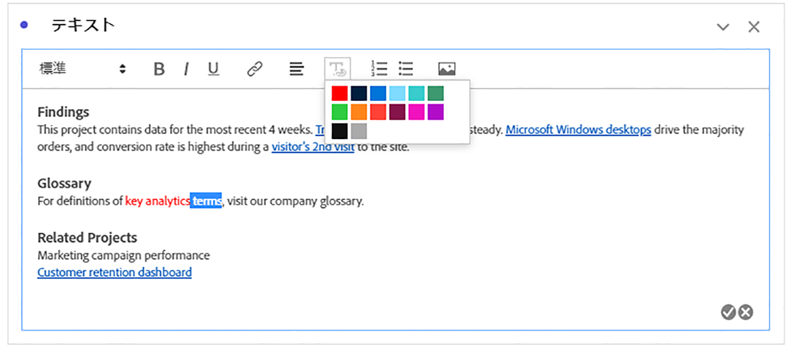
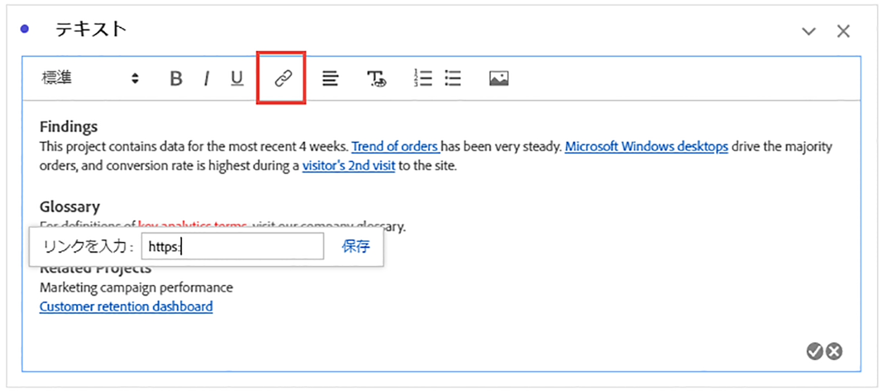
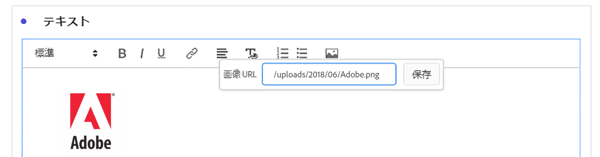

# テキスト

テキストのビジュアライゼーションまたはパネル/ビジュアライゼーションの説明を使用して、ユーザー定義のテキストをWorkspaceプロジェクトに追加できます（ヘッダー/**[!UICONTROL 説明を編集]**&#x200B;を右クリック）。 また、テキストの書式設定の変更、ハイパーリンクの追加、画像の追加を行うこともできます。

## 書式の調整{#format}

テキストボックスや説明を編集する際に、選択したテキストのフォントサイズ（見出しレベル）、色、スタイル（太字、斜体、下線）および配置を調整できます。 箇条書きと番号付きのリストを追加することもできます。

## ハイパーリンクの追加 {#hyperlinks}

ハイパーリンクを追加するには、テキストをハイライト表示し、メニューのハイパーリンクアイコンをクリックします。 ハイパーリンクは、外部のWebサイト、ドキュメントページ、[Workspaceプロジェクト/パネル/ビジュアライゼーション](https://experienceleague.adobe.com/docs/analytics/analyze/analysis-workspace/curate-share/shareable-links.html)などにリンクして、プロジェクトの受信者に役立てることができます。

## 追加画像{#images}

プロジェクトに画像を追加するには、メニューの画像アイコンをクリックし、公開画像URLを挿入します。 画像URLは、`https`で始まる、`.png`、`.jpeg`、`.jpg`、または`.gif`の形式で、公開アクセス可能である必要があります。 静的な画像とアニメーション画像がサポートされます。

