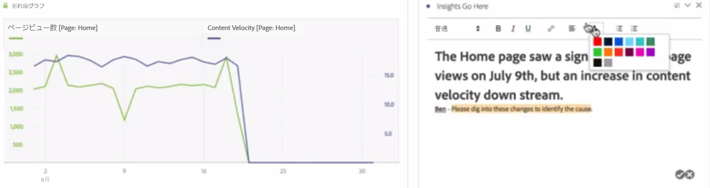
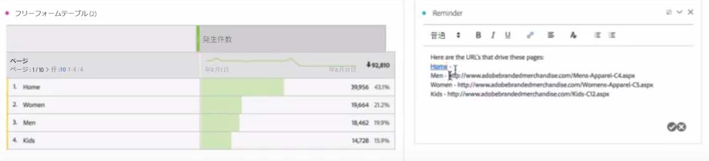

# テキスト

ユーザー定義のテキストをワークスペースに追加できます。

フォント設定を変更できます（太字、斜体など）。また、テキストボックスビジュアライゼーションおよびパネル／ビジュアライゼーションの説明内にハイパーリンクを追加できます。

## Change font settings {#section_32727EE03FD04A8EB1D1B387DCAF6537}

テキストビジュアライゼーションをパネルにドラッグしてテキストを追加した後、テキストを書式設定できます。見出しレベルの追加、テキストの太字／斜体／下線の変更、テキストの色の変更などをおこなえます。

## Add hyperlinks {#section_D55B857188A74A06B49006DF3511DC7C}

テキストをハイライト表示し、書式設定メニューのハイパーリンクアイコンをクリックして、ハイパーリンクを追加します。
