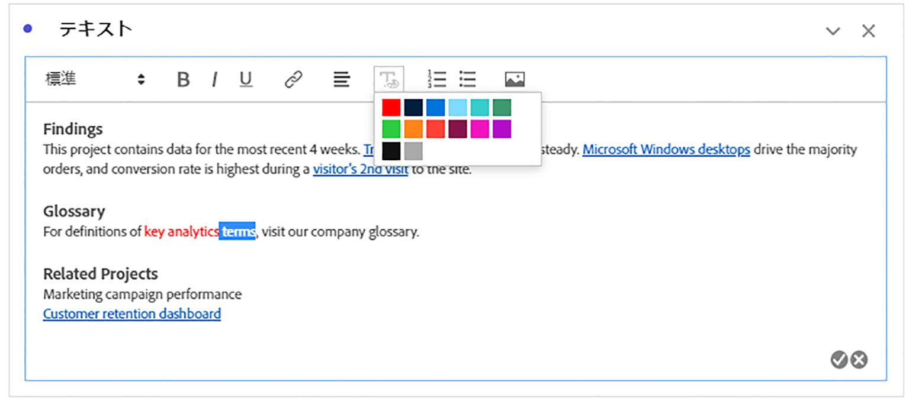
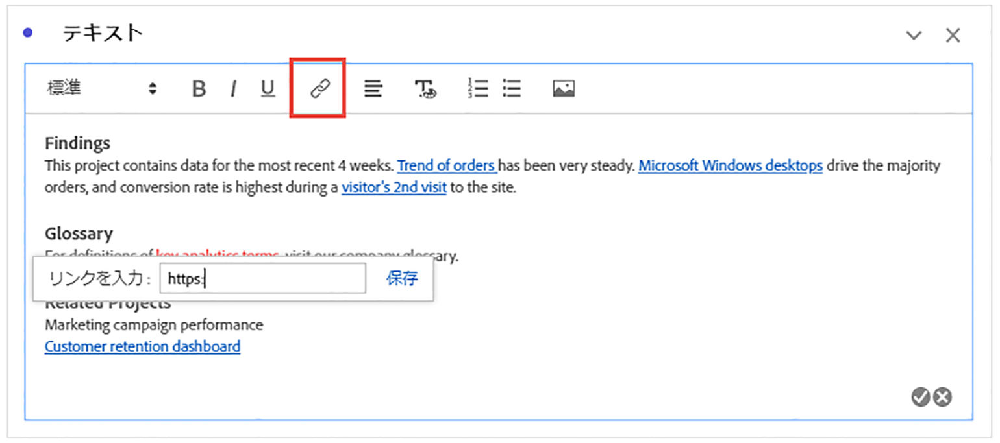
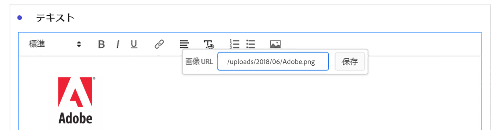

# テキスト {#text-visualization}

>[!CONTEXTUALHELP]
>id="workspace_text_button"
>title="テキスト"
>abstract="ユーザー定義のリッチテキストビジュアライゼーションをプロジェクトに追加します。"

<!-- markdownlint-enable MD034 -->

>[!BEGINSHADEBOX]

_この記事では、この記事の_  _**Adobe Analytics**._ _この記事の_  _**Customer Journey Analytics** バージョンについては、[Text](https://experienceleague.adobe.com/ja/docs/analytics-platform/using/cja-workspace/visualizations/text)を参照してください。_

>[!ENDSHADEBOX]

次のことが可能です。
ユーザー定義のリッチテキストを Workspace プロジェクトに追加するには、 **[!UICONTROL テキスト]**&#x200B;ビジュアライゼーションを使用するか、ビジュアライゼーションとパネルの説明を使用します。

## 使用

テキストビジュアライゼーションは、次の方法で使用できます。

1.  **[!UICONTROL テキスト]**&#x200B;ビジュアライゼーションを追加します。 [パネルへのビジュアライゼーションの追加](freeform-analysis-visualizations.md#add-visualizations-to-a-panel)を参照してください。

1. パネルまたはビジュアライゼーションで、コンテキストメニューから「**[!UICONTROL 説明を編集]**」を選択します。

   説明の編集が完了したら  を選択し、キャンセルするには  を選択します。

テキストの書式設定の変更、ハイパーリンクの追加、画像の追加を行うことができます。

## 書式設定の調整 {#format}

テキストボックスや説明を編集する際に、選択したテキストのフォントサイズ（見出しレベル）、色、スタイル（太字、斜体、下線）および配置を調整できます。 箇条書きと番号付きのリストを追加することもできます。

## ハイパーリンクの追加 {#hyperlinks}

ハイパーリンクを追加するには、テキストをハイライト表示し、メニューで  を選択します。 ハイパーリンクを使用すると、プロジェクトの受信者にさらに支援を提供できます。 ハイパーリンクは、外部 web サイト、ドキュメントページ、[Workspace プロジェクト、パネル、ビジュアライゼーション](/help/analyze/analysis-workspace/curate-share/shareable-links.md)などにリンクできます。

## 画像を追加 {#images}

プロジェクトに画像を追加するには、メニューでを選択し、**[!UICONTROL 画像URL]** （例：`https://www.adobe.com/uploads/2018/06/Adobe.png`）に画像URLを指定して、**[!UICONTROL 保存]**&#x200B;を選択します。

画像 URL は、`https`で始まる、`.png`、`.jpeg`、`.jpg`、または`.gif`の形式で、公開アクセス可能である必要があります。 静的な画像とアニメーション画像がサポートされます。

画像のドラッグ&amp;ドロップ挿入はサポートされていないことに注意してください。

