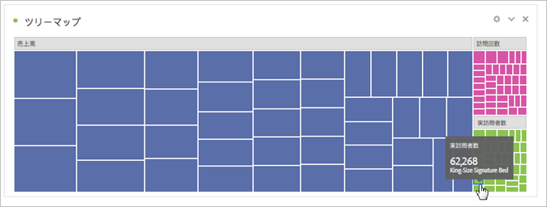

# [!UICONTROL ツリーマップ] {#treemap}

<!-- markdownlint-disable MD034 -->

>[!CONTEXTUALHELP]
>id="workspace_treemap_button"
>title="ツリーマップ"
>abstract="ツリーマップビジュアライゼーションを作成して、ネストされた長方形で階層（ツリー構造）データを表示します。"

<!-- markdownlint-enable MD034 -->

>[!BEGINSHADEBOX]

_この記事では、この記事の_  _**Customer Journey Analytics**&#x200B;版の[ ツリーマップ ](https://experienceleague.adobe.com/ja/docs/analytics-platform/using/cja-workspace/visualizations/treemap)を参照してください。__**Adobe Analytics**。_ __

>[!ENDSHADEBOX]

階層（ツリー構造）データを、ネストされた長方形のセットとして表示するには、 **[!UICONTROL ツリーマップ]**&#x200B;ビジュアライゼーションを使用します。

ツリーの各分岐が長方形で示され、これに、下位レベルの分岐を示す小さな長方形がタイル状に並べられています。

ツリーマップを使用すると、他の方法では検出が困難なパターンを確認できます。 ディメンションのカラーとサイズを使用すると、ディメンションが相関している仕組みや、特定のディメンションが特に関連しているかどうかを確認できます。 ツリーマップの 2 つ目のメリットは、構造上、ツリーマップがスペースを効率的に使用できることです。

>[!BEGINSHADEBOX]

デモビデオについて詳しくは、 [ツリーマップビジュアライゼーション](https://experienceleague.adobe.com/en/docs/analytics-learn/tutorials/analysis-workspace/visualizations/treemap-visualization){target="_blank"}を参照してください。

>[!ENDSHADEBOX]

>[!MORELIKETHIS]
>
>[ パネルへのビジュアライゼーションの追加](/help/analyze/analysis-workspace/visualizations/freeform-analysis-visualizations.md#add-visualizations-to-a-panel)
>[ビジュアライゼーション設定](/help/analyze/analysis-workspace/visualizations/freeform-analysis-visualizations.md#settings)
>[ビジュアライゼーションコンテキストメニュー](/help/analyze/analysis-workspace/visualizations/freeform-analysis-visualizations.md#context-menu)
>
