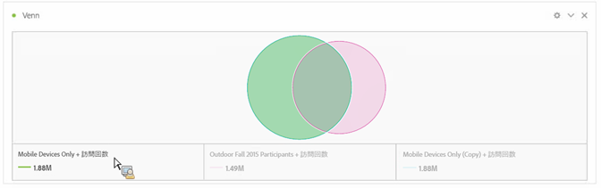
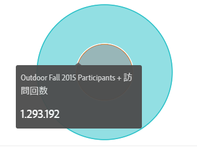
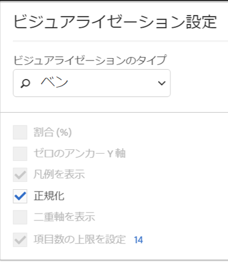

# ベン

ベン図のビジュアライゼーションを使用すると、（コンポーネントから）最大 3 セグメントおよび 1 つの指標をドラッグして、ベン図を作成できます。

セグメント上にマウスポインターを置くと、割合などのインサイトが得られます。

To turn the Venn diagram into a Freeform table, click the colored dot next to the **[!UICONTROL Venn]** header and select **[!UICONTROL Manage Data Sources]** &gt; **[!UICONTROL Available Data Sources]** &gt; **[!UICONTROL Freeform Table]**.

To normalize the Venn diagram (take the size out of it), go to its Visualization Settings icon and select **[!UICONTROL Normalization]**.

