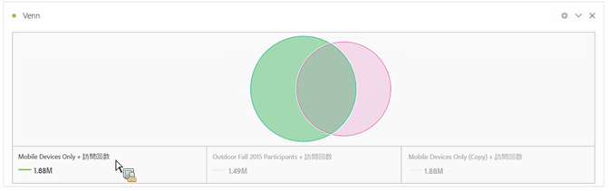
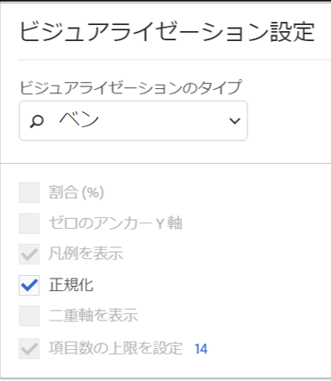

# ベン {#venn}

<!-- markdownlint-disable MD034 -->

>[!CONTEXTUALHELP]
>id="workspace_venn_button"
>title="ベン"
>abstract="ベン図ビジュアライゼーションを作成して、2 つの要素とその重複のサイズを視覚的にすばやく比較します。"

<!-- markdownlint-enable MD034 -->

>[!BEGINSHADEBOX]

_この記事では、この記事の_  _**Adobe Analytics**_ _でベンのビジュアライゼーションについて説明します。この記事の_  _**Customer Journey Analytics** バージョンについては、[Venn](https://experienceleague.adobe.com/ja/docs/analytics-platform/using/cja-workspace/visualizations/venn)を参照してください。_

>[!ENDSHADEBOX]

 **[!UICONTROL ベン図]**&#x200B;ビジュアライゼーションを使用すると、（コンポーネントパネルから）最大 3 フィルターおよび 1 つの指標をドラッグして、ベン図を作成できます。

>[!NOTE]
>
>Analysis Workspaceでは、エリア比例のベン図を使用します。 2次元で表される3つ以上の円を持つベン図は、常に完全な縦横比で描くことはできません。
> 
>Workspaceは最も近いベンを作成しようとしますが、結果は必ずしも視覚的に正確ではありません。

次に、フィルターにポインタを合わせると、パーセンテージなどについて、より多くのインサイトが得られます。

[!UICONTROL ベン図]ビジュアライゼーションから[!UICONTROL フリーフォームテーブル]を生成するには、**[!UICONTROL ベン図]**&#x200B;のヘッダーの横にあるカラー付きの  を選択し、「**[!UICONTROL データソースを表示]**」を選択します。 [!UICONTROL ベン図]ビジュアライゼーションを作成するために使用されたデータを含む&#x200B;**[!UICONTROL ベン図データ]**&#x200B;フリーフォームテーブルが表示されます。

<!--
To normalize the Venn diagram (take the size out of it), go select  and select **[!UICONTROL Normalization]**.

-->

>[!BEGINSHADEBOX]

デモビデオについて詳しくは、 [ベン図ビジュアライゼーション](https://experienceleague.adobe.com/en/docs/analytics-learn/tutorials/analysis-workspace/visualizations/venn-diagram-visualization){target="_blank"}を参照してください。

>[!ENDSHADEBOX]

>[!MORELIKETHIS]
>
>[ パネルへのビジュアライゼーションの追加](/help/analyze/analysis-workspace/visualizations/freeform-analysis-visualizations.md#add-visualizations-to-a-panel)
>[ビジュアライゼーション設定](/help/analyze/analysis-workspace/visualizations/freeform-analysis-visualizations.md#settings)
>[ビジュアライゼーションコンテキストメニュー](/help/analyze/analysis-workspace/visualizations/freeform-analysis-visualizations.md#context-menu)
>

