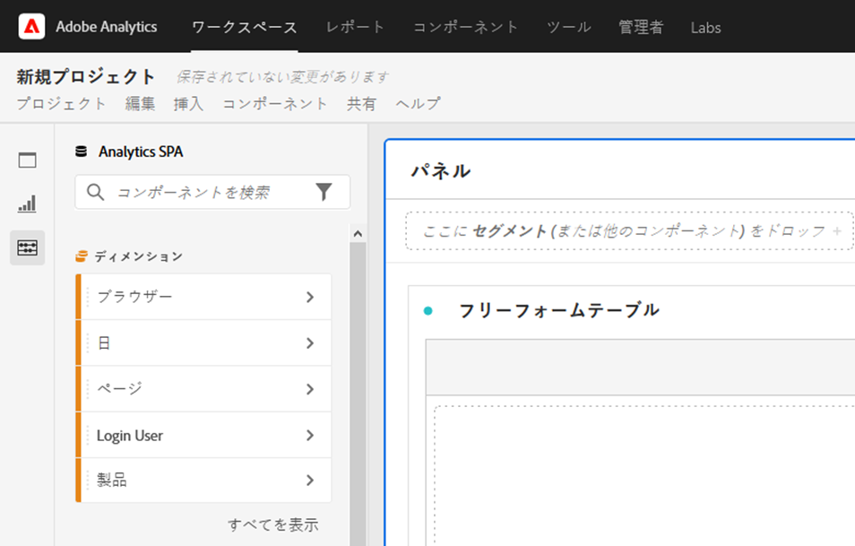
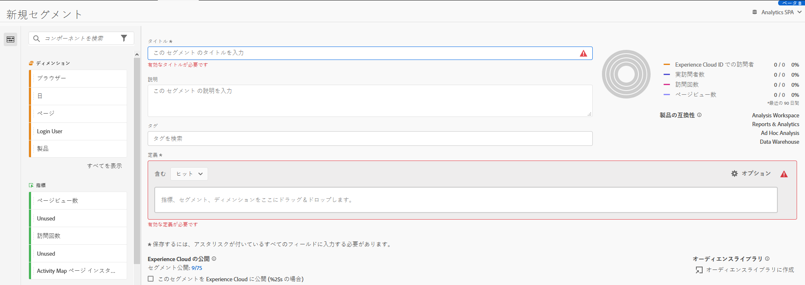

# Analysis Workspace のアクセシビリティ

Adobe Analytics の主要な分析ツールである [!UICONTROL Analysis Workspace] のアクセシビリティサポートについて説明します。

アクセシビリティとは、視覚、聴覚、認知、モーターなどの障害を持つユーザーに対して、製品を使用できるようにすることです。ソフトウェア製品のアクセシビリティ機能の例としては、スクリーンリーダーのサポート、グラフィックの代替テキスト、キーボードショートカット、表示色のコントラストの大きさの変更などがあります。

[!UICONTROL Analysis Workspace] には、次のような、使いやすいツールが用意されています。

## キーボードを使用した [!UICONTROL Workspace] の操作

[!UICONTROL Analysis Workspace] でのナビゲーションは、上から下、左から右です。次のナビゲーション要素はアクセシビリティを容易にします。

* `Tab` キーは、ランドマークショートカットを有効にします。Workspace内の大きいセクション間を移動します。 左側のレールでは、ドラッグ可能なオプション間を移動するこ `Tab` ともできます。
* ハイライト表示した後の個々の要素間 `left/right arrows``Tab` の移動。
* プロジェクト内の最初のパネルに `F6` 移動し、そのパネル内のビジュアライゼーション間を移動します。 次に、プロジェクト内の次のパネルに移動し、繰り返します。
* フォーカスインジケーターを適用して、目が見えるキーボードユーザーが現在どの UI 要素にフォーカスがあるかを明確に示します。インジケーターは、選択した要素の周りの青い境界線です。

   

### メニューバーのキーボードナビゲーション

1. メニューバーに到達するまでタブを押します。
1. 左右の矢印キーを使用して、目的のメニューに移動します。
1. を押 `Enter` してメニューを選択し、そのオプションを表示します。
1. 上向き/下向き矢印キーを使用して、目的のメニューオプションに移動します。
1. を押 `Enter` して、オプションを選択します。

### ドラッグ&amp;ドロップ操作のキーボードナビゲーション

[!UICONTROL Analysis Workspace] は、ドラッグ&amp;ドロップによるユーザーインターフェイスです。ただし、ユーザーは、代わりにキーボードを使用してコンポーネントを追加できます。

1. 左側のパネルのコンポーネントにタブを移動します。
1. `Enter` を押して選択します。
1. 矢印キーを使用して、コンポーネントをドロップする領域に移動します。
1. `Enter` を押して、コンポーネントを配置します。

### キーボードショートカット（ホットキー）

[!UICONTROL Analysis Workspace] は、シームレスなワークフローを実現するための豊富な[キーボードショートカットのセット](https://experienceleague.adobe.com/docs/analytics/analyze/analysis-workspace/build-workspace-project/fa-shortcut-keys.html?lang=ja-JP)を備えています。ナビゲーション、分析の作成、インサイトの民主化に関する一般的なショートカットを以下に示します。

#### ナビゲーション

| ショートカット | アクション |
|---|---|
| Alt + Shift + 1/2/3 | 別のパネルにジャンプする：[!UICONTROL パネル]、[!UICONTROL ビジュアライゼーション]、[!UICONTROL コンポーネント] |
| Alt +左向き矢印または右向き矢印 | パネル間の移動 |
| Alt + M | すべてのパネルを折りたたむ／展開 |
| Alt + Ctrl + M | アクティブパネルを折りたたみ／展開 |
| Ctrl + / | 左パネルを検索 |

#### 分析作成

| ショートカット | アクション |
|---|---|
| Alt + 1 | 新しいフリーフォームテーブル |
| Ctrl + Shift + C | 新規計算指標 |
| Ctrl + Shift + D | 新しい日付範囲 |
| Ctrl + Shift + E | 新しいセグメント |
| Ctrl + Z | 元に戻す |
| shift キーを押したまま（パネルセグメントドロップゾーン内） | [ドロップダウンフィルター](https://experienceleague.adobe.com/docs/analytics-learn/tutorials/analysis-workspace/using-panels/using-drop-down-filters.html?lang=ja-JP)の作成 |

#### 民主化

| ショートカット | アクション |
|---|---|
| Ctrl + S | 保存 |
| Ctrl + Shift + G | キュレート |
| Ctrl + G | 共有 |
| Alt + Shift + S | スケジュール |
| Alt + L | プロジェクトへのリンクを取得 |
| Ctrl + Shift + B | PDF をダウンロード |

## スクリーンリーダーとスクリーン拡大鏡のサポート

スクリーンリーダーは、コンピューターの画面に表示されるテキストを読み上げます。また、アクセシビリティタグや属性で指定された、アプリケーション内のボタンラベルや画像の説明など、テキスト以外の情報も読み上げます。

## カラーパレットとコントラスト

[!UICONTROL Analysis Workspace] は、WCAG 2.1 AA への準拠を目指しています（カラーコントラストの要件を含む）。

また、プロジェクトに対しては、**[!UICONTROL プロジェクト]**／**[!UICONTROL プロジェクト設定]**／[プロジェクトのカラーパレット](https://experienceleague.adobe.com/docs/analytics/analyze/analysis-workspace/build-workspace-project/color-palettes.html?lang=ja-JP)で、ユーザーが希望するカラーパレットを設定できます。

## コンポーネントビルダーの必須フィールドの検証

コンポーネントを構築する際、保存時に必須フィールドの検証が行われます。必須フィールドが検証に合格しない場合は、赤い枠線にエラーアイコンが表示されます。修正する必要がある問題の説明が文書で表示されます。

コンポーネントの検証が完了すると、を押すとビルダーが閉じ `Save` ます。

## オペレーティングシステムのアクセシビリティ機能のサポート

Analysis Workspace は、MS Windows と macOS に組み込まれたアクセシビリティ機能（コントラストの大きいモード、共通キー、遅いキーやフィルターキーなど）をサポートしています。また、Windows 上の VoiceOver for macOS や NVDA などの支援テクノロジーとの対話を可能にするためのユーザーインターフェイスに関する情報も提供します。
