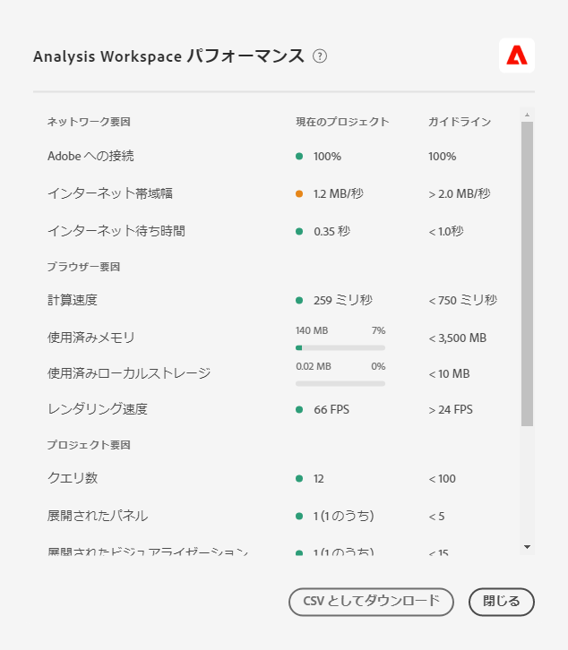

# Analysis Workspace のパフォーマンスの最適化

様々な要因が、Analysis Workspaceでのプロジェクトの成果に影響を与える。 最も最適な方法でプロジェクトを計画して構築できるように、プロジェクトを構築する前に、開始が寄稿した人々が何かを知っておくことが重要です。 このページには、パフォーマンスに影響を与える要因のリストと、Analysis Workspaceでのパフォーマンスを確実にピークにするための最適化が含まれています。

>[!IMPORTANT]
>
>Analysis Workspaceのパフォーマンスページは限定的なリリースになっています。 [詳細情報](https://docs.adobe.com/content/help/ja-JP/analytics/landing/an-releases.html)

## ヘルプ/Analysis Workspaceでのパフォーマンス

[ **[!UICONTROL Analysis Workspace] > [ヘルプ] > [パフォーマンス]**]では、ネットワーク、ブラウザ、プロジェクト要因など、プロジェクトのパフォーマンスに影響する要因を確認できます。 最も正確な結果を得るには、プロジェクトを完全に読み込んでから[パフォーマンス]ページを開きます。
* 「現在のプロジェクト」列には、現在のプロジェクトとユーザー環境の結果が表示されます。
* 「ガイドライン」列には、各要素に対するAdobeの推奨しきい値が表示されます。

また、パフォーマンスのコンテンツをCSV **形式で** ダウンロードして、Adobeのカスタマーケアや社内のITチームと簡単に共有できます。

>[!NOTE]
>
>パフォーマンスページの情報は、モーダルを開くたびに異なります。これは、要因が変わる可能性があるためです。 さらに、より多くのデータが利用可能になるにつれて、Adobeは引き続きガイドラインを改善します。

## ネットワーク要因

ヘルプ/パフォーマンスのネットワーク要因は次のとおりです。

| 要因 | 定義 | 影響を受ける | 最適化 |
| --- | --- | --- | --- |
| Adobe への接続 | Adobeは、パフォーマンスページを開いたときに、10回のテスト呼び出しで送信します。 これは、成功した誘い文句(CTA：コールトゥAdobe)の割合を示します。 | ローカルネットワークの問題やAdobeの問題は、この要因に影響します。 | status.adobe.comを確認し、既知のサービスに問題があるかどうかを確認します。 次に、ローカルネットワーク接続を検証します。 |
| インターネット帯域幅 | Google Chromeでのみ使用できます。 場所での帯域幅の推定値。 ガイドラインは2.0 MB/sです。 | ローカルネットワーク接続は、この要因に影響します。 | ローカルネットワーク接続を検証します。 |
| インターネット待ち時間 | Adobeは、パフォーマンスページを開いたときに、10回のテスト呼び出しで送信します。 これは、リクエストがAdobeに移動して返されるまでの平均時間を表します。 簡単に言うと、これは、場所とAdobeの間のインターネットの速度を測定する尺度です。 ガイドラインは1秒未満です。 | ローカルネットワークの問題、多数の開いているブラウザータブ、またはAdobeの問題が、この要因に影響します。 | status.adobe.comを確認し、既知のサービスに問題があるかどうかを確認します。 次に、ローカルネットワーク接続を検証し、使用していないブラウザータブを閉じます。 |

## ブラウザー要因

ヘルプ/パフォーマンスブラウザーの要因は次のとおりです。

| 要因 | 定義 | 影響を受ける | 最適化 |
| --- | --- | --- | --- |
| 計算速度 | コンピューターが処理テストを実行する速度。 ガイドラインは750ミリ秒未満です。 | この要因は、お使いのハードウェアと同時プログラムに影響します。 | コンピューターのタスクマネージャー(PC)またはアクティビティモニター(Mac)を開き、プログラムを閉じることができるかどうかを確認します。 次に、未使用のブラウザータブまたは他のプログラムーを閉じます。   これらの対応が役に立たない場合は、ITチームとハードウェアの詳細について話し合ってください。 |
| 使用済みメモリ | Google Chromeでのみ使用できます。 Google Chromeブラウザー内のすべてのワークスペースタブは、合計4 GBのメモリを共有します。 これは、現在のプロジェクトで消費されているメモリ許容量の割合を表します。 ガイドラインは3500 MBで、Workspaceがメモリエラーの表示を開始するポイントです。 | 複数のタブで作業する場合や5,000行のデータをダウンロードする場合は、メモリ使用量が増加します。 | メモリエラーが発生した場合は、他のWorkspaceタブを閉じたり、50000行を実行して一度に1回ダウンロードしたりします。 |
| 使用済みローカルストレージ | ブラウザーで使用するために、コンピューターにローカルに保存されたデータ。 各接触チャネル（experience.adobe.comなど）には10 MBの余裕があります。 | Analysis Workspaceは、自動保存（既存）プロジェクト、ユーザ設定、機能フラグの保存など、いくつかの機能にローカルストレージを使用します。 | Analysis Workspaceの機能が中断されないようにするには、experience.adobe.comドメインのローカルストレージをクリアします。 |
| レンダリング速度 | FPSは、「フレーム/秒」の略で、ブラウザーが画面にページを描画する1秒あたりの回数を表します。 24 FPSは一般に人間の目が観察できるものです。fpsがそれより低い場合は、Workspaceでレンダリングの問題が発生します。 | FPSは、多数のWorkspaceプロジェクトで一度に複数のマルチタスクを実行し、表示されるプロジェクトのサイズに影響を受けます。 コンピュータ上で実行している他のプログラム（ストリーミング、バックグラウンドスキャナなど）に影響が及ぶ場合があります。 さらに、お使いのハードウェアはこの要因に影響します。 | コンピューターのタスクマネージャー(PC)またはアクティビティモニター(Mac)を開き、プログラムを閉じることができるかどうかを確認します。 次に、未使用のブラウザータブまたは他のプログラムーを閉じます。   これらの対応が役に立たない場合は、ITチームとハードウェアの詳細について話し合ってください。 |

## プロジェクト要因

ヘルプ/パフォーマンスプロジェクトの要因は、次のとおりです。

| 要因 | 定義 | 最適化 |
| --- | --- | --- |
| クエリ数 | プロジェクトに表示されるデータを取得するためにAdobeに対して行われたクエリ（要求）の合計数です。 クエリには、テーブルのランク付け要求、異常値検出要求、スパークライン要求、左側のレールに表示されるコンポーネントなどがあります。 折りたたまれたパネルとビジュアライゼーションを除外します。 ガイドラインは100。 | データを特定の目的または関係者のグループを提供する複数のプロジェクトに分割することで、可能な限りプロジェクトをシンプル化します。 タグを使用してプロジェクトをテーマに編成し、 [直接リンクを使用して内部目次を作成し](https://docs.adobe.com/content/help/ja-JP/analytics/analyze/analysis-workspace/curate-share/shareable-links.html) 、関係者が必要なものをより簡単に見つけられるようにします。 |
| パネルを展開（合計パネルを除く） | プロジェクト内の合計パネル数の中で、展開されたパネルの数。 ガイドラインは5です。 | プロジェクトを簡単にする手順を実行した後、読み込み時に表示する必要のないパネルをプロジェクト内で折りたたむ。 プロジェクトを開くと、展開されたパネルのみが処理されます。 折りたたまれたパネルは、ユーザが展開するまで処理されません。 |
| ビジュアライゼーションの拡張（合計ビジュアライゼーション数を超える） | プロジェクト内の合計の中で展開されたテーブルおよびビジュアライゼーションの数。 非表示のデータソースを除外します。 ガイドラインは15です。 | プロジェクトを簡略化する手順を実行した後、読み込み時に表示する必要のないプロジェクト内のビジュアライゼーションを折りたたみます。 レポートの消費者にとって最も重要なビジュアルに優先順位を付け、必要に応じて、サポートするビジュアルを個別の、より詳細なパネルまたはプロジェクトに分割します。 |
| フリーフォームセルの数 | プロジェクト内のフリーフォームテーブルのセルの合計数で、すべてのテーブルの行*列で計算されます。 非表示のデータソースを除外します。 ガイドラインは4000。 | テーブルの列数を減らして、最も重要なデータポイントのみを表示します。 表示される行数を調整したり、テーブルフィルターを適用したり、セグメントを適用したりして、テーブルの行数を減らします。 |
| 利用可能なコンポーネント | プロジェクトの左側のレールで取得された、プロジェクト内のすべてのレポートスイートにおけるコンポーネントの合計数。 ガイドラインは2000。 | カスタマイズされたコンポーネントのセットを含む、厳選された仮想レポートスイートの作成については、製品管理者にお問い合わせください。 |
| 使用済みコンポーネント | プロジェクトで使用されるコンポーネントの合計数です。 ガイドラインは100。 | 使用されるコンポーネントの数は、パフォーマンスに直接影響を与えるものではありません。 ただし、これらのコンポーネントの複雑さは、プロジェクトのパフォーマンスに影響を与えます。 以下の「追加要因」セクションの最適化を参照してください。 |
| 最長の日付範囲 | この係数は、プロジェクトで使用されている最も長い日付範囲を表示します。 指針は1年です。 | できるだけ、必要以上のデータを取り込まないようにします。パネルカレンダーを分析に関連する日付に絞り込むか、フリーフォームテーブルで日付範囲コンポーネント（紫のコンポーネント）を使用します。 テーブルで使用される日付範囲は、パネルの日付範囲より優先されます。例えば、先月、先週および昨日をテーブルの列に追加して、特定の範囲のデータをリクエストできます。Analysis Workspace での日付範囲の扱いについて詳しくは、[こちらのビデオ](https://docs.adobe.com/content/help/en/analytics-learn/tutorials/analysis-workspace/calendar-and-date-ranges/date-ranges-and-calendar-in-analysis-workspace.html)を参照してください。  さらに、プロジェクトで使用される前年比の比較数を最小限に抑えます。 前年比の比較を計算すると、対象となる月の間の完全な 13 ヶ月分のデータが調べられます。これは、パネルの日付範囲を過去 13 ヶ月に変更した場合と同じ影響を与えます。 |

## その他の要因

ヘルプ/パフォーマンスには、次のような要因は含まれません。

| 要因 | 定義 | 影響を受ける | 最適化 |
| --- | --- | --- | --- |
| セグメントの複雑度 | 複雑なセグメントはプロジェクトのパフォーマンスに大きな影響を与える可能性があります。 | セグメントを複雑にする要因には、以下のものがあります（影響の大きい順）。 <ul><li>演算子には「contains」（次を含む）、「contains any of」（次のいずれかを含む）、「matches」（次と一致する）、「starts with」（次で開始する）、または「ends with」（次で終わる）などがあります。 </li><li>順次セグメント（特にディメンション制限（Within/After）が使用されている場合） </li><li>セグメントで使用されているディメンション内の一意のディメンション項目の数（例えば、ページに一意の項目が 10 個ある場合は Page = &#39;A&#39; の方が、一意の項目が 100,000 個ある場合の Page = &#39;A&#39; より速くなります）。 </li><li>使用されるディメンションの数（例：Page = &#39;Home&#39; と Page = &#39;Search result&#39; は、eVar 1 = &#39;red&#39; と eVar 2 = &#39;blue&#39; の場合より速くなります）</li><li>多くの OR 演算子（AND の代わりに）</li><li>様々なスコープの、入れ子になったコンテナ（例：「訪問者」内にある「訪問」内のヒット）</li></ul> | 複雑な要因の一部は防ぐことはできませんが、セグメントの複雑さを軽減する機会を探してください。 一般的に、セグメント条件をより具体的に指定するほど速くなります。次に例を示します。<ul><li>コンテナでは、セグメントに加えて単一のコンテナを使用する方が、一連の入れ子になったコンテナよりも高速になります。</li><li>演算子を使用した場合、「次を含む」よりも「等しい」の方が速く、「次のいずれかを含む」よりも「次のいずれかに等しい」の方が速くなります</li><li>多くの条件では、AND 演算子は一連の OR 演算子よりも高速になります。</li></ul> 多数のOR文を「次のいずれかに等しい」単一の文に絞り込む機会を探します。  [分類は](/help/components/classifications/c-classifications.md) 、多くの値を簡潔なグループにまとめるのに役立ち、簡潔なグループからセグメントを作成することもできます。 分類グループをセグメント化すると、多数の OR 文や「次を含む」条件を含むセグメントのパフォーマンスがよくなります。 |
| ビジュアライゼーションの複雑さ(セグメント、指標、フィルター) | プロジェクトに追加されるビジュアライゼーションのタイプ（フォールアウトやフリーフォームテーブルなど）自体は、プロジェクトのパフォーマンスにあまり影響しません。処理時間が長くなる原因は、ビジュアライゼーションの複雑さです。 | ビジュアライゼーションの複雑さが増す要因は、以下のとおりです。<ul><li>リクエストされるデータ範囲</li><li>フリーフォームテーブルの行として使用されるセグメントなど、適用されるセグメントの数</li><li>複雑なセグメントの使用</li><li>[フリーフォームテーブルでの静的項目の行または列](https://docs.adobe.com/content/help/ja-JP/analytics/analyze/analysis-workspace/build-workspace-project/column-row-settings/manual-vs-dynamic-rows.html)</li><li>フリーフォームテーブルの行に適用されるフィルター</li><li>含まれている指標（特にセグメントを使用する計算指標）の数</li></ul> | プロジェクトの読み込みに想定よりも時間がかかる場合は、可能であれば一部のセグメントを eVar とフィルターに置き換えます。  貴社のビジネスにとって重要なデータポイントに対してセグメントと計算指標を継続的に使用している場合は、これらのデータポイントをより直接的に取り込むために実装を改善することを検討してください。 Adobe Experience Platform LaunchなどのタグマネージャーやAdobeの処理ルールを使用すると、実装の変更をすばやく簡単に実装できます。 |
| レポートスイートのサイズ | レポートスイートで収集されるデータの量。 | - | Adobe Analyticsでの全体的なエクスペリエンスを改善するために実装が改善される可能性があるかどうかについては、導入チームまたはAdobeのエキスパートにお問い合わせください。 |

## 一般的なエラーメッセージ

Analysis Workspaceとの対話中にエラーが発生する場合があり、パフォーマンスにも影響します。 以下に、最も一般的なエラータイプ、エラーの発生理由、最適化を示します。

| エラーメッセージ | エラーの発生理由 | 最適化 |
| --- | --- | --- |
| [!UICONTROL レポートスイートで、異常に重いレポート処理が発生しています。後でやり直してください。] | 組織が特定のレポートスイートに対して同時に実行するリクエストが多すぎます。このエラーの原因となっているのは、API リクエスト、スケジュール済みプロジェクト、スケジュール済みレポート、スケジュール済みアラート、およびレポートリクエストをおこなう同時ユーザーです。 | レポートスイートのリクエストやスケジュールを1日中均等に配分します。 |
| [!UICONTROL システムエラーが発生しました。 ヘルプ/サポートチケットを送信できるカスタマーケアのリクエストをログに記録し、エラーコードを記載してください。] | アドビで問題が発生しています。この問題は解決する必要があります。 | エラーコードをカスタマーケアに送信します。 |
| [!UICONTROL リクエストが複雑すぎます。] | レポート要求が大きすぎるので、実行できません。このエラーの原因は、リクエストのサイズ、セグメントまたは検索フィルターで一致した項目が多すぎる、含まれる指標が多すぎる、互換性のないディメンションと指標の組み合わせなどが原因でタイムアウトになります。 | テーブルの一部の列や行を削除してリクエストを簡略化するか、テーブルを個別のリクエストに分割することを検討します。 |
| [!UICONTROL このビジュアライゼーションのセグメントまたは検索の1つに、返された結果が多すぎるテキスト検索が含まれています。] | セグメント条件またはレポートフィルターが範囲を超えています。 | 検索テキストの条件を絞り込み、もう一度要求を試みます。 |
| [!UICONTROL このディメンションでは、現在、デフォルト以外のアトリビューションモデルをサポートしていません。] | デフォルト以外の属性は、使用しているディメンションではサポートされません。 | Replace the dimension in your table with one that is compatible with [Attribution IQ](../attribution/overview.md). |
| [!UICONTROL 列が多すぎるか事前設定された行が原因で、要求に失敗しました。] | テーブルに含まれるフリーフォームセルが多すぎます（行*列）。 | テーブルの列または行を削除するか、テーブルを個別のリクエストに分割することを検討します。 |
